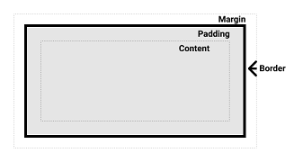
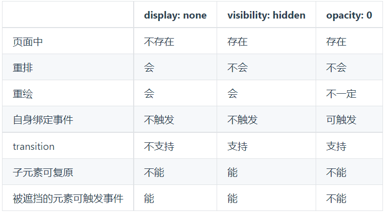
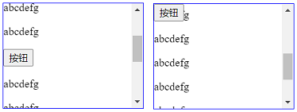

- [1、CSS选择器及其优先级](#1css%E9%80%89%E6%8B%A9%E5%99%A8%E5%8F%8A%E5%85%B6%E4%BC%98%E5%85%88%E7%BA%A7)
- [2、伪类和伪元素](#2%E4%BC%AA%E7%B1%BB%E5%92%8C%E4%BC%AA%E5%85%83%E7%B4%A0)
- [3、CSS属性的继承](#3css%E5%B1%9E%E6%80%A7%E7%9A%84%E7%BB%A7%E6%89%BF)
- [4、盒模型](#4%E7%9B%92%E6%A8%A1%E5%9E%8B)
- [5、display的属性值及其作用](#5display%E7%9A%84%E5%B1%9E%E6%80%A7%E5%80%BC%E5%8F%8A%E5%85%B6%E4%BD%9C%E7%94%A8)
- [6、display、visibility、opacity的区别](#6displayvisibilityopacity%E7%9A%84%E5%8C%BA%E5%88%AB)
- [7、position的属性值及含义](#7position%E7%9A%84%E5%B1%9E%E6%80%A7%E5%80%BC%E5%8F%8A%E5%90%AB%E4%B9%89)
- [8、flex布局](#8flex%E5%B8%83%E5%B1%80)

# 1、CSS选择器及其优先级
| 选择器 | 符号 | 描述 | 示例 |
|  ----  | ---- |  ----  | ---- |
| id选择器  | #id名 |  | #banner{color:red;} |
| 类选择器  | .类名 | 一个class可以有多个类名 | .special{color:red;} |
| 伪类选择器  | :伪类名 |  | li:first-child{color:red;} |
| 属性选择器  | E[att] | 针对特定属性 | [disabled]{color:red;} |
|  | E[att=val] | 针对特定的属性值 | [type=”button”]{color:red;} |
|  | E[att~=val] | class属性中包含special | [class~=special]{color:red;} |
|  | E[att|=val] | 以en/en-开头 | [lang|=en]{color:red;} |
|  | E[att^=val] | 以某些值开头 | [href^=”#”]{color:red;} |
|  | E[att$=val] | 以某些值结尾 | [href$=pdf]{color:red;} |
|  | E[att*=val] | 包含某些值 | [href*=”.com”]{color:red;} |
| 标签选择器 | 标签名E | 标签与选择器相同的元素 | p{color:red;} |
| 伪元素选择器  | ::伪元素名 |  | #banner::after{content:”在元素后面插入引号中内容”;} |
| 通配符选择器 | * | 页面中所有元素 | *{color:red;} |


CSS优先级的计算方法，将权重相加。
- 行内样式style：1000
- id选择器：100
- 类、伪类和属性选择器：10
- 标签和伪元素选择器：1

注意：
- !important声明的样式的优先级最高；
- 继承得到的样式的优先级最低；
- 如果优先级相同，后面覆盖前面；
- 通用选择器（*）、子选择器（>）和相邻同胞选择器（+）并不在这四个等级中，所以它们的权值都为 0 ；
- 样式表的来源不同时，优先级顺序为：内联样式 > 内部样式 > 外部样式 > 浏览器用户自定义样式 > 浏览器默认样式。

# 2、伪类和伪元素
[伪类和伪元素_MDN](https://developer.mozilla.org/zh-CN/docs/Learn/CSS/Building_blocks/Selectors/Pseudo-classes_and_pseudo-elements)  
[总结伪类和伪元素](http://www.alloyteam.com/2016/05/summary-of-pseudo-classes-and-pseudo-elements/)  

伪类是选择器的一种，用于选择处于特定状态的元素，为其添加样式，比如某类型的第一个元素，或当鼠标指针悬浮在元素上面时。  
伪类是开头为冒号的关键字。  
  

伪元素用于创建一些不在文档树中的元素，并为其添加样式。  
伪元素开头为双冒号。  


# 3、CSS属性的继承
**有继承性的属性：**

- 字体系列属性：font-family、font-weight、font-size、font-style
- 文本系列属性：text-indent、text-align、line-height、word-spacing、letter-spacing、text-transform、color
- 元素可见性：visibility
- 列表布局属性：list-style列表风格，包括list-style-type、list-style-image等
- 光标属性：cursor，光标显示为何种形态

注意，文本的对齐、装饰、方向等属性无继承性，如vertical-align、text-decoration、text-shadow、white-space、unicode-bidi设置文本的方向

# 4、盒模型
[盒模型_MDN](https://developer.mozilla.org/zh-CN/docs/Learn/CSS/Building_blocks/The_box_model) 

盒模型包括内容区域、padding内边距、border边框、margin外边距。

CSS 中组成一个块级盒子需要：

- Content box: 这个区域是用来显示内容，大小可以通过设置 width 和 height.
- Padding box: 包围在内容区域外部的空白区域；大小通过 padding 相关属性设置。
- Border box: 边框盒包裹内容和内边距。大小通过 border 相关属性设置。
- Margin box: 这是最外面的区域，是盒子和其他元素之间的空白区域。大小通过 margin 相关属性设置。



# 5、display的属性值及其作用

- **block：** 会独占一行，默认宽度为父元素宽度，可以设置width、height、margin和padding属性；div, p, h1-h6, ul, form, …

- **inline：** 默认宽度为内容宽度，设置width、height属性无效，但可以设置水平方向的margin和padding属性，不能设置垂直方向的padding和margin；span, a, label, cite, em, …

- **inline-block：** 默认宽度为内容宽度，可以设置width、height、margin和padding属性；input, textarea, select, button, …

- **none：** 设置元素不显示，后面元素会占据它的位置。

# 6、display、visibility、opacity的区别
**display:none** 设置元素不展示。

- 创建DOM树时，忽略属性设置为display:none的元素；
- 子元素随父元素一起，被忽略；
- 绑定的事件不能触发；
- 该元素不占据空间，如果修改该属性，会引起回流；
- transition无效。

**visibility:hidden** 设置元素不可见。

- 隐藏元素，但是其他元素的布局不改变，相当于此元素变成透明；
- 若将其子元素设为 visibility: visible，则该子元素依然可见；
- 该元素绑定的事件不能触发；
- 不会引起回流，会引起重绘；
- transition有效。

**opacity:0** 设置元素透明度为0

- 子元素不能设置透明度进行反隐藏；
- 绑定的事件能触发；
- 不会引起回流，不一定会引起重绘；如果利用 animation 动画，对 opacity 做变化（animation会默认触发GPU加速），则只会触发 GPU 层面的 composite，不会触发重绘
- transition有效。



# 7、position的属性值及含义 
- **static**：默认值。没有定位，元素出现在正常的流中（忽略 top, bottom, left, right 或者 z-index 声明）。

- **relative**：生成相对定位的元素，相对于其正常位置进行定位，但不影响周围元素的位置。多用于绝对定位元素的参照物。

- **absolute**：生成绝对定位的元素，相对于非 static 定位的第一个父元素进行定位。如果祖先没有定位元素，则以页面的即html元素的包含块为参照物。脱离文档流，文档流中没有它的空间，未设置偏移时在原位置。

- **fixed**：生成固定定位的元素，相对于浏览器窗口进行定位，元素的位置在屏幕滚动时不会改变。例如回到顶部的按钮⼀般都是用此定位方式。

- **sticky**：粘性定位，该定位基于用户滚动的位置。它的行为就像 position:relative; 而当页面滚动超出目标区域时，它的表现就像 position:fixed;，它会固定在目标位置。

relative、absolute、fixed元素的位置通过 "left", "top", "right" 以及 "bottom" 属性进行规定。

sticky举例：实现如下效果，按钮在文档流中，如果超出视窗则固定在顶部



```html
<div class="container">
  <p>abcdefg</p>
  <p>abcdefg</p>
  <p>abcdefg</p>
  <p>abcdefg</p>
  <p>abcdefg</p>
  <button class="btn">按钮</button>
  <p>abcdefg</p>
  <p>abcdefg</p>
  <p>abcdefg</p>
  <p>abcdefg</p>
  <p>abcdefg</p>
  <p>abcdefg</p>
  <p>abcdefg</p>
</div>
```
```css
.container {
  height: 150px;
  border: 1px solid #00f;
  overflow-y: auto;
}

.btn {
  position: sticky;
  top: 0;
}
```

# 8、flex布局
[flex 布局的基本概念](https://developer.mozilla.org/zh-CN/docs/Web/CSS/CSS_Flexible_Box_Layout/Basic_Concepts_of_Flexbox)

flex 布局是 CSS 弹性盒子布局的一种。在弹性布局模型中，弹性容器的子元素可以在任何方向上排布，也可以“弹性伸缩”其尺寸，既可以增加尺寸以填满未使用的空间，也可以收缩尺寸以避免父元素溢出。子元素的水平对齐和垂直对齐都能很方便的进行操控。

flex 布局是一种一维的布局模型，它给 flexbox 的子元素之间提供了强大的空间分布和对齐能力。一个 flexbox 一次只能处理一个维度上的元素布局，一行或者一列。作为对比的是另外一个二维布局 grid 布局，可以同时处理行和列上的布局。

- **flex-direction**: row|row-reverse|column|column-reverse 设置主轴的方向  
- **flex-wrap**: nowrap|wrap|wrap-reverse 设置换行  
- **flex-flow**: <'flex-direction'>||<'flex-wrap'> 同时设置主轴方向及换行  

flex 元素上的属性：  
- **flex-basis**: <width> 设置元素在主轴上的初始宽/高  
- **flex-grow**: <number> 先按照设置的宽度分配空间，如果有多余空间，将多余空间按比例分配给设置flex-grow的元素。  
- **flex-shrink**: <number> 分配超出的负的剩余空间。初始值是1，平均分配。如果均设为0，则不分配，超出。哪个元素的该值越大，按比例分配的负的空间更多。
- **flex**:<'flex-grow'>||<'flex-shrink'>||<'flex-basis'> 值缩写，默认值0 1 auto。  
flex: 1是flex: 1 1 auto;的缩写  

元素间的对齐和空间分配：  
- **justify-content**:flex-start|flex-end|center|space-between|space-around 设置主轴方向上的对齐方式，与text-align类似
- **align-items**: flex-start|flex-end|center|baseline|stretch 设置辅轴方向上的对齐方式，与vertical-align类似
- **align-content**: flex-start|flex-end|center|space-between|space-around|stretch 对于多行元素，设置辅轴方向上行对齐方式

