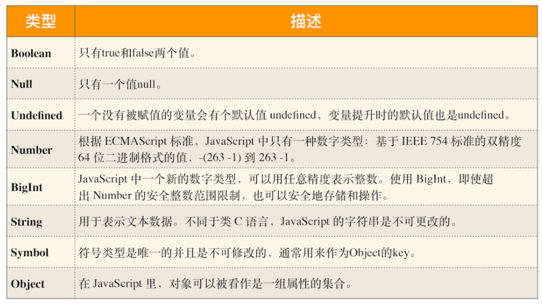
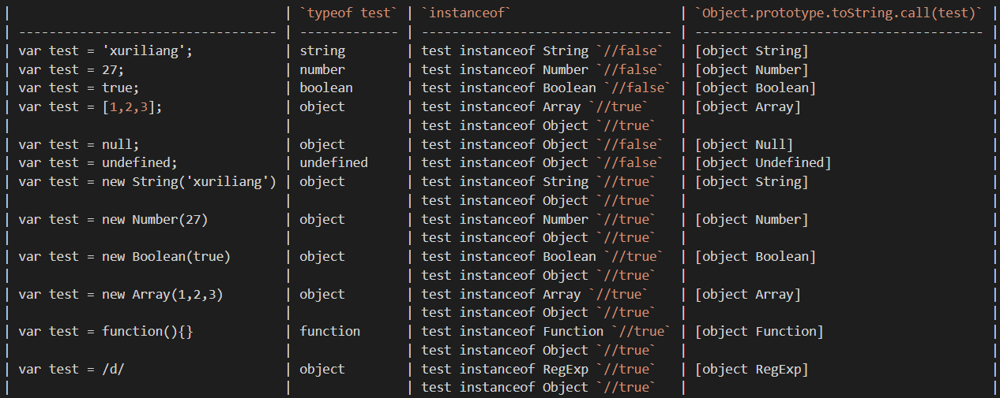
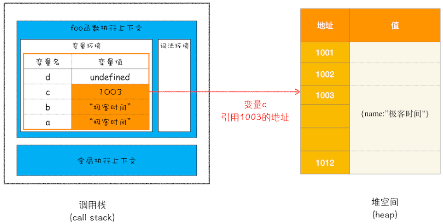

# 1、JavaScript有哪些数据类型
JavaScript共有八种数据类型，分别是 Undefined、Null、Boolean、Number、String、Symbol、BigInt、Object。  

前 7 种类型为基础类型，最后 1 种（Object）为引用类型。
引用数据类型（Object）有几种常见的类型：Function、Array、RegExp、Date、Math。



# 2、Symbol
[https://es6.ruanyifeng.com/#docs/symbol](https://es6.ruanyifeng.com/#docs/symbol)

Symbol 代表创建后独一无二且不可变的数据类型，它主要是为了解决可能出现的全局变量冲突的问题。

Symbol 值作为属性名，遍历对象的时候，该属性不会出现在for...in、for...of循环中，也不会被Object.keys()、Object.getOwnPropertyNames()、JSON.stringify()返回。

- **Object.getOwnPropertySymbols(obj)** 方法，可以获取指定对象的所有 Symbol 属性名。
- **Reflect.ownKeys(obj)** 方法可以返回所有类型的键名，包括常规键名和 Symbol 键名。

**Symbol.for()** 接受一个字符串作为参数，然后搜索有没有以该参数作为名称的 Symbol 值。如果有，就返回这个 Symbol 值，否则就新建一个以该字符串为名称的 Symbol 值，并将其注册到全局。

```javascript
let s1 = Symbol.for('foo');
let s2 = Symbol.for('foo');
s1 === s2 // true
```

**Symbol.keyFor()** 方法返回一个已登记的 Symbol 类型值的key。
```javascript
let s1 = Symbol.for("foo");
Symbol.keyFor(s1) // "foo"

let s2 = Symbol("foo");
Symbol.keyFor(s2) // undefined
```

# 3、BigInt
[https://es6.ruanyifeng.com/#docs/number#BigInt](https://es6.ruanyifeng.com/#docs/number#BigInt-%E6%95%B0%E6%8D%AE%E7%B1%BB%E5%9E%8B)  

BigInt 是一种数字类型的数据，它可以表示任意精度格式的整数，使用 BigInt 可以安全地存储和操作大整数，即使这个数已经超出了 Number 能够表示的安全整数范围。

# 4、判断数据类型的方式

## 1) typeof
**typeof 变量名;**

可以识别标准类型（Null除外），不能识别具体的对象类型（Function除外）。

```javascript
typeof undefined // 'undefined'
typeof null      // 'object'，不能判断null
typeof true      // 'boolean'
typeof 1         // 'number'
typeof "abc"     // 'string'
typeof Symbol()  // 'symbol'
typeof 1n        // 'bigint'

typeof {}           // 'object'
typeof [1,2]        // 'object'，不能识别具体的对象类型
typeof function(){} // 'function'，可以识别function
```

## 2) instanceof
**变量名 instanceof 类型;**

判别内置对象类型、自定义对象类型，不能判别标准类型。给定引用类型的实例则返回true，检测基本类型值返回false。

如果该类型在该变量的原型链上，则为true。

```javascript
function Foo(name) {
    this.name = name
}
var foo = new Foo('bar')
foo instanceof Foo; // true
foo instanceof Object; // true

/\d/ instanceof RegExp; // true
/\d/ instanceof Object; // true

1 instanceof Number; // false
```

## 3) Object.prototype.toString.call()
toString() 是 Object 的原型方法。

调用该方法返回格式为 "[object Xxx]" 的字符串，其中 Xxx 就是对象的类型，第一个首字母要大写（注意：使用 typeof 返回的是小写）。

对于 Object 对象，直接调用 toString() 就能返回 [object Object]；而对于其他对象，则需要通过 call 来调用，才能返回正确的类型信息。

可以识别标准类型以及内置（build-in）对象类型（函数、数组、Date、正则表达式等），不能识别自定义类型。

## 4) constructor
对象原型的属性，指向构造器本身。识别标准类型（Undefined、Null除外）、内置对象类型、自定义对象类型。

```javascript
"abc".constructor === String; // true
true.constructor === Boolean; // true
(123).constructor === Number; // true
({}).constructor == Object; // true
[].constructor == Array; // true
new Person("hsg").constructor == Person; // true
```



# 5、堆和栈的区别
数据类型分为原始数据类型（前7种）和引用数据类型（对象、数组和函数），两种类型的**存储位置不同**：

- 原始数据类型直接存储在栈（stack）中的简单数据段，占据空间小、大小固定，属于被频繁使用数据；
- 引用数据类型存储在堆（heap）中的对象，占据空间大、大小不固定。引用数据类型在栈中存储了指针，该指针指向堆中该实体的起始地址。

基础类型存储在栈内存，被引用或拷贝时，会创建一个完全相等的变量；引用类型存储在堆内存，存储的是地址，多个引用指向同一个地址，这里会涉及一个“共享”的概念。

JavaScript 引擎需要用栈来维护程序执行期间上下文的状态，如果栈空间大了话，所有的数据都存放在栈空间里面，那么会影响到上下文切换的效率，进而又影响到整个程序的执行效率。



在操作系统中，内存被分为栈区和堆区。
栈：每当一个函数被调用时，该函数的返回类型和一些调用的信息被存放到栈中，这个被调用的函数再为它的自动变量和临时变量在栈上分配空间。每调用一个函数一个新的栈就会被使用。

|  | 栈 | 堆 |
| --- | --- | --- |
| 用途 | 存放函数的参数值、局部变量等 | 用于动态分配内存，堆的分配方式类似于链表 |
| 空间大小 | 默认1M或2M，可以设置 | 4G |
| 管理方式 | 由编译器自动释放，无需人为控制 | 由程序员申请分配和释放，若程序员不释放，程序结束时可能由垃圾回收机制回收 |
| 碎片问题 | 栈是一块连续的内存区域，是先进后出，不可能有一个内存块从栈中间弹出。 | 堆频繁new/delete会造成内存空间的不连续，造成大量的碎片，使程序效率降低 |
| 生长方向 | 从高地址位向低地址位增长 | 位于BSS和栈中间的地址区域，堆是从低地址位向高地址位增长 |
| 效率 | 栈是机器系统提供的数据结构，计算机会在底层对栈提供支持（有专门的寄存器存放栈的地址，压栈出栈都有专门的机器指令执行），这就决定了栈的效率比较高。 | 堆则是C/C++函数库提供的，它的机制是很复杂的。例如分配一块内存，堆会按照一定的算法，在堆内存中搜索可用的足够大小的空间，如果没有（可能是由于内存碎片太多），就有可能调用系统功能去增加程序数据段的内存空间，这样就有机会分到足够大小的内存，然后进行返回。总之，堆的效率比栈要低得多。 |

# 6、var、let和const的区别？如何使得const定义的对象的属性也不能被修改？
**var：**

- 不存在块级作用域；
- 存在变量提升，var声明的变量会给全局对象window/global添加属性；
- 重复声明时，后声明的变量会覆盖之前的变量；
- 声明时，可以不用设置初始值

var声明的内层变量可能覆盖外层变量，用来计数的循环变量泄露为全局变量，循环时产生的闭包可能会出现怪异行为。

**let和const：**

- 具有块级作用域；
- 不存在变量提升，在声明之前不可以使用，存在暂时性死区；
- 不可以重复声明；
- let用来声明变量，const用于声明常量，必须在声明时进行初始化，且不可更改。

const声明的变量是不允许改变指针的指向，但可以改变指针所指对象的属性值。

**如何使得const定义的对象的属性也不能被修改？**  
递归defineProperty

**ES5如何实现let、const？**
```javascript
(function(){
    var a = 1;
    console.log(a); // 1
})()
console.log(a); // Uncaught ReferenceError: a is not defined
```

```javascript
function _const(key, value) {
    window[key] = value;
    Object.defineProperty(window, key, {
        enumerable: false, // 能否通过delete删除，能否修改属性特性
        configurable: false, // 能否通过for-in返回属性
        get: function () {
            return value;
        },
        set: function (newValue) {
            if (newValue !== value) {
                throw TypeError("只读变量，不可修改");
            } else {
                return value;
            }
        },
    });
}

_const('a', 10)
console.log(a) // 10
delete a
console.log(a) // 10
for (let item in window) {
    if (item === 'a') { // 不可枚举，所以不执行
        console.log(window[item])
    }
}
a = 20 // Uncaught TypeError: 只读变量，不可修改
```

# 7、什么是变量提升，为什么要变量提升

# 8、为什么有的编程规范要求用void 0代替undefined？
Undefined 类型表示未定义，它的类型只有一个值，就是 undefined。任何变量在赋值前是 Undefined 类型、值为 undefined，一般我们可以用全局变量undefined（就是名为undefined的这个变量）来表达这个值，或者 void 运算来把任一一个表达式变成 undefined 值。

但是呢，因为**JavaScript的undefined是一个变量，而并非是一个关键字**，这是JavaScript语言公认的设计失误之一，所以，我们**为了避免无意中被篡改，我建议使用 void 0 来获取undefined值**。

Undefined跟 null 有一定的表意差别，null表示的是：“定义了但是为空”。所以，在实际编程时，我们一般不会把变量赋值为 undefined，这样可以保证所有值为 undefined 的变量，都是从未赋值的自然状态。

# 9、0.1 + 0.2不是等于0.3么？为什么JavaScript里不是这样的？
浮点数运算的精度问题导致等式左右的结果并不是严格相等，而是相差了个微小的值。使用JavaScript提供的最小精度值：

```javascript
Math.abs(0.1 + 0.2 - 0.3) <= Number.EPSILON
```

# 10、箭头函数和普通函数的区别

[箭头函数和普通函数的区别](https://link.juejin.cn?target=https%3A%2F%2Fsegmentfault.com%2Fa%2F1190000021380336)

1. 箭头函数属于匿名函数，匿名函数是要通过赋值语句赋值给变量，这个赋值的过程是在代码执行阶段进行的，不是在声明阶段，所以没有函数声明提升的特性
2. 箭头函数不能用于构造函数，不能使用new命令，也不具有new.target和super
3. 箭头函数没有原型属性prototype
4. 在普通函数中，this总是指向调用它的对象，如果用作构造函数，this指向创建的对象实例；箭头函数本身没有this，但是它在声明时可以捕获其所在上下文的this供自己使用。
5. 箭头函数不绑定arguments，可以用扩展运算符...接收参数
6. 不能简单返回对象字面量，如果要直接返回对象时需要用小括号包起来，因为大括号被占用解释为代码块了
7. 不能使用yield关键字，因此箭头函数不能用作 Generator 函数

