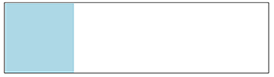
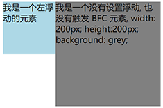
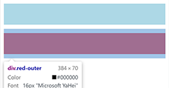

[块格式化上下文_MDN](https://developer.mozilla.org/zh-CN/docs/Web/Guide/CSS/Block_formatting_context)  
[浅析 BFC 及其作用](https://blog.csdn.net/riddle1981/article/details/52126522)  
[10 分钟理解 BFC 原理](https://zhuanlan.zhihu.com/p/25321647)

块格式化上下文（Block Formatting Context，BFC）是页面中的一块渲染区域，有一套渲染规则，决定了子元素如何布局，以及和其他元素的关系和相互作⽤。

创建BFC：

- 根元素：\<html>；
- 浮动元素：float 不是 none；
- 绝对定位元素：position 为 absolute 或 fixed；
- display 值为：inline-block、flex、table-cell、table-caption等；
- overflow 值为：hidden、auto、scroll，不为 visible。

BFC的特点：

- BFC在垂直方向上，自上而下排列，和文档流的排列方式一致；
- BFC是独立的容器，容器内部元素不会影响外部元素；
- BFC内部，上下相邻的两个容器的margin会重叠；
- 计算BFC的高度时，需要计算浮动元素的高度
- BFC区域不会与浮动的容器发生重叠
- 每个元素的左margin值和容器的左border相接触

BFC的应用：

**清除浮动，解决高度塌陷的问题**
```html
<div style="border: 1px solid #000; overflow: hidden;">
	<div style="width: 100px; height: 100px; background: grey; float: left;"></div>
</div>
```
    

**解决元素被浮动元素覆盖；创建左边固定、右边自适应布局**
```html
<div style="height: 100px; width: 100px; float: left; background: lightblue;">我是一个左浮动的元素</div>
<div style="width: 200px; height: 200px; background: grey; overflow: hidden;">我是一个没有设置浮动, 也没有触发 BFC 元素, width: 200px; height:200px; background: grey;</div>
```
    

**阻止外边距塌陷**
```html
<div class="blue"></div>
<div class="red-outer">
  <div class="red-inner"></div>
</div>
```
```css
.blue, .red-inner{
    height: 50px;
    margin: 10px 0;
}
.blue {
    background: lightblue;
}
.red-inner {
    background: red;
}
.red-outer {
    overflow: hidden;
}
```
  
