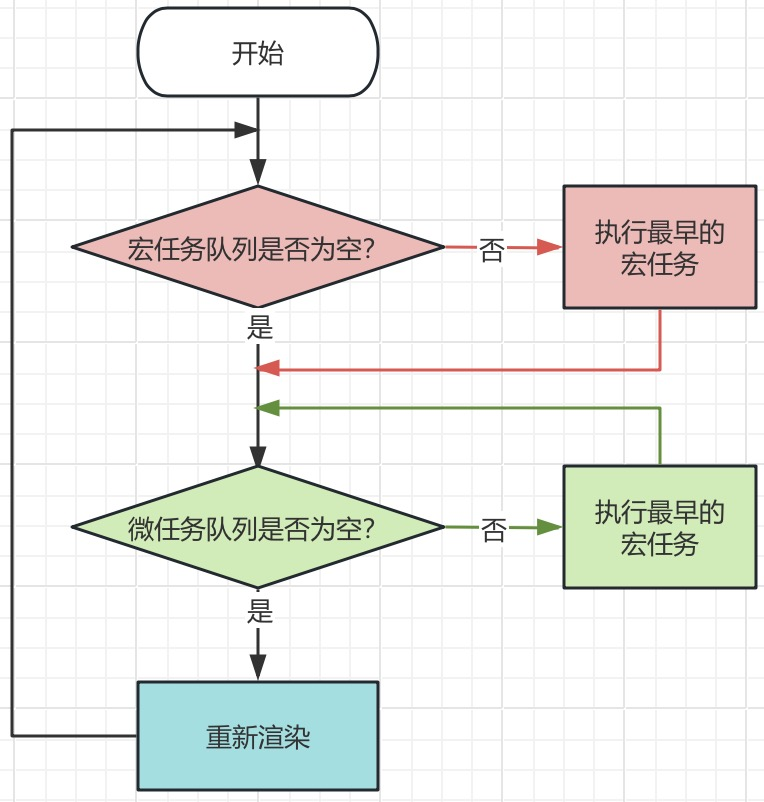

## 1. 事件循环机制

[从 event loop 规范探究 javaScript 异步及浏览器更新渲染时机](https://github.com/aooy/blog/issues/5)

JavaScript 是单线程，一些高耗时操作会带来线程阻塞问题。为了解决这个问题，JavaScript 有两种任务的执行模式：同步模式和异步模式。

**宏任务和微任务：** 异步任务分为`宏任务`与`微任务`两种，`宏任务`是由宿主（浏览器、Node）发起的，而`微任务`由 JavaScript 自身发起。

| 宏任务                          | 微任务                         |
| ------------------------------- | ------------------------------ |
| setTimeout                      | Promise.[ then/catch/finally ] |
| setInterval                     | MutationObserver（浏览器）     |
| setImmediate（Node）            | process.nextTick （Node）      |
| I/O                             | Object.observe                 |
| DOM 渲染、DOM 事件（浏览器）    | queueMicrotask                 |
| script 整体代码                 |                                |
| requestAnimationFrame（浏览器） |                                |
| 网络请求、webSocket             |                                |

**任务队列：** 事件循环通过`宏任务队列`和`微任务队列`来保存宏任务和微任务。任务队列符合`先进先出`的特点，即添加任务时，添加至队列尾部，取出任务时，从队列头部取。

**事件循环机制：**

1. 一段代码执行时，会先执行宏任务中的同步代码；
2. 如果执行中遇到宏任务，且宏任务已经到了执行时间，就把这个宏任务推入`宏任务队列`中；
3. 如果执行中遇到微任务，就把微任务推入到`当前宏任务的微任务队列`中;
4. 在本轮宏任务的同步代码执行完成后，依次执行所有的微任务（此时可能产生新的微任务），直到微任务队列清空；
5. 执行一些必要的渲染和绘制操作；
6. 进入下一个循环，执行下一个宏任务。




**为什么要设计宏任务和微任务两个队列：** 宏任务难以满足对时间精度要求较高的任务，很难控制任务开始执行的时间。为每个宏任务增加了微任务队列后，微任务既不会影响当前宏任务的执行效率，也解决了实时性问题，在当前宏任务主要功能执行结束后去执行对应的微任务。

## 2. requestAnimationFrame

使用 setTimeout 设置的回调任务实时性并不是太好，所以很多场景并不适合使用 setTimeout。比如你要使用 JavaScript 来实现动画效果，函数 requestAnimationFrame 就是个很好的选择。

```javascript
var reqId = requestAnimationFrame(func);
cancelAnimationFrame(reqId);
```

requestAnimationFrame 只有一个参数，即回调函数，间隔时间由显示器的刷新频率控制，通常 1s 刷新 60 次。

requestAnimationFrame 属于宏任务，但是，它和那些平行级别的那些宏任务执行顺序是不确定的。

```javascript
setTimeout(() => {
  console.log(1);
});
requestAnimationFrame(() => {
  console.log(2);
});
setTimeout(() => {
  console.log(4);
});
Promise.resolve(3).then((res) => {
  console.log(res);
});
// 3 2 1 4
// 3 1 2 4
// 先输出 3 是肯定的，因为是放在微任务里，1 肯定在 4 前面，因为都是宏任务那就按照一般顺序，但是 2 怎么判断位置。
```

## 3. setTimeout、setInterval、requestAnimationFrame 的区别

- 引擎层面
  - setTimeout 属于 JS 引擎 ，存在事件轮询
  - requestAnimationFrame 属于 GUI 引擎
  - JS 引擎与 GUI 引擎是互斥的，也就是说 GUI 引擎在渲染时会阻塞 JS 引擎的计算，因为如果在 GUI 渲染的时候，JS 同时又改变了 dom，那么就会造成页面渲染不同步
- 性能层面
  - 当页面被隐藏或最小化时，定时器 setTimeout 仍会在后台执行动画任务
  - 当页面处于未激活的状态下，该页面的屏幕刷新任务会被系统暂停，requestAnimationFrame 也会停止
