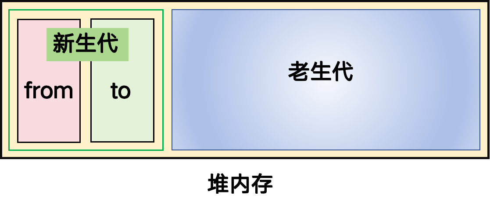
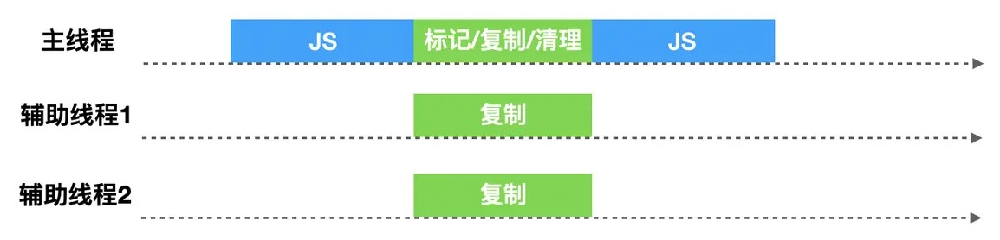
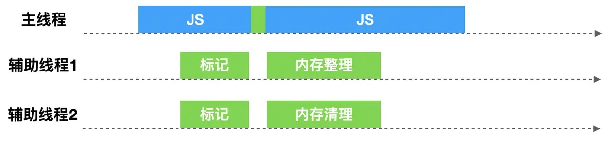

[MDN 内存管理](https://developer.mozilla.org/zh-CN/docs/Web/JavaScript/Memory_management)

[你真的了解垃圾回收机制吗](https://juejin.cn/post/6981588276356317214)

## 1. 内存管理和垃圾回收

不管什么程序语言，内存生命周期基本是一致的：

- 分配你所需要的内存；
- 使用分配的内存（读、写）；
- 不需要时释放内存。

在 JavaScript 中，通过自动内存管理实现内存分配和闲置资源回收。当我们创建变量（对象，字符串等）时，系统会自动给对象分配对应的内存。每隔一定时间，当系统发现变量不再使用时，会自动释放变量的内存。

垃圾回收（Garbage Collection，简称 GC）即确定哪个变量不会再使用，然后释放它占用的内存。

## 2. 垃圾回收标记策略

垃圾回收标记策略指跟踪记录哪个变量还会使用，哪个变量不再使用。

浏览器发展史上，用过两种标记策略：引用计数和标记清理。

### 2.1 引用计数

引用计数策略是指，如果一个对象没有引用指向它（0 引用），该对象将会被垃圾回收机制回收。

```javascript
var o = {
  a: {
    b: 2,
  },
};
// 两个对象被创建，一个作为另一个的属性被引用，另一个被分配给变量 o
// 很显然，没有一个可以被垃圾收集

var o2 = o; // o2 变量是第二个对“这个对象”的引用

o = 1; // 现在，“这个对象”只有一个 o2 变量的引用了，“这个对象”的原始引用 o 已经没有

var oa = o2.a; // 引用“这个对象”的 a 属性
// 现在，“这个对象”有两个引用了，一个是 o2，一个是 oa

o2 = "yo"; // 虽然最初的对象现在已经是零引用了，可以被垃圾回收了
// 但是它的属性 a 的对象还在被 oa 引用，所以还不能回收

oa = null; // a 属性的那个对象现在也是零引用了
// 它可以被垃圾回收了
```

- 优点
  - 当引用值的引用次数为 0 时，可以立即回收垃圾
  - 只需要在引用和失去引用时计数，不需要遍历堆里的所有活动对象和非活动对象
- 缺点
  - 引用计数需要一个计数器，计数器需要占很大的位置，因为引用数量的上限是不确定的
  - 循环引用无法回收，这也是最严重的

循环引用

```javascript
var o = {};
var o2 = {};
o.a = o2; // o 引用 o2
o2.a = o; // o2 引用 o
```

### 2.2 标记-清理

标记-清理算法是指，一个对象不可达时，表明该对象不再需要，可以进行垃圾回收。

标记-清理算法执行过程：

- 1. 标记阶段

  - 垃圾收集器在运行时会给内存中的所有变量都加上一个标记，假设内存中所有对象都是垃圾，全标记为 0
  - 然后从各个根对象（全局 window 对象、文档 DOM 树）开始深度遍历，找所有从根开始引用的对象，然后找这些对象引用的对象……把不是垃圾的节点改成 1

- 2. 清理阶段
  - 清理所有标记为 0 的非活动对象，销毁并回收它们所占用的内存空间
- 3. 整理磁盘（避免内存碎片化）
- 4. 最后，把所有内存中对象标记修改为 0，等待下一轮垃圾回收

优点：打标记很简单，一位二进制位就可以表示；解决了循环引用问题

2012 年起，所有现代浏览器都使用了标记-清理垃圾回收算法，只是各大浏览器厂商还对此算法进行了优化加工，且不同浏览器的 JavaScript 引擎 在运行垃圾回收的频率上有所差异。

## 3. V8 引擎的垃圾回收策略

V8 内存：

- 64 位下是 1.4G
- 32 位下 700MB
- 但是根据浏览器不同，有些许扩容；Node 情况下会有一些 C++内存扩容

为什么 V8 设计 1.4G 内存？

- 1.4G 对于浏览器脚本来说够用
- 回收的时候是阻塞式的，也就是进行垃圾回收的时候会中断代码的执行。

</img>

V8 将堆内存分为新生代和老生代两区域，采用不同的策略进行垃圾回收。

- 新生代的对象为存活时间较短的对象，即新产生的对象，通常只支持 1 ～ 8M 的容量；
- 老生代的对象为存活事件较长的对象，经历过一次垃圾回收还存活下来的对象，老生代占据了几乎所有内存，64 位下大概是 1.4G。

### 3.1 新生代垃圾回收

新生代的回收算法，可以简述为`复制-清空`。新生代将一个内存空间分为 from 空间和 to 空间两部分。

- 将 from 空间里的活动对象复制到 to 空间
- 然后释放掉整个 from 空间
- 然后对调 from 和 to。

这样可以提升回收速度，牺牲空间换时间。

### 3.2 老生代垃圾回收

新生代会转为老生代对象：

- 当一个对象经过多次复制后依然存活，它将会被认为是生命周期较长的对象，会被移动到老生代中;
- 如果复制一个对象到空闲区时，空闲区空间占用超过了 25%，那么这个对象会被直接晋升到老生代空间中。因为如果某个对象内存占比过大，将会影响后续内存分配。

因为老生代中的对象通常比较大，复制会非常耗时，从而导致回收执行效率不高，所以老生代垃圾回收老生代采用`标记清除整理`算法。

### 3.3 全停顿

全停顿（Stop-The-World）：JavaScript 是一门单线程语言，运行在主线程上，在进行垃圾回收时会阻塞 JavaScript 脚本的执行，需等待垃圾回收完毕后再恢复脚本执行，我们把这种行为叫做全停顿。

### 3.4 并行回收

V8 在新生代垃圾回收中，使用`并行（parallel）`机制。在整理排序阶段，也就是将活动对象从 from 复制到 to 时，启用多个辅助线程，并行的进行整理。

</img>

为了解决多个线程可能会复制同一个活动对象的问题，V8 会保存活动对象复制后的地址，便于其它协助线程找到该活动对象后可以判断该活动对象是否已被复制。

### 3.5 并发标记/清理/整理

主线程在开始执行 JavaScript 代码时，辅助线程可以同时执行标记/清理/整理操作。

V8 在老生代垃圾回收中，如果堆中的内存大小超过某个阈值之后，会启用`并发（Concurrent）标记`任务。

当堆中的某个对象指针指向了新对象，`写入屏障（write barriers）`技术会在辅助线程在进行并发标记的时候进行追踪。

当并发标记完成或者动态分配的内存到达极限的时候，主线程会执行最终的快速标记步骤，此时主线程会挂起，会再一次的扫描根集以确保所有的对象都完成了标记，由于辅助线程已经标记过活动对象，主线程的本次扫描只是进行 check 操作。

确认完成之后，辅助线程分别进行`清理内存`操作和`整理内存`操作。

</img>

## 4. 内存泄漏

内存泄漏（Memory Leak）是指程序中已动态分配的堆内存由于某种原因程序未释放或无法释放，造成系统内存的浪费，导致程序运行速度减慢甚至系统崩溃等严重后果。

### 4.1 检测内存

浏览器端：window.performance.memory

- 单位是 bit，/1024/1024 转化为 mb

```typescript
window.performance.memory: MemoryInfo={
  jsHeapSizeLimit: 4294705152,
  totalJSHeapSize: 10025814,
  usedJSHeapSize: 8397106
}
```

Node.js：process.memoryUsage()

- rss：C++内存加 V8 内存
- heapTotal：V8 引擎总内存
- heapUsed：V8 引擎使用内存
- external：C++分配给 V8 引擎的额外内存

```javascript
function testMemory() {
  var memory = process.memoryUsage().heapUsed;
  console.log(memory / 1024 / 1024 + "mb");
}
```

Node.js 可以手动触发垃圾回收 `global.gc`

Node.js 可以设置内存大小

```shell
node --max-old-space-size=1700 test.js
node --max-new-space-size=1024 test.js
```

- max-old-space-size 表示设置老生代内存空间的最大容量，老生代可设置的最大内存空间约为 1.7G
- max-new-space-size 表示设置新生代内存空间的最大容量。新生代可设置的最大内存空间约为 1.0G。

### 4.2 内存泄漏的场景

[一文带你了解如何排查内存泄漏导致的页面卡顿现象](https://juejin.cn/post/6947841638118998029)

#### 1) 全局变量使用不当

全局变量没有及时回收（手动赋值 null），或者未声明变量变为全局变量等

```javascript
function fn() {
  // 'use strict'; 加严格模式可以避免这种情况
  name = new Array(100000);
}
fn();
```

#### 2) 定时器未清除

```javascript
export default {
  mounted() {
    this.timer = setInterval(() => { ... }, 2000);
  },
  beforeDestroy() {
    clearInterval(this.timer);
  }
}
```
