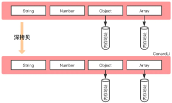

[如何写出一个惊艳面试官的深拷贝?](https://juejin.cn/post/6844903929705136141)  
[JS 从零手写一个深拷贝](https://www.cnblogs.com/echolun/p/16157161.html)  

# 1、浅拷贝
浅拷贝一个对象时，如果属性是基本类型，拷贝的就是基本类型的值，如果属性是引用类型，拷贝的就是内存地址，所以如果原对象或拷贝后的对象改变了引用类型的值，就会影响到另一个对象。  


## 1) object.assign()
它不会拷贝对象的继承属性，不会拷贝对象的不可枚举的属性；
可以拷贝 Symbol 类型的属性。

```javascript
const cloneObj = Object.assign({}, obj);
```

```javascript
let obj1 = { a: { b: 1 }, [Symbol(1)]: 1 };
Object.defineProperty(obj1, 'innumerable', {
    value: '不可枚举属性',
    enumerable: false
});

let obj2 = Object.assign({}, obj1)
obj1.a.b = 2;
console.log(obj1); // {a: {b: 2}, innumerable: '不可枚举属性', Symbol(1): 1}
console.log(obj2); // {a: {b: 2}, Symbol(1): 1}
```

Object.assign() 方法只能拷贝源对象的可枚举的自身属性，同时拷贝时无法拷贝属性的特性们，而且访问器属性会被转换成数据属性，也无法拷贝源对象的原型，该方法配合 Object.create() 方法可以实现上面说的这些。
```javascript
Object.create(
    Object.getPrototypeOf(obj),
    Object.getOwnPropertyDescriptors(obj)
);
```

## 2) 对象和数组的扩展运算符
对象的扩展运算符等同于使用Object.assign()方法。

```javascript
let cloneObj = { ...obj }
let cloneArr = [ ...arr ];
```

## 3) 数组的 slice() 和 concat()
```javascript
arr.slice(0)
[].concat(arr)
```

## 4) Array.from()
```javascript
Array.from(arr)
```

# 2、深拷贝
深拷贝将一个对象从内存中完整的拷贝一份出来，从堆内存中开辟一个新的区域存放新对象，且修改新对象不会影响原对象。这两个对象是相互独立、不受影响的，彻底实现了内存上的分离。  



## 1) JSON.parse(JSON.stringify())
这种写法非常简单，而且可以应对大部分的应用场景，但是它还是有很大缺陷的，比如拷贝其他引用类型、循环引用等情况。

- 拷贝的对象的值中如果有函数、undefined、symbol 这几种类型，经过 JSON.stringify 序列化之后的字符串中这个键值对会消失；
- 拷贝 Date 引用类型会变成字符串；
- 拷贝 RegExp 引用类型会变成空对象；
- 对象中含有 NaN、Infinity 以及 -Infinity，会变成 null；
- 无法拷贝不可枚举的属性；
- 无法拷贝对象的原型链；
- 无法拷贝对象的循环应用，即对象成环 (obj[key] = obj)，成环时JSON.stringify()会报错。

```javascript
function Obj() {
    this.obj = { a: 1 };
    this.arr = [1, 2, 3];
    this.func = function() { alert(1) }; // 丢失
    this.und = undefined; // 丢失
    this.sym = Symbol(1); // 丢失
    this.date = new Date(0); // 变成字符串
    this.reg = /123/; // 变成空对象
    this.NaN = NaN; // 变成null
    this.infinity = Infinity; // 变成null
}
Obj.prototype.protoVal = [11, 22, 33]; // 丢失
let obj1 = new Obj();
Object.defineProperty(obj1, 'innumerable', { // 丢失
    enumerable: false,
    value: 'innumerable'
});
// obj1.self=obj1; 成环时JSON.stringify()会报错
console.log('obj1', obj1);

let str = JSON.stringify(obj1);
let obj2 = JSON.parse(str);
console.log('obj2', obj2);
/*
obj: {a: 1},
arr: [1, 2, 3],
date: "1970-01-01T00:00:00.000Z",
reg: {},
NaN: null,
infinity: null,
[[Prototype]]: Object
*/
```

## 2) 递归实现 -- 基础版
通过 for in 遍历对象的属性值，
如果是原始类型，无需继续拷贝，直接返回；
如果是引用类型，创建一个新的对象，遍历需要克隆的对象，将需要克隆对象的属性执行深拷贝后依次添加到新对象上。

- 支持判断空对象null
- 兼容普通对象和数组

```javascript
function isObject(obj) {
    return obj !== null && (typeof obj === "object" || typeof obj === "function");
}

function deepClone(obj) {
    if (!isObject(obj)) { // 如果不是对象直接返回
        return obj;
    }

    const newObj = Array.isArray(obj) ? [] : {}; // 如果是对象，确定是对象还是数组
    for (const key in obj) {
        newObj[key] = deepClone(obj[key]); // 递归
    }
    return newObj;
}
```
虽然利用递归能实现一个深拷贝，但还是有一些问题没有完全解决，例如：

- 不能复制不可枚举的属性以及 Symbol 类型；
- 对于 Array、Date、RegExp、Error、Function 这样的引用类型并不能正确地拷贝；
- 对象的属性里面成环，即循环引用没有解决。

## 3) 递归实现1

- 使用 Reflect.ownKeys 方法遍历对象的不可枚举属性以及 Symbol 类型；
- 当参数为 Date、RegExp 类型，则直接生成一个新的实例返回；
- 利用 Object 的 getOwnPropertyDescriptors 方法可以获得对象的所有属性，以及对应的特性，顺便结合 Object 的 create 方法创建一个新对象，并继承传入原对象的原型链；
- 利用 WeakMap 类型作为 Hash 表，保存已拷贝的对象，如果存在循环，则引用直接返回 WeakMap 存储的值。

```javascript
const deepClone = function(obj, hash = new WeakMap()) {
    if (obj.constructor === Date)
        return new Date(obj) // 日期对象直接返回一个新的日期对象

    if (obj.constructor === RegExp)
        return new RegExp(obj) //正则对象直接返回一个新的正则对象

    //如果循环引用了就用 weakMap 来解决
    if (hash.has(obj)) return hash.get(obj)

    let cloneObj = Object.create(Object.getPrototypeOf(obj), Object.getOwnPropertyDescriptors(obj))

    hash.set(obj, cloneObj)

    for (let key of Reflect.ownKeys(obj)) {
        cloneObj[key] = (isObject(obj[key]) && typeof obj[key] !== 'function') ? deepClone(obj[key], hash) : obj[key]
    }

    return cloneObj
}
```

## 4) 递归实现2

### a. 解决对象的循环引用
解决循环引用问题，我们可以额外开辟一个存储空间（**WeakMap**结构），来存储当前对象和拷贝对象的对应关系，当需要拷贝当前对象时，先去存储空间中找，有没有拷贝过这个对象，如果有的话直接返回，如果没有的话继续拷贝，这样就巧妙化解的循环引用的问题。

```javascript
function deepClone(obj, map = new WeakMap()) {
    if (!isObject(obj)) {
        return obj;
    }

    if (map.has(obj)) { // 如果已经拷贝过，直接返回
        return map.get(obj);
    }

    const newObj = Array.isArray(obj) ? [] : {};

    map.set(obj, newObj); // 保存当前对象对应的拷贝后的对象

    for (const key in obj) {
        newObj[key] = deepClone(obj[key], map);
    }
    return newObj;
}
```

### b. 判断对象的具体类型
```javascript
const getObjectType = (obj) => {
    return Object.prototype.toString.call(obj);
}
```

```javascript
// 可遍历类型
const arrType = '[object Array]';
const objType = '[object Object]';
const mapType = '[object Map]';
const setType = '[object Set]';
const argType = '[object Arguments]';

// 不可遍历
const boolType = '[object Boolean]';
const numType = '[object Number]';
const strType = '[object String]';
const dateType = '[object Date]';
const errType = '[object Error]';
const regexpType = '[object Regexp]';
const symbolType = '[object Symbol]';
const funType = '[object Function]';
```

### c. 兼容其它可遍历的引用数据类型
```javascript
// 将可遍历类型做个集合
const traverseTypes = [arrType, objType, mapType, setType, argType];
```

### d. 兼容不可遍历的引用数据类型


```javascript
let obj = {
    num: 0,
    str: "",
    boolean: true,
    unf: undefined,
    nul: null,
    obj: { name: "我是一个对象", id: 1 },
    arr: [0, 1, 2],
    func: function () {
        console.log("我是一个函数");
    },
    date: new Date(0),
    reg: new RegExp("/我是一个正则/ig"),
    [Symbol("1")]: 1,
};
Object.defineProperty(obj, "innumerable", {
    enumerable: false,
    value: "不可枚举属性",
});
obj = Object.create(obj, Object.getOwnPropertyDescriptors(obj));
obj.loop = obj; // 设置loop成循环引用的属性

let cloneObj = deepClone(obj);
cloneObj.arr.push(4);

console.log("obj", obj);
console.log("cloneObj", cloneObj);
```
