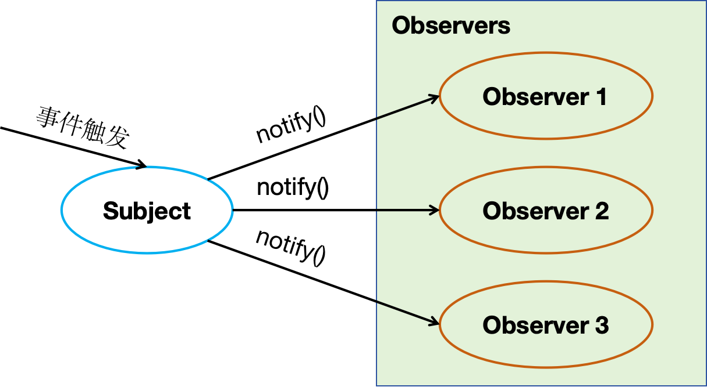

设计模式是从许多优秀的软件系统中，总结出的成功的、能够实现可维护性、复用的设计方案，使用这些方案将可以让我们避免做一些重复性的工作。

## 1. 单例模式

一个类只能构造出唯一实例。

先判断实例存在与否，如果存在则直接返回，如果不存在就创建了再返回，这就确保了一个类只有一个实例对象。

应用案例：弹框

```javascript
function Singleton(name) {
  this.name = name;
}

Singleton.prototype.getName = function () {
  console.log(this.name);
};

// 静态方法
Singleton.getInstance = function (name) {
  // this === Singleton
  if (!this.instance) {
    this.instance = new Singleton(name);
  }
  return this.instance;
};

let single1 = Singleton.getInstance("name1");
let single2 = Singleton.getInstance("name2");
console.log(single1 === single2); // true
single1.getName(); // name1
single2.getName(); // name1
```

## 2. 工厂模式

工厂模式是用来创建对象的一种最常用的设计模式。

不暴露创建对象的具体逻辑，而是将逻辑封装在一个函数中，这个函数就可以被视为一个工厂。

应用案例： jquery 中的 window.$

```javascript
class Car {
  constructor(name, color) {
    this.name = name;
    this.color = color;
  }
}
class Factory {
  static create(type) {
    switch (type) {
      case "car":
        return new Car("汽车", "白色");
        break;
      case "bicycle":
        return new Car("自行车", "黑色");
        break;
      default:
        console.log("没有该类型");
    }
  }
}
let p1 = Factory.create("car");
let p2 = Factory.create("bicycle");
console.log(p1, p1 instanceof Car); // {name: '汽车', color: '白色'} true
console.log(p2, p2 instanceof Car); // {name: '自行车', color: '黑色'} true
```

## 3. 策略模式

根据不同参数命中不同的策略。

如果一段代码包含多处 if 语句，并且违反了开放封闭原则，可以考虑策略模式，将算法的使用与算法的实现分离。

一个基于策略模式的程序至少由两部分组成：

- 策略类：封装具体的算法，并负责具体的计算过程
- 环境类：接受客户的请求，随后把请求委托给某一个策略类

应用案例：表单校验

```javascript
// 策略类：确定不变的内容，即策略规则对象
const strategies = {
  // 验证是否为空
  isNoEmpty: function (value, errorMsg) {
    if (value.trim() === "") {
      return errorMsg;
    }
  },
  // 验证最小长度
  minLength: function (value, length, errorMsg) {
    if (value.trim().length < length) {
      return errorMsg;
    }
  },
  // 验证手机号
  isMobile: function (value, errorMsg) {
    if (
      !/^(13[0-9]|14[5|7]|15[0|1|2|3|5|6|7|8|9]|17[7]|18[0|1|2|3|5|6|7|8|9])\d{8}$/.test(
        value
      )
    ) {
      return errorMsg;
    }
  },
};

// 环境类：找出变的地方，作为环境类context，负责接收用户的要求并委托给策略规则对象
class Validator {
  constructor() {
    this.cache = []; // 存储要验证的方法
    this.errList = []; // 存储最终的验证结果
  }
  add(value, rules) {
    for (let i = 0, rule; (rule = rules[i++]); ) {
      let strategyAry = rule.strategy.split(":");
      let errorMsg = rule.errorMsg;
      this.cache.push(() => {
        let strategy = strategyAry.shift();
        strategyAry.unshift(value);
        strategyAry.push(errorMsg);
        // 执行策略对象中的不同验证规则
        let error = strategies[strategy](...strategyAry);
        if (error) {
          this.errList.push(error);
        }
      });
    }
  }
  start() {
    for (let i = 0, validatorFunc; (validatorFunc = this.cache[i++]); ) {
      validatorFunc();
    }
    return this.errList;
  }
}

let validataFunc = function (info) {
  let validator = new Validator();
  validator.add(info.userName, [
    {
      strategy: "isNoEmpty",
      errorMsg: "用户名不可为空",
    },
    {
      strategy: "minLength:2",
      errorMsg: "用户名长度不能小于2位",
    },
  ]);
  validator.add(info.password, [
    {
      strategy: "minLength:6",
      errorMsg: "密码长度不能小于6位",
    },
  ]);
  validator.add(info.phoneNumber, [
    {
      strategy: "isMobile",
      errorMsg: "请输入正确的手机号码格式",
    },
  ]);
  return validator.start();
};

// 需要验证表单的对象
let userInfo = {
  userName: "王",
  password: "1234",
  phoneNumber: "666",
};
let errorMsg = validataFunc(userInfo);
console.log(errorMsg); // ['用户名长度不能小于2位', '密码长度不能小于6位', '请输入正确的手机号码格式']
```

## 4. 代理模式

代理模式是为一个对象提供一层代理，以便控制对它的访问。

应用案例：缓存代理、图片预加载、axios 中的拦截器

### 4.1 缓存代理

缓存代理可以为一些开销大的运算结果提供暂时的存储，在下次运算时，如果传递进来的参数跟之前一致，则可以直接返回前面存储的运算结果。

代理和本体接口是一致的，如果不需要代理对象，也可以选择直接请求本体。

```javascript
// 求乘积
var mult = function () {
  console.log("开始计算乘积");
  var res = 1;
  for (var i = 0, l = arguments.length; i < l; i++) {
    res = res * arguments[i];
  }
  return res;
};

// 缓存代理
var proxyMult = (function () {
  var cache = {};
  return function () {
    // 以参数作为 key，把计算结果保存下来
    var args = Array.prototype.join.call(arguments, ",");
    if (args in cache) {
      return cache[args];
    }
    return (cache[args] = mult.apply(this, arguments));
  };
})();

console.log(proxyMult(1, 2, 3, 4));
console.log(proxyMult(1, 2, 3, 4));
// 开始计算乘积
24;
24;
```

### 4.2 虚拟代理

虚拟代理把一些开销很大的对象，延迟到真正需要它的时候才去创建。

常见的就是图片预加载功能：

```javascript
// 图片本地对象，负责往页面中创建一个img标签，并且提供一个对外的setSrc接口
let myImage = (function () {
  let imgNode = document.createElement("img");
  document.body.appendChild(imgNode);

  return {
    //setSrc接口，外界调用这个接口，便可以给该img标签设置src属性
    setSrc: function (src) {
      imgNode.src = src;
    },
  };
})();
// 代理对象，负责图片预加载功能
let proxyImage = (function () {
  // 创建一个Image对象，用于加载需要设置的图片
  let img = new Image();
  img.onload = function () {
    // 监听到图片加载完成后，给被代理的图片本地对象设置src为加载完成后的图片
    myImage.setSrc(this.src);
  };
  return {
    setSrc: function (src) {
      // 设置图片时，在图片未被真正加载好时，以这张图作为loading，提示用户图片正在加载
      myImage.setSrc(
        "https://img.zcool.cn/community/01deed576019060000018c1bd2352d.gif"
      );
      img.src = src;
    },
  };
})();

proxyImage.setSrc("https://xxx.jpg");
```

## 5. 装饰者模式

在不改变对象自身的基础上，动态地给某个对象添加一些额外的职责

应用案例：在函数执行前后添加新的方法

```javascript
function fuc() {
  console.log(2);
}
Function.prototype.before = function (beFn) {
  let self = this;
  return function () {
    beFn.apply(this, arguments); // 先执行插入到前面的方法，类似于二叉树的前序遍历
    return self.apply(this, arguments); // 后执行当前的方法
  };
};
Function.prototype.after = function (afFn) {
  let self = this;
  return function () {
    self.apply(this, arguments); // 先执行当前的方法
    return afFn.apply(this, arguments); // 后执行插入到后面的方法
  };
};

function fuc1() {
  console.log(1);
}
function fuc3() {
  console.log(3);
}
function fuc4() {
  console.log(4);
}

fuc = fuc.before(fuc1).before(fuc4).after(fuc3);
fuc();
// 4 1 2 3
```

## 6. 组合模式

- 组合模式在对象间形成树形结构。
- 组合模式中基本对象和组合对象被一致对待。
- 无须关心对象有多少层, 调用时只需在根部进行调用。

应用案例： 打印文件目录

```javascript
class Combine {
  constructor() {
    this.list = [];
  }
  add(fn) {
    this.list.push(fn);
    return this; // 链式调用
  }
  excute() {
    for (let i = 0; i < this.list.length; i++) {
      this.list[i].excute();
    }
  }
}
let comb1 = new Combine();
comb1
  .add({
    excute() {
      console.log(1);
    },
  })
  .add({
    excute() {
      console.log(2);
    },
  });

let comb2 = new Combine();
comb2
  .add({
    excute() {
      console.log(3);
    },
  })
  .add({
    excute() {
      console.log(4);
    },
  });

let comb3 = new Combine();
comb3
  .add({
    excute() {
      console.log(5);
    },
  })
  .add({
    excute() {
      console.log(6);
    },
  });
comb2.add(comb3);

let comb4 = new Combine();
comb4.add(comb1).add(comb2);
comb4.excute();

// 1 2 3 4 5 6
```

## 7. 访问者模式

在不改变该对象的前提下访问其结构中元素的新方法

应用案例：babel 插件

```javascript
// 元素类
class Student {
  constructor(name, chinese, math, english) {
    this.name = name;
    this.chinese = chinese;
    this.math = math;
    this.english = english;
  }

  accept(visitor) {
    visitor.visit(this);
  }
}

// 访问者类
class ChineseTeacher {
  visit(student) {
    console.log(`语文${student.chinese}`);
  }
}

class MathTeacher {
  visit(student) {
    console.log(`数学${student.math}`);
  }
}

class EnglishTeacher {
  visit(student) {
    console.log(`英语${student.english}`);
  }
}

// 实例化元素类
const student = new Student("张三", 90, 80, 60);
// 实例化访问者类
const chineseTeacher = new ChineseTeacher();
const mathTeacher = new MathTeacher();
const englishTeacher = new EnglishTeacher();
// 接受访问
student.accept(chineseTeacher); // 语文90
student.accept(mathTeacher); // 数学80
student.accept(englishTeacher); // 英语60
```

## 8. 观察者模式

观察者模式定义了对象间的一种一对多的依赖关系，当一个对象的状态发生改变时，所有依赖于它的对象都将得到通知，并自动更新。



- 观察者 Observer：实现 update 方法，供目标对象调用。
- 目标对象 Subject：
  - 维护观察者列表 observerList；
  - addObserver，添加观察者的方法，即给观察者提供订阅功能
  - notifyObservers，当自身发生变化后，调用该方法依次通知每个观察者执行 update 方法，即通知订阅的观察者

```javascript
class Observer {
  constructor(name) {
    this.name = name;
  }

  update() {
    console.log("更新" + this.name);
  }
}

class Subject {
  constructor() {
    this.observerList = [];
  }

  // 添加观察者
  addObserver(observer) {
    this.observerList.push(observer);
  }

  // 通知每个观察者
  notifyObservers() {
    this.observerList.forEach((observer) => {
      observer.update();
    });
  }
}

const subject = new Subject();
const observer1 = new Observer("观察者1");
const observer2 = new Observer("观察者2");

subject.addObserver(observer1);
subject.addObserver(observer2);

subject.notifyObservers();
// 更新观察者1
// 更新观察者2
```

## 9. 发布订阅模式

基于一个消息中心，订阅者订阅某类型的相关主题，发布者发布主题事件，通知各个订阅该主题的订阅者。

发布者和订阅者通过事件通道进行关联，发布者的发布动作和订阅者的订阅动作相互独立，无需关注对方，消息派发由发布订阅中心负责。

- 发布者 Publisher
- 订阅者 Subscriber
- 事件通道 Event Channel、PubSub
  - events 对象，维护任务类型，以及每种任务下的订阅情况
  - subscribe，给订阅者提供订阅功能
  - publish，发布者发布任务后，中介会给所有的订阅者发布任务

应用案例：EventBus

```javascript
class PubSub {
  constructor() {
    // 事件中心，每种事件下存放其订阅者的回调函数
    // type1: [回调函数1，...], type2: [回调函数1，...], ...
    this.events = {};
  }

  // 订阅方法
  subscribe(type, fn) {
    if (!this.events[type]) {
      this.events[type] = [];
    }
    this.events[type].push(fn);
  }

  // 发布方法
  publish(type, ...args) {
    if (this.events[type]) {
      this.events[type].forEach((fn) => fn(...args));
    }
  }

  // 取消订阅方法
  unsubscribe(type, fn) {
    if (this.events[type]) {
      const fnIndex = this.events[type].findIndex((e) => e === fn);
      if (fnIndex != -1) {
        this.events[type].splice(fnIndex, 1);
      }
    }
    if (this.events[type].length === 0) {
      delete this.events[type];
    }
  }
  unsubscribeAll(type) {
    if (this.events[type]) {
      delete this.events[type];
    }
  }
}

let pubSub = new PubSub();

pubSub.subscribe("task1", function (name) {
  console.log("订阅任务1-1：" + name);
});
function task1(name) {
  console.log("订阅任务1-2：" + name);
}
pubSub.subscribe("task1", task1);

pubSub.subscribe("task2", function (name) {
  console.log("订阅任务2：" + name);
});

pubSub.publish("task1", "yc");
// 订阅任务1-1：yc
// 订阅任务1-2：yc
pubSub.publish("task2", "fb");
// 订阅任务2：fb

pubSub.unsubscribe("task1", task1);
pubSub.publish("task1", "yc");
// 订阅任务1-1：yc
```

## 10. 观察者模式和发布订阅模式的区别

观察者模式：

- 目标对象有一系列依赖于它的观察者
- 观察者模式大多数时候是同步的，比如当事件触发，Subject 就会去调用观察者的方法

发布订阅模式：

- 发布者和订阅者不知道对方的存在，只有通过消息代理进行通信
- 发布-订阅模式大多数时候是异步的（使用消息队列）


