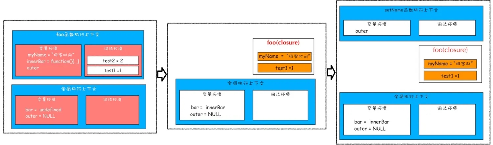

[MDN 闭包](https://developer.mozilla.org/zh-CN/docs/Web/JavaScript/Closures)

举个例子：

```javascript
function foo() {
  var myName = "极客时间";
  let test1 = 1;
  const test2 = 2;
  var innerBar = {
    getName: function () {
      console.log(test1);
      return myName;
    },
    setName: function (newName) {
      myName = newName;
    },
  };
  return innerBar;
}

var bar = foo();
bar.setName("极客邦");
console.log(bar.getName());
// 1
// 极客邦
```

1. 执行到 foo 函数内部的 return innerBar 这行代码时调用栈的情况；
2. foo 函数执行完成之后，其执行上下文从栈顶弹出了，但是由于返回的 setName 和 getName 方法中使用了 foo 函数内部的变量 myName 和 test1，所以这两个变量依然保存在内存中。无论在哪里调用了 setName 和 getName 方法，它们都会背着这个 foo 函数的专属背包，称为 foo 函数的闭包。
3. 当执行到 bar.setName 方法中的 myName = "极客邦" 这句代码时，JavaScript 引擎会沿着“当前执行上下文–> foo 函数闭包–> 全局执行上下文”的顺序来查找 myName 变量。



## 1. 闭包的产生和定义

要理解闭包，先理解[词法作用域和作用域链](./执行上下文和作用域.md)。JavaScript 使用词法作用域，这意味着函数执行时使用的是定义函数所在的变量作用域。为此，函数内部必须包含对函数定义所在作用域的引用。

闭包（closure）是一个函数定义所在的外部函数的变量的组合，让内部函数总是可以访问外部函数的变量。

在 JavaScript 中，闭包会随着函数的创建而被同时创建。

1. 外部函数包含内部函数，将产生一个闭包。

```javascript
function init() {
  var name = "Mozilla"; // name 是一个被 init 创建的局部变量
  function displayName() {
    alert(name); // 使用了父函数中声明的变量，将产生一个闭包
  }
  displayName();
}
init();
```

下图分别执行到 var name = "Mozilla"; 执行到 displayName(); 执行到 alert(name);


2. 定义函数与调用函数的作用域不同时，会产生闭包。

- 返回一个函数，会产生闭包。
- 在定时器、事件监听、Ajax 请求、Web Workers 或者任何异步中，只要使用了回调函数，就会产生闭包。

当一个函数（外部函数）的返回值是另一个函数（内部函数）时，即使外部函数已经执行结束了，但是内部函数引用外部函数的变量依然保存在内存中，内部函数仍然可以调用这些变量，我们把这些变量的集合称为闭包。

```javascript
// 和上图调用栈相同
function makeFunc() {
  var name = "Mozilla";
  function displayName() {
    alert(name);
  }
  return displayName;
}

var myFunc = makeFunc();
myFunc();
```

## 2. 闭包的应用

[闭包的 6 种应用场景](https://juejin.cn/post/7264183910597279799?searchId=2024070819041866A6DEB24EF792141D29)

### 2.1 异步操作使用闭包

在定时器、事件监听、Ajax 请求、Web Workers 或者任何异步中，使用闭包。

### 2.2 使用闭包实现私有属性和方法

节流、防抖、函数柯里化等。

### 2.3 循环中的闭包

var 声明的变量会被提升至 foo 函数的顶部，回调函数进入事件队列；循环结束，主线程出现空闲时间时，事件队列执行回调函数打印 i，此时 i 已经变为 3，打印三次 3。

```javascript
function foo() {
  for (var i = 0; i < 3; i++) {
    setTimeout(() => {
      console.log(i);
    });
  }
}
foo();
```

for 循环体中变量 i 使用 let 声明，每次 for 循环时，都会创建一个块级作用域，产生不同的执行上下文，各个上下文单独管理自己的变量；打印 i 变量时，变量 i 从三个不同互不影响的闭包中获取。

```javascript
function foo() {
  for (let i = 0; i < 3; i++) {
    setTimeout(() => {
      console.log(i);
    });
  }
}
foo();
```

### 2.4 创建新对象或类时，方法通常应关联于对象的原型

```javascript
function MyObject(name, message) {
  this.name = name.toString();
  this.message = message.toString();

  // 如果方法定义到对象的构造器中，将导致每次构造器被调用时，方法都会被重新赋值一次。
  // 会产生闭包
  // this.getName = function() {
  // return this.name;
  // };
}
MyObject.prototype.getName = function () {
  return this.name;
};
```
