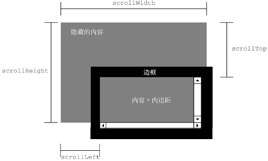
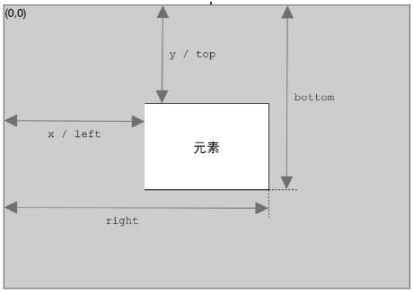

## 1. 元素尺寸

### 1.1 偏移尺寸 offset

偏移尺寸 offset 包含元素在屏幕上占用的所有视觉空间，包括宽高、内边距、滚动条和边框，但不包含外边距。

- offsetWidth：元素在水平方向上占用的像素尺寸，包括它的宽度、垂直滚动条宽度（如果可见）和左、右边框的宽度。
- offsetHeight：元素在垂直方向上占用的像素尺寸，包括它的高度、水平滚动条高度（如果可见）和上、下边框的高度。
- offsetLeft：元素左边框外侧距离包含元素左边框内侧的像素数。
- offsetTop：元素上边框外侧距离包含元素上边框内侧的像素数。


### 1.2 客户端尺寸 client

客户端尺寸 client 包含元素内容及其内边距所占用的空间，不包含滚动条占用的空间。

- clientWidth：内容区宽度加左、右内边距宽度。
- clientHeight：内容区高度加上、下内边距高度。


### 1.3 滚动尺寸 scroll

滚动尺寸 scroll 提供了元素内容滚动距离的信息。

有些元素，比如 `<html>` 无须任何代码就可以自动滚动，而其他元素则需要使用 CSS 的 overflow 属性令其滚动。

- scrollWidth：没有滚动条出现时，元素内容的总宽度。
- scrollHeight：没有滚动条出现时，元素内容的总高度。
- scrollLeft：内容区左侧隐藏的像素数，设置这个属性可以改变元素的滚动位置。
- scrollTop：内容区顶部隐藏的像素数，设置这个属性可以改变元素的滚动位置。



## 2. getBoundingClientRect()

浏览器在每个元素上都暴露了 getBoundingClientRect() 方法，返回一个 DOMRect 对象，包含 6 个属性：left、top、right、bottom、height 和 width。这些属性给出了元素在页面中相对于视口的位置。



```javascript
const isElementVisible = (el) => {
  const rect = el.getBoundingClientRect();
  const vWidth = window.innerWidth || document.documentElement.clientWidth;
  const vHeight = window.innerHeight || document.documentElement.clientHeight;

  if (rect.right < 0 || rect.bottom < 0 || rect.left > vWidth || rect.top > vHeight) {
    return false;
  }

  return true;
};
```


getBoundingClientRect 方法会使浏览器发生回流和重绘，性能消耗稍大，但兼容性比 Intersection Observer 要好。

## 3. IntersectionObserver

[Intersection_Observer_API](https://developer.mozilla.org/zh-CN/docs/Web/API/Intersection_Observer_API)

IntersectionObserver 接口提供了一种异步观察目标元素与其祖先元素或顶级文档视窗 (viewport) 交叉状态的方法。在目标元素与视口或者其他指定元素发生交集时和触发配置的回调函数。

```javascript
// 获取要监测的元素
const boxes = document.querySelectorAll(".box");

// 创建观察者，配置回调函数
// 通过 isIntersecting 属性判断元素与视口是否相交
const observer = new IntersectionObserver((entries, observer) => {
  entries.forEach((entry) => {
    console.log(entry.target, entry.isIntersecting ? "visible" : "invisible");
  });
});

boxes.forEach((box) => {
  observer.observe(box);
});
```

实现指令检查是否滚动到底部

```javascript
const intersect = {
  inserted(el, binding) {
    const value = binding.value;
    const { handler, options = {} } = value;

    const observer = new IntersectionObserver((entries = [], observer) => {
      if (!el._observe) return;

      if (handler && el._observe.init) {
        const isIntersecting = Boolean(entries.find((entry) => entry.isIntersecting));

        if (isIntersecting) {
          handler(entries, observer, isIntersecting);
        }
      }

      el._observe.init = true;
    }, options);

    el._observe = { init: false, observer };

    observer.observe(el);
  },
  unbind(el) {
    if (!el._observe) return;

    el._observe.observer.unobserve(el);
    delete el._observe;
  },
};

export default intersect;
```
