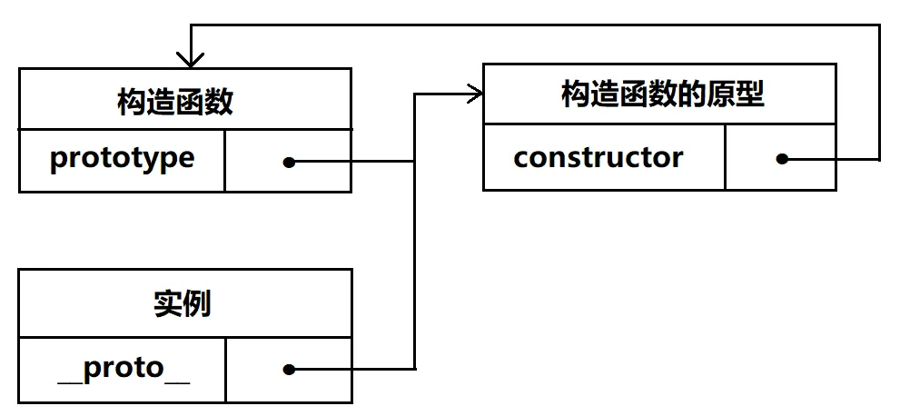
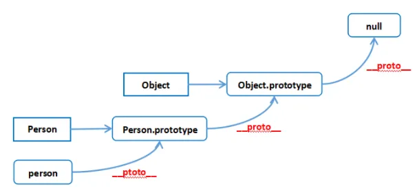
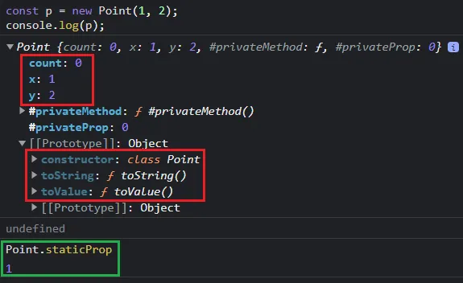

## 1. 原型

- `prototype`：每个构造函数都有一个原型对象 prototype
  - prototype 属性是一个指针，指向一个对象，该对象包含所有实例共享的属性和方法。
- `constructor`：原型对象都包含一个指向构造函数的指针 constructor
- `__proto__`：当调用构造函数创建一个新实例，该实例的内部将包含一个 \_\_proto\_\_ 属性，指向构造函数的原型对象
  - 所有的引用类型（数组、对象、函数）都有一个 \_\_proto\_\_ 属性



## 2. 使用构造函数创建对象

创建自定义类型最常见的方式，就是组合使用构造函数模式与原型模式。

- `构造函数模式`用于定义实例属性，而`原型模式`用于定义方法和共享的属性。
- 每个实例都会有自己的一份实例属性的副本，但同时又共享着对方法的引用，最大限度地节省了内存。

```javascript
// 构造函数模式，用于定义实例属性
function Person(name, age) {
  this.name = name;
  this.age = age;
  this.friends = ["Bob"];
}

// 原型模式，用于定义方法和共享属性
Person.prototype = {
  constructor: Person,
  sayName: function () {
    alert(this.name);
  },
};

// 定义静态方法，直接将该函数作为类函数的属性
Person.statciFunc = function () {
  console.log("我是静态方法，与实例无关");
};

var person1 = new Person("Tom", 29);
var person2 = new Person("Mary", 32);

person1.friends.push("Van");
alert(person1.friends); // "Bob,Van"
alert(person2.friends); // "Bob"
alert(person1.friends === person2.friends); // false
alert(person1.sayName === person2.sayName); // true
```

## 3. new 的实现原理

[MDN new](https://developer.mozilla.org/zh-CN/docs/Web/JavaScript/Reference/Operators/new)

new 操作符用于创建对象的实例。

new 关键字会进行如下的操作：

1. 创建一个空的 JavaScript 对象（即{}）；
2. 为空对象添加属性 \_\_proto\_\_，将该属性指向构造函数的原型对象；
3. 将空对象作为 this 的上下文；
4. 如果构造函数的返回值为对象，则返回构造函数的返回值，否则返回新对象。

如果你没有使用 new 运算符，构造函数会像其他的常规函数一样被调用，并不会创建一个对象。在这种情况下，this 的指向也是不一样的。

```javascript
function myNew(func, ...args) {
  // 创建空对象
  const obj = {};

  // 将空对象的属性__proto__指向构造函数原型
  obj.__proto__ = func.prototype;

  // 将空对象作为this上下文，执行构造函数
  const result = func.call(obj, ...args);

  // 如果构造函数的返回值为对象，则返回构造函数的返回值
  const isObject = typeof result === "object" && result !== null;
  const isFunction = typeof result === "function";
  if (isObject || isFunction) {
    return result;
  }

  // 如果构造函数没有返回对象，则返回新对象
  return obj;
}
```

```javascript
function Person(name, age) {
  this.name = name;
  this.age = age;
}

Person.prototype.sayHello = function () {
  console.log(this.name);
};

const xiaoming1 = new Person("xiaoming", 12);
console.log(xiaoming1);

const xiaoming2 = myNew(Person, "xiaoming", 12);
console.log(xiaoming2);
```

### 如何判断一个函数是通过 new 来调用

一个函数可以直接调用，也可以用 new 调用，如何设置只能通过 new 调用？

下图截取自 Vue 源码：

```javascript
function Vue() {
  if (!(this instanceof Vue)) {
    alert("Vue 是构造器，应该使用 new 操作符调用");
  }
}
```

- 假设 `const vue = new Vue();`
- 则 `vue.__proto__ === Vue.prototype`
- 因此 `vue instanceof Vue === true`
- 如果直接 Vue()，返回的是 Vue()的执行结果，没有原型链

## 4. 原型链

实例对象都有 \_\_proto\_\_ 属性，指向它的原型对象；原型对象也是对象，也有 \_\_proto\_\_ 属性，指向原型对象的原型对象，直到最顶层对象 Object 的原型 `Object.prototype.__proto__===null`，这样一层一层形成的链式结构，称为原型链。

当获取一个对象的某个属性时，如果这个对象本身没有这个属性，就会沿着原型链往上查找，直到 Object.prototype。



**原型与实例的关系可以通过两种方式来确定：**

1. instanceof 操作符：如果一个实例的原型链中出现过相应的构造函数，则 instanceof 返回 true；
2. isPrototypeOf() 方法：用于检查一个原型对象是否存在于另一个对象的原型链中，只要原型链中包含这个原型对象，这个方法就返回 true。

```javascript
function Person(name) {
  this.name = name;
}
const person = new Person("yc");
console.log(person instanceof Person); // true
console.log(person instanceof Object); // true
console.log(Person.prototype.isPrototypeOf(person)); // true
console.log(Object.prototype.isPrototypeOf(person)); // true
```

## 5. 继承

继承，即让一个引用类型继承另一个引用类型的属性和方法。

原型链继承和构造函数继承了解即可，主要是组合继承和寄生式组合继承。

### 5.1 原型链继承

- 优点：无
- 缺点：
  - 创建子类实例时，不能向父类的构造函数中传递参数
  - 父类中所有引用类型的属性会被所有子类实例共享，也就说一个子类实例修改了父类中的某个引用类型的属性时，其他子类实例也会受到影响

```javascript
function Parent() {
  this.name = "parent";
  this.hobby = ["sing", "rap"];
}

function Child() {
  this.type = "child";
}
Child.prototype = new Parent();

let child1 = new Child();
let child2 = new Child();
child1.name = "Bob";
console.log(child1.name); // Bob，在 child1 实例新增了 name 属性
console.log(child2.name); // parent
child1.hobby.push("basketball");
console.log(child1.hobby); // [ 'sing', 'rap', 'basketball' ]
console.log(child2.hobby); // [ 'sing', 'rap', 'basketball' ]
```

### 5.2 构造函数继承（经典继承）

- 优点：
  - 在子类构造函数中可以向父类的构造函数中传递参数
  - 避免了父类中的引用类型属性在子类中共享的问题
- 缺点：父类原型对象上的方法子类继承不到

```javascript
function Parent(age) {
  this.name = "parent";
  this.age = age;
  this.hobby = ["sing", "rap"];
}
Parent.prototype.sayHi = function () {
  console.log("Hi");
};

function Child(age) {
  Parent.call(this, age);
  this.type = "child";
}

let child1 = new Child(15);
let child2 = new Child(15);
child1.hobby.push("basketball");
console.log(child1.name); // parent
console.log(child1.age); // 15
console.log(child1.type); // child
console.log(child1.hobby); // [ 'sing', 'rap', 'basketball' ]
console.log(child2.hobby); // [ 'sing', 'rap' ]
child1.sayHi(); // 报错，child1.sayHi is not a function
```

### 5.3 组合继承（原型链继承+构造函数继承）

使用最多的继承模式是组合继承，使用原型链继承共享的属性和方法，而通过借用构造函数继承实例属性。既通过在原型上定义方法实现了函数复用，又能够保证每个实例都有它自己的属性。

- 优点：
  - 在子类构造函数中可以向父类的构造函数中传递参数
  - 避免了父类中的引用类型属性在子类中共享的问题
  - 父类原型对象上的方法子类也可以继承到
- 缺点：父类构造函数被调用了两次

SubType.prototype 上会有两个属性：name 和 colors。它们都是 SuperType 的实例属性，但现在成为了 SubType 的原型属性。在调用 SubType 构造函数时，也会调用 SuperType 构造函数，这一次会在新对象上创建实例属性 name 和 colors。这两个实例属性会遮蔽原型上同名的属性。

```javascript
function SuperType(name) {
  this.name = name;
  this.colors = ["red", "blue", "green"];
}
SuperType.prototype.sayName = function () {
  console.log(this.name);
};

function SubType(name, age) {
  // 继承属性
  SuperType.call(this, name); // 第二次调用SuperType()
  // 添加新属性
  this.age = age;
}

// 继承方法
SubType.prototype = new SuperType(); // 第一次调用SuperType()

// 将子类原型的constructor指向SubType
SubType.prototype.constructor = SubType;

// 添加新方法
SubType.prototype.sayAge = function () {
  console.log(this.age);
};
```

将子类的原型指向父类的实例，子类原型不仅拥有父类实例所拥有的全部属性和方法，其内部还有 `__proto__` 指针指向父类的原型。


```javascript
function Parent(age) {
  this.name = "parent";
  this.age = age;
  this.hobby = ["sing", "rap"];
}
Parent.prototype.sayHi = function () {
  console.log("Hi");
};

function Child(age) {
  Parent.call(this, age); // 第二次调用Parent
  this.type = "child";
}
Child.prototype = new Parent(); // 第一次调用Parent
Child.prototype.constructor = Child;

let child1 = new Child(15);
let child2 = new Child(15);
child1.hobby.push("basketball");
console.log(child1.name); // parent
console.log(child1.age); // 15
console.log(child1.type); // child
console.log(child1.hobby); // [ 'sing', 'rap', 'basketball' ]
console.log(child2.hobby); // [ 'sing', 'rap' ]
child1.sayHi(); // Hi
```

### 5.4 寄生式组合继承（实现继承最有效的方式！）

- 优点：实现继承最有效的方式！
- 缺点：无

```javascript
function Parent(age) {
  this.name = "parent";
  this.age = age;
  this.hobby = ["sing", "rap"];
}
Parent.prototype.sayHi = function () {
  console.log("Hi");
};

function Child(age) {
  Parent.call(this, age);
  this.type = "child";
}
Child.prototype = Object.create(Parent.prototype);
Child.prototype.constructor = Child;

let child1 = new Child(15);
let child2 = new Child(15);
child1.hobby.push("basketball");
console.log(child1.name); // parent
console.log(child1.age); // 15
console.log(child1.type); // child
console.log(child1.hobby); // [ 'sing', 'rap', 'basketball' ]
console.log(child2.hobby); // [ 'sing', 'rap' ]
child1.sayHi(); // Hi
```

Object.create() 方法用于创建一个新对象，使用参数对象来作为新创建对象的原型（prototype）。原理如下：

```javascript
function object(o) {
  function F() {}
  F.prototype = o;
  return new F();
}
```

## 6. 类 class

### 6.1 class 的基本用法

constructor() 方法是类的默认方法，通过 new 命令生成对象实例时，自动调用该方法，该方法默认返回实例对象 this。

实例属性现在除了可以定义在 constructor()方法里面的 this 上面，也可以定义在类内部的最顶层。

类的属性和方法，除非显式定义在 this 上，否则都是定义在原型上。

```javascript
class Point {
  count = 0; // 定义在类内部最顶层的变量，相当于this.count = 0;

  constructor(x, y) {
    this.x = x;
    this.y = y;
  }

  toString() {}

  toValue() {}

  static staticProp = 1; // 静态属性

  static staticMethod() {
    // 静态方法
  }

  #privateProp = 0; // 私有属性

  #privateMethod() {
    // 私有方法
  }
}
```



### 6.2 class 的继承

```javascript
class ColorPoint extends Point {
  constructor(x, y, color) {
    super(x, y); // 调用父类的constructor(x, y)
    this.color = color;
  }

  toString() {
    return this.color + " " + super.toString(); // 调用父类的toString()
  }
}
```

### 6.3 手写 class

```javascript
// Child 为子类的构造函数， Parent为父类的构造函数
function selfClass(Child, Parent) {
  // Object.create 第二个参数，给生成的对象定义属性和属性描述符/访问器描述符
  Child.prototype = Object.create(Parent.prototype, {
    // 子类继承父类原型上的属性和方法
    constructor: {
      enumerable: false,
      configurable: false,
      writable: true,
      value: Child,
    },
  });
  // 继承父类的静态属性和静态方法
  // **Object.setPrototypeOf()**方法设置一个指定的对象的原型（即，内部 `[[Prototype]]` 属性）到另一个对象或 [`null`]
  Object.setPrototypeOf(Child, Parent);
}
```

## 7. instanceof 的实现原理

instanceof 运算符用于检测构造函数的 prototype 属性是否出现在某个实例对象的原型链上。

```javascript
function myInstanceof(obj, className) {
  // 参数检查
  if (!obj || !className || !obj.__proto__ || !className.prototype) {
    return false;
  }

  let curProto = obj.__proto__;

  while (curProto) {
    // 遍历原型链，从子类原型到父类原型一直到Object原型
    if (curProto === className.prototype) {
      return true;
    }
    curProto = curProto.__proto__;
  }

  return false;
}
```

```javascript
function SubType(name, age) {
  this.name = name;
  this.age = age;
}
const instance = new SubType("yc", 18);
console.log(myInstanceof(instance, SubType)); // true
console.log(myInstanceof(instance, Object)); // true
```

## 8. 函数的原型

- 函数实例（不是实例对象）的 `__proto__` 指向 `Function.prototype`
- `Function.prototype.__proto__` 指向 `Object.prototype`
- 函数实例的原型的 `__proto__` 指向 `Object.prototype`，函数实例的原型就是构造函数创建对象的原型

```javascript
function func() {}
console.log(func.__proto__ === Function.prototype); // true
console.log(Function.prototype.__proto__ === Object.prototype); // true
console.log(func.prototype.__proto__ === Object.prototype); // true

console.log(Object.__proto__ === Function.prototype); // true
console.log(Array.__proto__ === Function.prototype); // true
console.log(Date.__proto__ === Function.prototype); // true

f = new func();
console.log(f.__proto__ === func.prototype); // true
```
