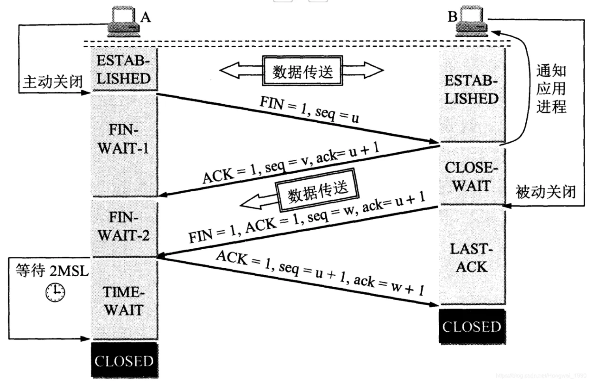
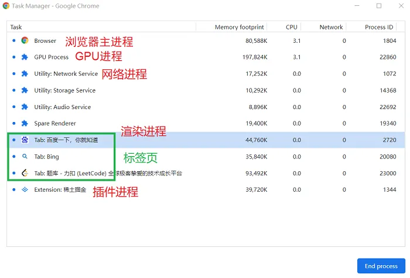
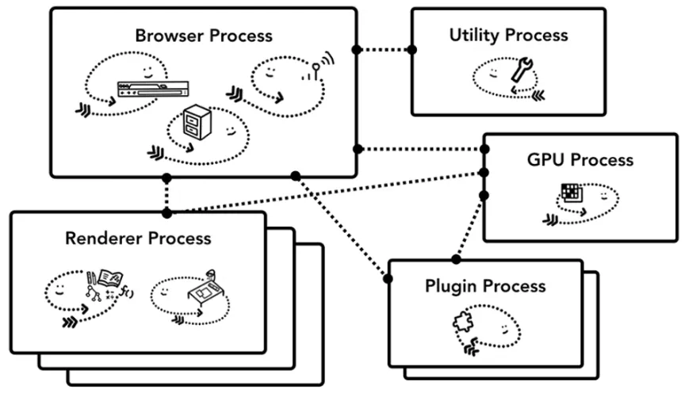
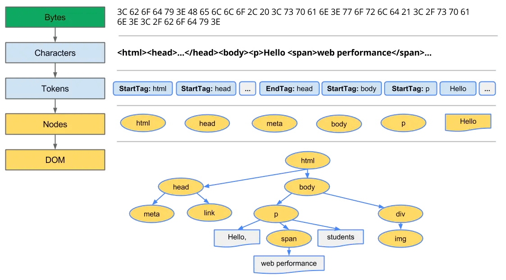

## 1. 从输入 URL 到页面加载发生了什么？

1. 用户在地址栏输入 URL 并按下回车；
2. 浏览器查找当前 URL 是否存在缓存，并比较缓存是否过期；
3. DNS 将域名解析为对应的 IP 地址；
4. 根据 IP 地址，通过三次握手建立 TCP 连接；
5. 发送 HTTP 请求；
6. 服务器处理请求，浏览器接收 HTTP 响应；
7. 浏览器解析并渲染页面；
8. 通过四次挥手关闭 TCP 连接。

## 2. DNS 域名解析的过程

1. 优先在`浏览器 DNS 缓存`中查找，如果有缓存，则直接响应用户的请求
2. 如果没有要访问的域名，就继续在`操作系统的 DNS 缓存`中查找，如果也没有，最后通过本地的 DNS 服务器查到对应的 IP 地址
3. `DNS 服务器`查询过程：
   - 如果没有找到对应的 IP 地址，浏览器会发出一个 DNS 请求到`本地 DNS 服务器`，本地 DNS 服务器会首先查询它的缓存记录，如果缓存中有此条记录，直接返回结果；
   - 如果没有找到对应的 IP 地址，
     1. 本地 DNS 服务器向`根域名服务器`发送请求，根域名服务器会返回一个所查询域的顶级域名服务器地址；
     2. 本地 DNS 服务器向`顶级域名服务器`（负责 com, org, net, edu 等顶级域名和 cn, uk, fr 等国家顶级域名）发送请求，顶级域名服务器返回一个所查询域的权威域名服务器；
     3. 本地 DNS 服务器向`权威域名服务器`（例 163.com 域名服务器）发出请求，收到一个域名和 IP 地址对应关系；
     4. 本地 DNS 服务器把 IP 地址返回浏览器，把对应关系保存在缓存中，以备下次查询时直接返回结果。

## 3. TCP 的三次握手和四次挥手

### 3.1 三次握手

浏览器拿到域名对应的 IP 地址后，会以一个随机端口（1024~65535）向 Web 服务器（httpd、nginx 等）发起 TCP 的连接请求，通过三次握手建立 TCP 连接。

1. 第一次握手：客户端发送 SYN 数据包到服务器（SYN=1 表示要建立连接，seq=x 随机产生的初始序列号），客户端进入 SYN_SENT 状态，等待服务端确认；
2. 第二次握手：服务端收到数据包后，由标志位 SYN=1 知道客户端请求建立连接，服务端确认用户的 SYN 包（ACK=1，ack=x+1），服务端也发送一个 SYN 包（SYN=1，seq=y），服务端进入 SYN_RCVD 状态；
3. 第三次握手：客户端收到确认后，检查 ACK 是否为 1，ack 是否为 x+1，如果正确则将标志位 ACK 置为 1，ack=y+1，并将该数据包发送给服务端，服务端检查 ACK 是否为 1，ack 是否为 y+1，如果正确则连接建立成功，客户端和服务端进入 ESTABLISHED 状态，完成三次握手，随后客户端与服务端之间可以开始传输数据了。

**握手为什么需要三次？**

- 第二次是客户端确认服务器端收到连接请求且可以连接。
- 第三次是服务器端确认客户端可以建立连接，防止客户端已经不需要连接，而服务器端一直等待。
- 假设客户端发出了第一个连接请求，因为网络阻塞隔了一段时间才到达服务器，此时客户端已经不需要连接了。如果握手只有两次，服务端将一直等待，会浪费资源。

### 3.2 四次挥手

客户端或服务器均可主动发起挥手动作，假如是客户端先发起关闭请求。

1. 第一次挥手：客户端请求断开连接（FIN=1，序号 seq=u），进入 FIN_WAIT1 状态。
2. 第二次挥手：服务端收到断开连接请求后，发出确认报文段（ACK=1，确认号 ack=u+1，序号 seq=v），服务端进入 CLOSE_WAIT 状态，客户端收到服务端的确认后，进入 FIN_WAIT2 状态。

   - 此时的 TCP 处于半关闭状态，客户端到服务端的连接释放。

3. 第三次挥手：如果服务端也想断开连接了，服务端请求断开连接（FIN=1，ACK=1，序号 seq=w，确认号 ack=u+1），服务端进入 LAST_ACK 状态。
4. 第四次挥手：客户端收到断开连接请求后，发出确认报文段（ACK=1，seq=u+1，ack=w+1），客户端进入 TIME_WAIT 状态。此时 TCP 未释放掉，需要经过时间等待计时器设置的时间 2MSL 后，客户端才进入 CLOSED 状态。

**挥手为什么需要四次？**

- 三次握手是因为服务端收到建立连接请求的 SYN 报文后，把 ACK 和 SYN 放在一个报文里发送给客户端。
- 四次挥手是 TCP 的连接是全双工的，需要双方分别释放连接。比如客户端到服务器的连接释放了，表示客户端不再发送数据了，但是还可以接收数据。

**四次挥手后，为什么客户端最后还要等待 2MSL？**

MSL 是 Maximum Segment Lifetime 英文的缩写，表示报文最大生存时间。

- 保证客户端发送的最后一个 ACK 报文能够到达服务器，因为这个 ACK 报文可能丢失，如果服务端没有收到，服务端会重发一次，而客户端就能在这个 2MSL 时间段内收到这个重传的报文，接着给出回应报文，并且会重启 2MSL 计时器。
- 防止“已经失效的连接请求报文段”出现在本连接中。客户端发送完最后一个确认报文后，在这个 2MSL 时间中，就可以使本连接持续的所产生的所有报文都从网络中消失，这样新的连接中不会出现旧连接的请求报文。

## 4. 浏览器进程

- 浏览器主进程：主要负责界面显示、用户交互、子进程管理，同时提供存储等功能。
  - UI thread：控制浏览器上的按钮及输入框；
  - network thread：处理网络请求，从网上获取数据；
  - storage thread：控制文件等的访问。
- 渲染进程：即通常所说的浏览器内核，负责一个标签页内关于页面呈现的所有内容，将 HTML、CSS 和 JavaScript 转换为用户可以与之交互的网页。
  - 排版引擎 Blink 和 JavaScript 引擎 V8 都是运行在该进程中；
  - 默认情况下，Chrome 会为每个 Tab 标签创建一个渲染进程。Tab 较多时，可能会合并某些进程。
- GPU 进程：GPU 可以实现 3D CSS 的效果，网页、Chrome 的 UI 界面都选择采用 GPU 来绘制。
- 网络进程：主要负责页面的网络资源加载。
- 插件进程：主要是负责插件的运行，因插件易崩溃，所以需要通过插件进程来隔离，以保证插件进程崩溃不会对浏览器和页面造成影响。

打开 1 个页面至少需要 1 个网络进程、1 个浏览器进程、1 个 GPU 进程以及 1 个渲染进程，共 4 个；如果打开的页面有运行插件的话，还需要再加上 1 个插件进程。

优点：

- 某一渲染进程出问题不会影响其他进程
- 更为安全，在系统层面上限定了不同进程的权限

缺点：

- 更高的资源占用。由于不同进程间的内存不共享，不同进程的内存常常需要包含相同的内容。例如每个进程都会包含公共基础结构的副本（如 JavaScript 运行环境）。
- 更复杂的体系架构。浏览器各模块之间耦合性高、扩展性差等问题，会导致现在的架构已经很难适应新的需求了

渲染进程包含 5 种线程：

- GUI 渲染线程：主要负责页面的渲染，解析 HTML、CSS，构建 DOM 树，布局和绘制等。
- JS 引擎线程：主要负责处理 JavaScript 脚本，执行代码。该线程与 GUI 渲染线程互斥，当 JS 引擎线程执行 JavaScript 脚本时间过长，将导致页面渲染的阻塞。
- 事件触发线程：主要负责将准备好的事件交给 JS 引擎线程执行。比如 setTimeout 定时器计数结束， ajax 等异步请求成功并触发回调函数，或者用户触发点击事件时，该线程会将整装待发的事件依次加入到任务队列的队尾，等待 JS 引擎线程的执行。
- 定时器触发线程：负责执行异步定时器一类的函数的线程，如： setTimeout，setInterval。
- 异步 http 请求线程：负责执行异步请求一类的函数的线程，如： Promise，axios，ajax 等

## 5. 浏览器页面渲染的过程

[渲染页面：浏览器的工作原理](https://developer.mozilla.org/zh-CN/docs/Web/Performance/How_browsers_work)

浏览器与 web 服务器建立连接后，发送一个请求获取 HTML 文件。

一旦浏览器收到第一个数据分块（通常是 14KB 的数据），就开始解析收到的信息，不必等获取到全部 HTML 文件才开始解析。但是在渲染到屏幕上面之前，HTML、CSS、JavaScript 必须被解析完成。

### 5.1 构建 DOM 树

解析 HTML 文件，构造 DOM 树，DOM 树描述了文档的内容。

- 在控制台输入 document 回车，可查看 DOM 树的内容。
- DOM 和 HTML 内容几乎是一样的，但是 DOM 保存在内存中是树状结构，可以通过 JavaScript 来查询或修改其内容。

1. **解码（encoding）：** 浏览器读取 HTML 的二进制字节，并根据文件的指定编码（例如 UTF-8）将它们转换成字符串。
2. **令牌化（Tokenization）：** 令牌化是词法分析的过程，将输入解析成 HTML 符号，包括：开始标签、结束标签、属性名和属性值。
3. **DOM 树构建：** 创建 DOM 节点，插入 DOM 树中。
4. 当整个解析的过程完成以后，浏览器会通过 DOMContentLoaded 事件来通知 DOM 解析完成。

当解析器发现非阻塞资源，例如图片或、CSS 文件、iconfont，浏览器会请求这些资源并且继续解析。但是对于 `<script>` 标签（特别是没有 async 或者 defer 属性的）会阻塞 HTML 的解析。

### 5.2 构建 CSSOM 树

处理 CSS 并构建 CSSOM 树（样式计算）。

- DOM 构造是增量的，CSSOM 却不是。
- CSS 是渲染阻塞的：浏览器会阻塞页面渲染直到它接收和执行了所有的 CSS。因为规则可以被覆盖，所以内容不能被渲染直到 CSSOM 的完成。
- 从选择器性能的角度，更少的特定选择器是比更多的要快，千万不要过渡层叠。

1. 将 CSS 文本转换为浏览器可以理解的结构 styleSheets；
   - 该结构同时具备了查询和修改功能
   - 在控制台输入 document.styleSheets 回车，可查看 styleSheets 的内容
2. 转换样式表中的属性值，使其标准化；
   - 例，2em->32px，blue->rgb(0,0,255)，bold->700
3. 计算出 DOM 树中每个节点的具体样式；
   - 涉及到 CSS 的继承规则和层叠规则
   - 所有的样式值会被挂在到 window.getComputedStyle 当中，可以通过 JS 来获取计算后的样式。

### 5.3 生成布局树

将 DOM 和 CSSOM 组合成布局树，渲染树将所有相关样式与 DOM 树中的每个可见节点匹配起来，并根据 CSS 级联，确定每个节点的计算样式。

1. 从 DOM 树的根开始，遍历每个可见节点；
2. 不可见的节点会被忽略，如 `<head>` 标签下面的全部内容，属性包含 `dispaly:none` 的元素。

### 5.4 布局和回流/重排

在渲染树上运行布局以计算每个节点的的尺寸和位置。

**重排（reflow）：** 如果修改了节点大小和位置等，影响了布局，会引起重排。重排需要更新完整的渲染流水线，所以开销也是最大的。

有以下的操作会触发回流:

- 一个 DOM 元素的几何属性变化，常见的几何属性有 width、height、padding、margin、left、top、border 等。
- DOM 节点的增加、删除或移动。
- 读写 offset 族、scroll 族和 client 族属性的时候，浏览器为了获取这些值，需要进行回流操作。
- 调用 window.getComputedStyle 方法。

### 5.5 绘制和重绘

将各个节点绘制到屏幕上，其中第一次的绘制被称为首次有意义的绘制。

**重绘（repaint）：** 当页面中元素样式的改变并不影响它在文档流中的位置时（例如：color、background-color、visibility 等），浏览器会将新样式赋予给元素并重新绘制它，这个过程称为重绘。

### 5.6 合成

当文档的各个部分以不同的层绘制，相互重叠时，必须进行合成，以确保它们以正确的顺序绘制到屏幕上，并正确显示内容。

## 6. script 标签 async 和 defer 的区别

JavaScript 的加载、解析与执行会阻塞 DOM 的构建。如果 `<script>` 带有 async 和 defer，就会异步请求这些资源，不会阻塞页面渲染.

- 执行顺序的区别
  - async 的执行，并不会按照 script 在页面中的顺序来执行，而是谁先加载完谁执行
  - defer 的执行，则会按照引入的顺序执行，即便是后面的 script 资源先返回
- 对 window.onload 的影响
  - 使用 async 的 script 标签，对 window.onload 事件没有影响，window.onload 可以在之前或之后执行
  - 使用 defer 的 script 标签，会在 window.onload 事件之前被执行
- 使用场景的区别
  - 如果你的脚本并不关心页面中的 DOM 元素是否渲染，并且也不会产生其他脚本需要的数据，使用 async，如统计、埋点等功能
  - defer 可以用来控制 js 文件的加载顺序
