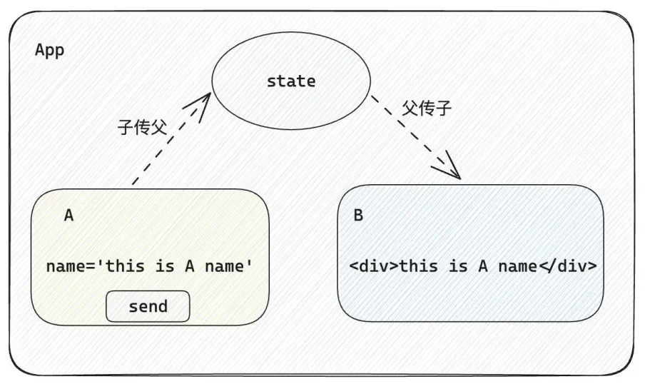
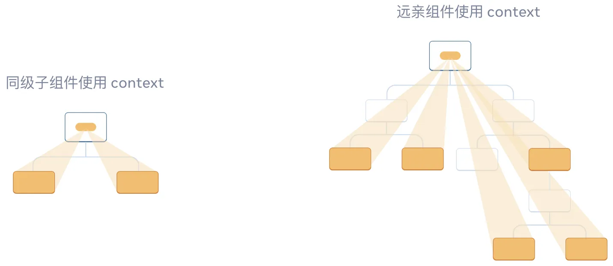

[React 官方文档](https://react.docschina.org/learn)  
[React 生态](https://github.com/enaqx/awesome-react)

React，用于构建 Web 和原生交互界面的库。

创建 React 项目：[create-react-app](https://create-react-app.bootcss.com/docs/getting-started) [React 官方安装文档](https://react.docschina.org/learn/installation)

## 1. JSX

JavaScript XML（JSX）是 JavaScript 语法扩展，使用 XML 标记的方式直接声明界面，可以让你在 JavaScript 文件中书写类似 HTML 的标签。
优势：

- HTML 的声明式模版写法
- JS 的可编程能力

JSX 不是标准的 JavaScript 语法，它是 JavaScript 的语法扩展，浏览器本身不能识别，需要通过解析工具做解析之后才能在浏览器中运行。

```javascript
const message = 'World'

export default function HelloWorld() {
  return (
    <>
      <h1>Hello {message}!</h1>
    </>
  );
}

// https://www.babeljs.cn/
// Babel 将上述内容编译为普通的 JavaScript 对象
import { jsxs as _jsxs, Fragment as _Fragment, jsx as _jsx } from "react/jsx-runtime";
const message = 'World';
export default function HelloWorld() {
  return /*#__PURE__*/_jsx(_Fragment, {
    children: /*#__PURE__*/_jsxs("h1", {
      children: ["Hello ", message, "!"]
    })
  });
}
```

- **推荐在 JSX 代码的外面加 ()**，防止分号自动插入的 bug。如果你的标签和 return 关键字不在同一行，则必须把它包裹在一对括号中。
- **只能返回一个根元素**。如果想要在一个组件中包含多个元素，需要用一个父标签把它们包裹起来。如果你不想在标签中增加一个额外的 `<div>`，可以用 `<> </>` 来代替。
- **标签必须闭合**，需要在结尾处用/>。
- **使用驼峰式命名法给大部分属性命名**，而不是使用 HTML 的属性名称，如 class 对应 className，tabindex 对应 tabIndex，label 的 for 属性对应 htmlFor。
- **使用大括号 {} 编写 JavaScript 表达式**，比如字符串、变量、函数调用、三元运算符等。if 语句、switch 语句、变量声明不属于表达式，不能出现在 {} 中。
- 推荐使用 `/**/` 注释。

### 1.1 列表渲染

在 JSX 中可以使用 `Array.prototype.map()` 实现列表渲染。

```jsx
const list = [
  { id: 1001, name: "Vue" },
  { id: 1002, name: "React" },
  { id: 1003, name: "Angular" },
];

function App() {
  return (
    <ul>
      {list.map((item) => (
        <li key={item.id}>{item.name}</li>
      ))}
    </ul>
  );
}
```

### 1.2 条件渲染

- 可以通过运算符 && 或三元表达式实现基础的条件渲染；
- 可以通过「自定义函数 + 判断语句」实现条件渲染

```jsx
const flag = true;
const loading = false;

function App() {
  return (
    <>
      {flag && <span>完成</span>}
      {loading ? <span>loading...</span> : <span>加载完成</span>}
    </>
  );
}
```

```jsx
const type = 1;

function getArticleJSX() {
  if (type === 0) {
    return <div>无图模式模版</div>;
  } else if (type === 1) {
    return <div>单图模式模版</div>;
  } else if (type === 3) {
    return <div>三图模式模版</div>;
  }
}

function App() {
  return <>{getArticleJSX()}</>;
}
```

### 1.3 CSS

#### 1）className

```jsx
import "./index.css";

<h1 className="title">Hello World!</h1>;
```

```css
.title {
  font-size: 40px;
}

/* 相当于在style标签添加样式，是全局样式 */
/* <style type="text/css">
  .title {
    font-size: 40px;
  }
</style> */
```

#### 2）行内样式

```jsx
<h1 style={{ fontSize: 20, color: "red" }}>Hello World!</h1>
```

#### 3）classNames 库

[classnames](https://github.com/JedWatson/classnames)

classnames 是一个 JS 库，通过条件动态控制 class 类名，解决了通过字符串拼接动态设置类名不够直观、容易出错的问题。

```jsx
// className = {'foo bar'}
<div className={classNames("foo", { bar: true })}></div>
```

### 1.4 事件绑定

事件绑定通过 `on + 事件名称 = { 事件处理程序 }`，整体上遵循驼峰命名法。

传递给事件处理函数的函数应直接传递，而非调用。如果需要给事件处理函数传参，需要使用回调函数。

```jsx
function App() {
  const clickHandler = (name, e) => {
    console.log("button按钮点击了", name, e);
  };
  return (
    <button onClick={(e) => clickHandler("jack", e)}>click me</button>
    { /* 如果不用传参，可以直接写函数名称 */ }
    { /* <button onClick={clickHandler}>click me</button> */}
  );
}
```

## 2. useState

useState Hook 让你声明一个状态变量，状态变量一旦发生变化，组件的视图 UI 也会跟着变化（数据驱动视图）。

它接收初始状态并返回一对值：当前状态，以及一个让你更新状态的设置函数。

- `State 变量`：用于保存上次渲染的值；
- `State setter 函数`：更新 state 变量并触发 React 重新渲染组件。

```jsx
import { useState } from "react";

function App() {
  const [count, setCount] = useState(0);
  return (
    <div>
      <button onClick={() => setCount(count + 1)}>{count}</button>
    </div>
  );
}
```

- 设置 state 会触发重新渲染。
- 当你调用 useState 时，React 会为你提供该次渲染 的一张 state 快照。
- 在 React 中，状态被认为是只读的，应该始终替换它而不是修改它，直接修改状态不能引发视图更新。

### 2.1 更新 state 中的对象

- 把所有存放在 state 中的 JavaScript 对象都视为只读的。
- 对于对象类型的状态变量，应该始终传给 set 方法一个全新的对象来进行修改。

```javascript
const [person, setPerson] = useState({
  firstName: "Barbara",
  lastName: "Hepworth",
});

setPerson({
  ...person, // 复制上一个 person 中的所有字段
  firstName: e.target.value, // 但是覆盖 firstName 字段
});
```

### 2.2 更新 state 中的数组

|          | 避免使用 (会改变原始数组) | 推荐使用 (会返回一个新数组） |
| -------- | ------------------------- | ---------------------------- |
| 添加元素 | push, unshift             | concat, [...arr] 拓展运算符  |
| 删除元素 | pop, shift, splice        | filter, slice                |
| 替换元素 | splice, arr[i] = ...      | map                          |
| 排序     | reverse，sort             | 先将数组复制一份             |

```javascript
let initialCounters = [0, 0, 0];

const nextCounters = counters.map((c, i) => {
  if (i === index) {
    // 递增被点击的计数器数值
    return c + 1;
  } else {
    // 其余部分不发生变化
    return c;
  }
});
setCounters(nextCounters);
```

### 2.3 双向数据绑定

- 将 state 绑定到 input 的 value 属性
- 把 input 最新的 value 值设置给 state

```javascript
const [value, setvalue] = useState("");

<input type="text" value={value} onChange={(e) => setValue(e.target.value)} />;
```

## 3. 组件通信

### 3.1 父子组件-父传子 props

每个父组件通过为子组件提供 props 来传递信息。

- **props 可以传递任意的合法数据**，比如数字、字符串、布尔值、数组、对象、函数、JSX
- **props 是只读对象**，子组件只能读取 props 中的数据，不能直接进行修改, 父组件的数据只能由父组件修改
- `props.chilren`：当我们把 html 嵌套在组件的标签内部时，组件会自动在名为 children 的 props 属性中接收该内容

```jsx
function Son({ name, children }) {
  return (
    <>
      <div>{name}</div>
      {children}
    </>
  );
}

function App() {
  const name = "this is app name";
  return (
    <>
      <Son name={name}>
        <div>我是嵌套模版</div>
      </Son>
    </>
  );
}
```

### 3.2 父子通信-子传父

利用回调函数：父组件将一个函数作为 props 传递给子组件，子组件调用该回调函数，便可以向父组件通信。

```jsx
import { useState } from "react";

function Son({ onGetMsg }) {
  const msg = "this is son msg";
  return (
    <div>
      {/* 在子组件中执行父组件传递过来的函数 */}
      <button onClick={() => onGetMsg(msg)}>send</button>
    </div>
  );
}

function App() {
  const [msg, setMsg] = useState("");
  const getMsg = (msg) => setMsg(msg);

  return (
    <div>
      {msg}
      {/* 传递父组件中的函数到子组件 */}
      <Son onGetMsg={getMsg} />
    </div>
  );
}
```

### 3.3 兄弟组件通信

兄弟组件通信，可以使用父组件作为中间层来传递数据。



### 3.4 跨层级组件通信 useContext

useContext 允许父组件向其下层无论多深的任何组件传递参数。

通过 props 可以将信息从父组件传递到子组件。但是，如果某个状态在太高的层级，需要“逐层传递 props”，会变得很麻烦。



**实现步骤：**

1. 使用 `createContext` 方法创建一个 context；
2. 在需要数据的组件内通过 `useContext` **使用**刚刚创建的 context；
3. 在指定数据的组件中通过 `Ctx.Provider` 组件**提供**这个 context。

```jsx
import { createContext, useContext } from "react";

// 1. createContext方法创建一个上下文对象

const MsgContext = createContext();

function Com() {
  return (
    <div>
      this is component
      <SubCom />
    </div>
  );
}

function SubCom() {
  // 2. 在深层组件，通过 useContext 钩子函数使用数据
  const msg = useContext(MsgContext);
  return <div>this is sub component, {msg}</div>;
}

function App() {
  const msg = "this is app msg";
  return (
    <div>
      {/* 3. 在上层组件，通过 Provider 组件提供数据 */}
      <MsgContext.Provider value={msg}>
        this is App
        <Com />
      </MsgContext.Provider>
    </div>
  );
}
```

## 4. useReducer

## 5. useRef

### 5.1 使用 ref 操作 DOM

useRef 可以用于获取指定 DOM。

```jsx
import { useRef } from "react";

function App() {
  const inputRef = useRef(null);
  function handleClick() {
    inputRef.current.focus();
  }

  return (
    <>
      <input ref={inputRef} />
      <button onClick={handleClick}>聚焦输入框</button>
    </>
  );
}
```

### 5.2 使用 ref 引用值

## 6. useEffect

useEffect 会在渲染后运行一些代码，以便可以将组件与 React 之外的某些系统同步，比如浏览器 API、第三方小部件、网络等。

```javascript
useEffect(() => {
  // 副作用逻辑
  return () => {
    // 清除副作用
    // 通常在组件卸载时自动执行
  };
}, []);
```

- 参数 1 是一个函数，在函数内部可以放置要执行的操作
  - 该函数可以返回一个函数，用于清除副作用，通常在组件卸载时自动执行
- 参数 2 是一个数组，是可选的
  - 如果没有参数 2，每次渲染后都会执行该函数
  - 当是一个空数组时，函数只会在组件渲染完毕之后执行一次
  - 添加特定依赖项时，在组件初始渲染和依赖项变化时执行

```jsx
import { useEffect, useState } from "react";

function Son() {
  // 渲染后开启一个定时器
  useEffect(() => {
    const timer = setInterval(() => {
      console.log("定时器执行中...");
    }, 1000);

    return () => {
      // 清除副作用
      clearInterval(timer);
    };
  }, []);
  return <div>this is son</div>;
}

function App() {
  // 通过条件渲染模拟组件卸载
  const [show, setShow] = useState(true);
  return (
    <div>
      {show && <Son />}
      <button onClick={() => setShow(!show)}>{show ? "卸载组件" : "挂载组件"}</button>
    </div>
  );
}
```

## 7. 自定义 Hook

React 有一些内置 Hook，例如 useState，useContext 和 useEffect，有时我们需要自定义 Hook。

自定义 Hook 是以 `use 开头的函数`，可以`实现逻辑的封装和复用`。

1. 声明一个以 use 打头的函数
2. 在函数体内封装可复用的逻辑
3. 把组件中用到的状态或者回调 return 出去（以对象或者数组）
4. 某个组件中要用到这个逻辑，就执行这个函数，解构出来状态和回调进行使用

```jsx
import { useState } from "react";

function useToggle() {
  const [value, setValue] = useState(true);

  const toggle = () => setValue(!value);

  return {
    value,
    toggle,
  };
}

function App() {
  const { value, toggle } = useToggle();
  return (
    <div>
      {value && <div>this is div</div>}
      <button onClick={toggle}>toggle</button>
    </div>
  );
}
```

- 只能在组件中或者其他自定义 Hook 函数中调用
- 只能在组件的顶层调用，不能嵌套在 if、for、其它的函数中
