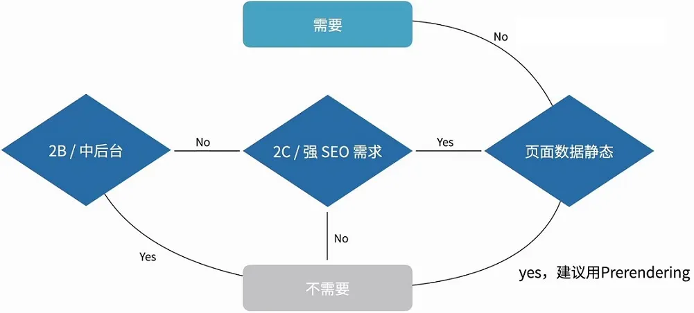
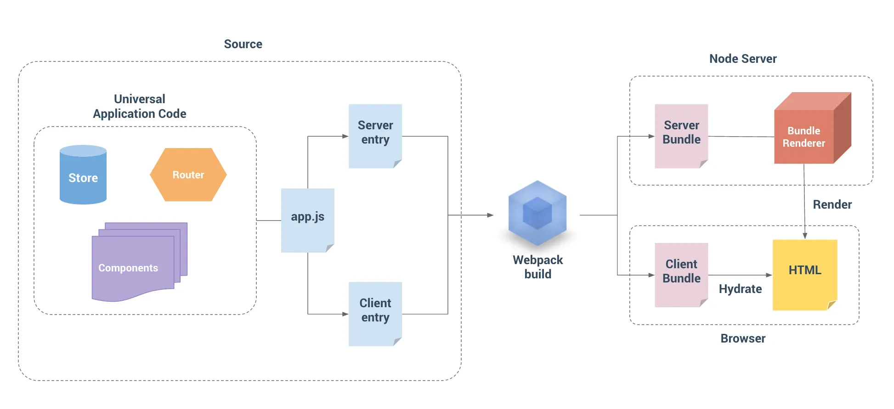

## 1. SSR 简介

### 1.1 什么是 SSR？

- 对于 SPA 应用，浏览器收到一个静态的 HTML 文件，包含空的 `<div id="app"></div>`；
- 对于服务端渲染（Server-Side Rendering，SSR），返回一个`带有具体内容的 HTML 字符串`给浏览器。

**SSR 渲染流程：**

1. **发送请求，获取数据**：浏览器向服务器发送请求，服务器根据请求的路由匹配相关的路由组件，执行组件的自定义服务端生命周期（例 Nuxt 的 asyncData）或者自定义获取数据的 hook，并且把执行后的数据收集起来，统一在 window 的属性中存储。
2. **返回静态 html 字符串**：vue 的组件会被 renderToString 渲染成静态 html 字符串，替换掉 index.html 中提前指定的占位代码，然后把 index.html 改变后的静态字符串发给浏览器。
3. **激活静态的 html**：浏览器将静态 html 激活为能交互的应用，把页面中的 DOM 元素与虚拟 DOM 之间建立联系，为页面中的 dom 元素添加事件绑定。

一个由服务端渲染的 Vue.js 应用也可以被认为是“同构的（Isomorphic）”或“通用的（Universal）”，因为应用的大部分代码同时运行在服务端和客户端。

SSR 是基于 vNode 实现的，通过 render 函数将 vNode 解析为真实 DOM。

### 1.2 SSR 与 CSR

|          | <div style="width: 200px">服务端渲染（Server Side Render，SSR）</div>                                                                                                                                                                                                                                                                                                                   | <div style="width: 200px">客户端渲染（Client Side Render，CSR）</div>                                                                                                                                                                                                                                                                                                                                                                                                                          | <div style="width: 200px">同构（isomorphic）</div>                                                                                                                                                                                                                                                                                                                                                                                                                       |
| -------- | --------------------------------------------------------------------------------------------------------------------------------------------------------------------------------------------------------------------------------------------------------------------------------------------------------------------------------------------------------------------------------------- | ---------------------------------------------------------------------------------------------------------------------------------------------------------------------------------------------------------------------------------------------------------------------------------------------------------------------------------------------------------------------------------------------------------------------------------------------------------------------------------------------- | ------------------------------------------------------------------------------------------------------------------------------------------------------------------------------------------------------------------------------------------------------------------------------------------------------------------------------------------------------------------------------------------------------------------------------------------------------------------------ |
| 执行过程 | <p style="background:#C1E77E">用户请求网页</p> <p style="background:#FBF5CB">服务端创建包含数据的 HTML 文件并返回给客户端</p> <p style="background:#FBF5CB">客户端浏览器能够快速地解析和渲染 HTML 文件，但此时页面不能够被富交互</p> <p style="background:#C1E77E">浏览器下载 Javascript 资源</p> <p>浏览器开始执行 Javascript</p> <p style="background:#C1E77E">用户可以与页面交互</p> | <p style="background:#C1E77E">用户请求网页</p> <p>由 CDN 返回已创建好的静态 HTML 文件给客户端</p> <p>客户端浏览器接收到静态 HTML 文件，然后开始请求相应的 CSS、JavaScript 文件，页面为空不可用</p> <p style="background:#C1E77E">浏览器下载 Javascript 资源</p> <p>浏览器执行 Javascript，开始调用接口，请求数据，页面处于被占位符填充状态（Loading）</p> <p>从服务器获取异步接口数据，浏览器开始渲染页面，在结束渲染后，取消 Loading</p> <p style="background:#C1E77E">用户可以与页面交互</p> | <p style="background:#C1E77E">用户请求网页</p> <p style="background:#FBF5CB">服务端创建包含数据的 HTML 文件并返回给客户端</p> <p style="background:#FBF5CB">客户端浏览器能够快速地解析和渲染 HTML 文件，但此时页面不能够被富交互</p> <p style="background:#C1E77E">浏览器下载 Javascript 资源</p> <p>浏览器执行 Javascript，客户端 Vue 开始执行，客户端激活</p> <p>从服务器获取非首屏或优先级较低的异步接口数据</p> <p style="background:#C1E77E">用户可以与页面交互</p> |
| 优缺点   | <ul><li> 更好的 SEO；</li> <li>更快的内容到达时间；</li> <li>每次页面跳转都需要重新加载，体验不佳。</li></ul>                                                                                                                                                                                                                                                                           | <ul><li>单页应用（SPA）页面跳转无刷新，用户体验丝滑；</li> <li>比较适合不强调 SEO 的中后台富交互应用；</li> <li>首次页面加载要等到资源都加载执行完，用户才可以进行操作。</li></ul>                                                                                                                                                                                                                                                                                                             | <ul><li>更好的 SEO；</li> <li>更快的内容到达时间；</li> <li>统一的心智模型：你可以使用相同的语言以及相同的声明式、面向组件的心智模型来开发整个应用，而不需要在后端模板系统和前端框架之间来回切换。</li></ul>                                                                                                                                                                                                                                                             |
| 实例     | 早期的网易、搜狐等门户网站                                                                                                                                                                                                                                                                                                                                                              | SPA 单页面应用                                                                                                                                                                                                                                                                                                                                                                                                                                                                                 |                                                                                                                                                                                                                                                                                                                                                                                                                                                                          |

解释：

- 更好的 SEO：搜索引擎爬虫抓取工具可以直接查看完全渲染的页面;
- 更快的内容到达时间，更快的首屏加载：
  - 服务端渲染的 HTML 无需等到所有的 JavaScript 都下载并执行完成之后才显示，所以你的用户将会更快地看到完整渲染的页面。
  - 数据获取过程在首次访问时在服务端完成，相比于从客户端获取，可能有更快的数据库连接。
  - 对于缓慢的网络情况或运行缓慢的设备，性能提升更加明显。

### 1.3 你真的需要 SSR 或同构吗？



## 2.Vue2-SSR-webpack5

[Vue2 SSR 官方指南](https://v2.ssr.vuejs.org/zh/)

[Vue2 SSR 官方示例](https://github.com/vuejs/vue-hackernews-2.0/tree/master)

[基于 Webpack5 的 Vue2 SSR 工程实践综述](https://juejin.cn/post/7243252896392888377)

### 2.1 基本用法

```shell
npm init
npm install vue@2 vue-server-renderer --save
npm install express --save
```

1. 编写一个 HTML 模版文件 `index.template.html`，包含占位符 `<!--vue-ssr-outlet-->` 和 `{{}}` 包裹的变量名；
2. 编写 `server.js` 启动一个服务；
3. 监听到请求后，通过 `renderer.renderToString` 将 Vue 实例转为字符串（该过程中同时处理变量），替换占位符，返回 HTML 字符串。

`cd base-demo`，运行 `node server.js`，在浏览器访问 `localhost:8080`，即可获取到 SSR 的页面。

```html
<!-- index.template.html -->
<html>
  <head>
    <!-- 使用双花括号(double-mustache)进行 HTML 转义插值(HTML-escaped interpolation) -->
    <title>{{ title }}</title>

    <!-- 使用三花括号(triple-mustache)进行 HTML 不转义插值(non-HTML-escaped interpolation) -->
    {{{ meta }}}
  </head>
  <body>
    <!--vue-ssr-outlet-->
  </body>
</html>
```

```javascript
// server.js
const Vue = require("vue");
const server = require("express")();

// 读取 HTML 字符串
const template = require("fs").readFileSync("./index.template.html", "utf-8");

// 创建一个 renderer
const renderer = require("vue-server-renderer").createRenderer({
  template,
});

const context = {
  title: "vue ssr",
  meta: `
    <meta name="keyword" content="vue,ssr">
    <meta name="description" content="vue srr demo">
    <meta charset="utf-8">
    `,
};

server.get("*", (req, res) => {
  // 创建一个 Vue 实例
  const app = new Vue({
    data: {
      url: req.url,
    },
    template: `<div>访问的 URL 是： {{ url }}</div>`,
  });

  // 将 Vue 实例渲染为 HTML
  renderer.renderToString(app, context, (err, html) => {
    console.log(html);
    if (err) {
      res.status(500).end("Internal Server Error");
      return;
    }
    res.end(html);
  });
});

console.log("listen 8080...");
server.listen(8080);
```

### 2.2 SSR 架构



对于客户端应用和服务器应用，都需要 webpack 打包。 服务器需要「Server Bundle」用于服务器端渲染(SSR)，客户端需要「Client Bundle」激活静态的 html 字符串。

```sh
vue2-ssr/
│
├── build/
│ ├── webpack.base.config.js   # 基础通用配置，包括开发环境和生产环境
│ ├── webpack.client.config.js # 客户端配置，用于生成 Client Bundle
│ ├── webpack.server.config.js # 服务器配置，用于生成 Server Bundle
│ └── setup-dev-server.js      # 开发环境热更新配置
│
├── src/
│ ├── App.vue                  # 根组件
│ ├── app.js                   # 通用 entry
│ ├── entry-client.js          # client 打包入口，仅运行于浏览器
│ ├── entry-server.js          # server 打包入口，仅运行于服务器
│ ├── router.js                # 创建 router 实例
│ ├── store.js                 # 用于预取数据
│ ├── index.template.html      # html 模板文件
│ └── views/                   # 业务代码
│   └── home/
│     ├── index.vue
│     └── homeStore.js         # 当前业务的 store module
│
└── server.js                  # 启动后端服务器响应 SSR 请求
```

### 2.3 App.vue

App.vue 是 Vue 的根组件，包含 `<div id="app"></div>`。

```vue
<template>
  <div id="app">
    <!-- 根据路由渲染对应的组件 -->
    <router-view></router-view>
  </div>
</template>
```

### 2.4 app.js

**避免状态单例：** 在纯客户端应用程序中，每个用户会在他们各自的浏览器中使用新的应用程序实例。对于服务器端渲染，必须要求每个请求都应该都是全新的、独立的应用程序实例，而不是单例对象，防止交叉请求造成的状态污染。

app.js 是我们应用程序的「通用 entry」，在客户端和服务器入口使用，创建根 Vue 实例。

通过工厂函数 `createApp` 为每个请求创建新的应用程序、router 和 store 实例。

```javascript
import Vue from "vue";
import App from "./App.vue";
import { createRouter } from "./router";
import { createStore } from "./store";
import { sync } from "vuex-router-sync";

// 导出一个工厂函数，用于创建新的应用程序、router 和 store 实例，每次 SSR 请求都会调用
export function createApp() {
  // 创建 router 和 store 实例
  const router = createRouter();
  const store = createStore();

  // 同步路由到 store：将路由的 $route 设置为 store 的状态 `store.state.route`
  sync(store, router);

  // 创建应用程序实例
  // 将 router、store、ssr context 注入到所有子组件，确保 `this.$router` and `this.$store` 在所有组件都可以使用
  const app = new Vue({
    router,
    store,
    render: (h) => h(App),
  });

  // 导出 app、router、store
  // 在这里不挂载 app，因为在服务器和客户端的处理是不同的
  return { app, router, store };
}
```

### 2.5 router.js

- 在 router.js 中，导出一个 createRouter 函数，用于创建一个新的 router 实例；
- 在 SSR 中，vue-router 只能采用 history 模式，因为在 hash 模式下，页面 URL 的 hash 内容并不会随着请求一起发送到服务器中；
- 使用异步组件实现代码分割和懒加载，有助于减少浏览器在初始渲染中下载的资源体积，改善可交互时间 TTI。

```javascript
import Vue from "vue";
import Router from "vue-router";

Vue.use(Router);

// 导出一个 createRouter 函数，用于创建一个新的 router 实例
export function createRouter() {
  return new Router({
    mode: "history",
    // 使用异步组件
    routes: [{ path: "/", component: () => import("./views/home/index.vue") }],
  });
}
```

### 2.6 数据预取 store.js

在服务端渲染之前预取数据，保存在 store 中，服务端和客户端都从 store 中获取数据。

为什么需要预取数据？

- 服务器端渲染本质上是渲染应用程序的“快照”，如果应用程序依赖于一些异步数据，需要在渲染前预取数据。
- 在客户端挂载 DOM，需要获取到与服务器端应用程序完全相同的数据。

store.js 的 module 可以放在每个业务的文件夹中。

```javascript
// src/store.js
import Vue from "vue";
import Vuex from "vuex";
import homeStore from "./views/home/homeStore";

Vue.use(Vuex);

export function createStore() {
  return new Vuex.Store({
    modules: {
      homeStore,
    },
  });
}
```

```javascript
// src/views/home/homeStore.js
export default {
  namespaced: true,
  state: () => ({
    item: {},
  }),
  actions: {
    fetchItem({ commit }) {
      // `store.dispatch()` 会返回 Promise，以便我们能够知道数据在何时更新
      return new Promise((resolve) => {
        setTimeout(() => {
          commit("setItem", { item: { title: "Hello" } });
          resolve();
        }, 1000);
      });
    },
  },
  mutations: {
    setItem(state, { item }) {
      state.item = item;
    },
  },
};
```

在组件中 dispatch 数据预取的 action。

在组件中暴露一个自定义静态函数 asyncData，在组件实例化之前调用，它无法访问 this，需要将 store 和路由信息作为参数传递进去。

```vue
<!-- src/views/home/index.vue -->
<template>
  <div>{{ item?.title }}</div>
</template>

<script>
import { createNamespacedHelpers } from "vuex";
const { mapState } = createNamespacedHelpers("homeStore");

export default {
  asyncData({ store, route }) {
    // 触发 action 后，会返回 Promise
    return store.dispatch("homeStore/fetchItem");
  },
  computed: {
    ...mapState(["item"]),
  },
};
</script>
```

### 2.7 entry-server.js

服务器 entry 根据 Vue 实例生成 HTML 字符串。

通过路由获得与 router.getMatchedComponents() 相匹配的组件，如果组件暴露出 asyncData，就调用这个方法。然后将解析完成的状态，附加到渲染上下文 context.state 中。

```javascript
import { createApp } from "./app";

export default (context) => {
  // 因为组件可能是动态的，且 asyncData 获取数据是异步的，所以返回一个 Promise。
  return new Promise((resolve, reject) => {
    const { app, router, store } = createApp();

    // 设置服务器端 router 的位置
    router.push(context.url);

    // 在路由器完成初始导航之后被解析，这时所有和初始路由有关联的异步入口钩子函数和异步组件都已经被解析
    // 仅在首次加载页面时被调用，之后切换路由不会再调用
    router.onReady(() => {
      const matchedComponents = router.getMatchedComponents();
      // 匹配不到的路由，执行 reject 函数，并返回 404
      if (!matchedComponents.length) {
        return reject({ code: 404 });
      }

      // 对所有匹配的路由组件调用 `asyncData()`
      Promise.all(
        matchedComponents.map((Component) => {
          if (Component.asyncData) {
            return Component.asyncData({
              store,
              route: router.currentRoute,
            });
          }
        })
      )
        .then(() => {
          // 在所有预取钩子asyncData resolve 后，store 已经填充入渲染应用程序所需的状态。
          // 当我们将状态附加到上下文，并且 `template` 选项用于 renderer 时，
          // context.state 将作为 window.__INITIAL_STATE__ 状态，自动嵌入到最终的 HTML 中
          context.state = store.state;

          // Promise 应该 resolve 应用程序实例，以便它可以渲染
          resolve(app);
        })
        .catch(reject);
    }, reject);
  });
};
```

### 2.8 entry-client.js

客户端 entry 用于创建 Vue 实例，将其挂载到 DOM 中。

- 通过 router.beforeResolve 在路由导航之前解析数据，应用程序会等待视图所需数据全部解析之后，再传入数据并处理当前视图。
  - 好处在于，可以直接在数据准备就绪时，传入视图渲染完整内容；
  - 但是如果数据预取需要很长时间，用户在当前视图会感受到“明显卡顿”，建议提供一个 loading 提示。
- 通过混入 beforeRouteUpdate，当路由组件重用（还是当前路由，仅修改参数）时，调用 asyncData 函数。

```javascript
import Vue from "vue";
import { createApp } from "./app";

const { app, router, store } = createApp();

// 初次路由时触发，在 entry-server.js 已处理 asyncData，直接设置 store.state
if (window.__INITIAL_STATE__) {
  store.replaceState(window.__INITIAL_STATE__);
}

router.onReady(() => {
  // 使用 `router.beforeResolve()` 注册一个全局守卫。
  // 这和 router.beforeEach 类似，因为它在每次导航时都会触发，不同的是，解析守卫刚好会在导航被确认之前、所有组件内守卫和异步路由组件被解析之后调用。
  // 因为包裹在onReady中，所以是非初次路由时触发，用于处理 asyncData。
  router.beforeResolve((to, from, next) => {
    const matched = router.getMatchedComponents(to);
    const prevMatched = router.getMatchedComponents(from);

    // 只关心非预渲染的组件，所以对比它们，找出两个匹配列表的差异组件
    let diffed = false;
    const activated = matched.filter((c, i) => {
      return diffed || (diffed = prevMatched[i] !== c);
    });

    if (!activated.length) {
      return next();
    }

    // 这里如果有加载指示器 (loading indicator)，就触发

    Promise.all(
      activated.map((c) => {
        if (c.asyncData) {
          return c.asyncData({ store, route: to });
        }
      })
    )
      .then(() => {
        // 停止加载指示器(loading indicator)

        next();
      })
      .catch(next);
  });

  app.$mount("#app");
});

// 在当前路由改变，但是该组件被复用时调用
// 举例来说，对于一个带有动态参数的路径 `/users/:id`，在 `/users/1` 和 `/users/2` 之间跳转的时候，
// 由于会渲染同样的 `UserDetails` 组件，因此组件实例会被复用。而这个钩子就会在这个情况下被调用。
// 因为在这种情况发生的时候，组件已经挂载好了，导航守卫可以访问组件实例 `this`
Vue.mixin({
  beforeRouteUpdate(to, from, next) {
    const { asyncData } = this.$options;
    if (asyncData) {
      asyncData({
        store: this.$store,
        route: to,
      })
        .then(next)
        .catch(next);
    } else {
      next();
    }
  },
});
```

### 2.9 webpack 配置

```sh
# 生成 package.json
npm init

# Vue 全家桶
npm install --save vue@2 vue-server-renderer
npm install --save vue-router@3
npm install --save vuex@3

# webpack
npm install --save-dev webpack webpack-cli webpack-merge

# 基础配置：处理 Vue、JS、CSS
npm install --save-dev vue-loader@15 vue-template-compiler
npm install --save-dev babel-loader @babel/core @babel/preset-env
npm install --save-dev vue-style-loader css-loader less-loader
npm install --save-dev mini-css-extract-plugin
npm install --save-dev css-minimizer-webpack-plugin

# 服务器配置
npm install express --save
npm install --save-dev sw-precache-webpack-plugin
npm install cross-env --save-dev
npm install vuex-router-sync
npm install webpack-node-externals --save-dev
npm install compression
npm install lru-cache --save

# 开发环境热更新配置：setup-dev-server.js
npm install chokidar
npm i memory-fs
npm install webpack-dev-middleware --save-dev
npm install webpack-hot-middleware --save-dev
```

#### 2.9.1 基础通用配置

基础配置和普通项目的 webpack 配置类似，区分开发环境配置和生产环境配置。

主要是配置内容包括：

- 出入口
- loader 配置
- 开发环境的热更新、source-map 等配置
- 生产环境的优化配置
- 关于 node 的特殊处理

```javascript

```

#### 2.9.2 服务器配置

服务器配置，生成 server bundle。

```javascript
const { merge } = require("webpack-merge");
const nodeExternals = require("webpack-node-externals");
const baseConfig = require("./webpack.base.config");
const VueSSRServerPlugin = require("vue-server-renderer/server-plugin");

// Error: Server-side bundle should have one single entry file. Avoid using CommonsChunkPlugin in the server config.
delete baseConfig.optimization;

module.exports = merge(baseConfig, {
  // 这允许 webpack 以 Node 方式处理动态导入，且在编译 Vue 组件时，告知 `vue-loader` 输送面向服务器代码。
  target: "node",
  devtool: "cheap-module-source-map",
  entry: "./src/entry-server.js",
  output: {
    filename: "server-bundle.js",
    // 使用 Node 风格导出模块
    libraryTarget: "commonjs2",
  },
  optimization: {
    splitChunks: false,
  },
  // https://webpack.js.org/configuration/externals/#function
  // https://github.com/liady/webpack-node-externals
  // 从 bundle 中排除依赖项。可以使服务器构建速度更快，并生成较小的 bundle 文件。
  externals: nodeExternals({
    // 不要排除的依赖项
    allowlist: [/\.css$/],
  }),
  // webpack5 中配合 externals 使用，为了忽略内置模块，如 path、fs 等
  externalsPresets: { node: true },
  // 将服务器的整个输出构建为单个 JSON 文件。默认文件名为 `vue-ssr-server-bundle.json`
  plugins: [new VueSSRServerPlugin()],
});
```

#### 2.9.3 客户端配置

客户端配置，生成客户端构建清单 clientManifest。

```javascript
const { merge } = require("webpack-merge");
const baseConfig = require("./webpack.base.config");
const VueSSRClientPlugin = require("vue-server-renderer/client-plugin");

const isProd = process.env.NODE_ENV === "production";

module.exports = merge(baseConfig, {
  entry: {
    app: "./src/entry-client.js",
  },
  devtool: isProd ? false : "cheap-module-source-map",
  plugins: [
    // 将客户端的整个输出构建为单个 JSON 文件的插件。默认文件名为 `vue-ssr-client-manifest.json`
    new VueSSRClientPlugin(),
  ],
});
```

### 2.10 Bundle Renderer

使用 server bundle 和 clientManifest 通过 createBundleRenderer API 构建 bundle renderer。bundle renderer 用法和普通 renderer 相同，但是有以下优点：

- 在 Node.js 环境支持 source map 配置
- 在开发环境甚至部署过程中热重载（通过读取更新后的 bundle，然后重新创建 renderer 实例）
- 关键 CSS 注入（在使用 \*.vue 文件时）：自动内联在渲染过程中用到的组件所需的 CSS。
- 使用 clientManifest 进行资源注入：自动推断出最佳的预加载（preload）和预取（prefetch）指令，以及初始渲染所需的代码分割 chunk。

```javascript
const { createBundleRenderer } = require("vue-server-renderer");

const templatePath = resolve("./src/index.template.html");
const template = require("fs").readFileSync(templatePath, "utf-8");
const serverBundle = require("./dist/vue-ssr-server-bundle.json");
const clientManifest = require("./dist/vue-ssr-client-manifest.json");

const renderer = createBundleRenderer(serverBundle, {
  template,
  clientManifest,
});
```

### 2.11 setup-dev-server.js

开发环境热更新配置。

已知，SSR 的渲染关键在于 renderer.renderToString，renderer 是由 createBundleRenderer 创建，需要传入 bundle、clientManifest 等实参。

热更新步骤：

1. 声明一个 renderer
2. 文件修改时重新编译，生成最新的 server bundle
3. 文件修改时重新编译，生成最新的 clientManifest
4. 使用最新的 server bundle 和 clientManifest 后，通过 createBundleRenderer 将 renderer 替换
5. 拿到最新的 renderer 执行 renderer.renderToString

```javascript
const fs = require("fs");
const path = require("path");
const MFS = require("memory-fs");
const webpack = require("webpack");
const chokidar = require("chokidar");
const clientConfig = require("./webpack.client.config");
const serverConfig = require("./webpack.server.config");

// 读取 dist 文件夹的指定文件 file 的内容
const readFile = (fs, file) => {
  try {
    return fs.readFileSync(path.join(clientConfig.output.path, file), "utf-8");
  } catch (e) {
    console.log(e);
  }
};

module.exports = function setupDevServer(app, templatePath, cb) {
  let bundle;
  let template;
  let clientManifest;

  let ready;
  const readyPromise = new Promise((r) => {
    ready = r;
  });
  const update = () => {
    if (bundle && clientManifest) {
      ready();
      cb(bundle, {
        template,
        clientManifest,
      });
    }
  };

  // 读取 `index.template.html` 模版文件
  template = fs.readFileSync(templatePath, "utf-8");
  chokidar.watch(templatePath).on("change", () => {
    template = fs.readFileSync(templatePath, "utf-8");
    console.log("index.html template updated.");
    update();
  });

  // 给 client 配置增加热更新中间件
  // https://github.com/webpack/webpack/issues/12408
  clientConfig.entry.app = ["webpack-hot-middleware/client?reload=true", clientConfig.entry.app];
  clientConfig.output.filename = "[name].js";
  clientConfig.plugins.push(new webpack.HotModuleReplacementPlugin(), new webpack.NoEmitOnErrorsPlugin());

  // https://github.com/webpack/webpack-dev-middleware
  const clientCompiler = webpack(clientConfig);
  const devMiddleware = require("webpack-dev-middleware")(clientCompiler, {
    publicPath: clientConfig.output.publicPath,
    serverSideRender: true,
  });
  app.use(devMiddleware);
  clientCompiler.hooks.done.tap("done", (stats) => {
    stats = stats.toJson();
    stats.errors.forEach((err) => console.error(err));
    stats.warnings.forEach((err) => console.warn(err));
    if (stats.errors.length) return;
    clientManifest = JSON.parse(readFile(devMiddleware.context.outputFileSystem, "vue-ssr-client-manifest.json"));
    update();
    console.log("clientCompiler success");
  });

  // https://github.com/webpack-contrib/webpack-hot-middleware
  app.use(require("webpack-hot-middleware")(clientCompiler, { heartbeat: 5000, log: false }));

  // watch and update server renderer
  const serverCompiler = webpack(serverConfig);
  serverCompiler.hooks.done.tap("done", (stats) => {
    console.log("serverCompiler success");
  });
  const mfs = new MFS();
  serverCompiler.outputFileSystem = mfs;
  serverCompiler.watch({}, (err, stats) => {
    if (err) throw err;
    stats = stats.toJson();
    if (stats.errors.length) return;

    // read bundle generated by vue-ssr-webpack-plugin
    bundle = JSON.parse(readFile(mfs, "vue-ssr-server-bundle.json"));
    update();
  });

  return readyPromise;
};
```

### 2.12 server.js
