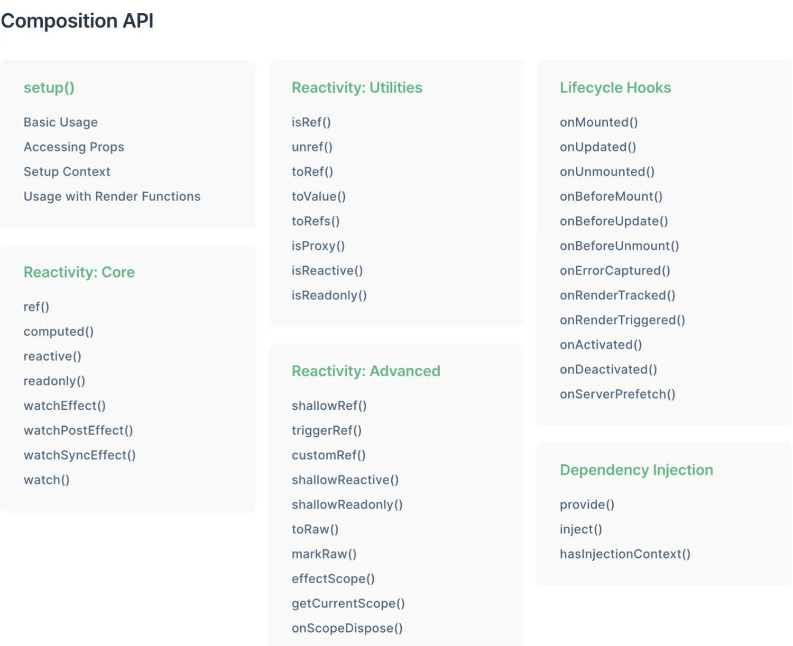
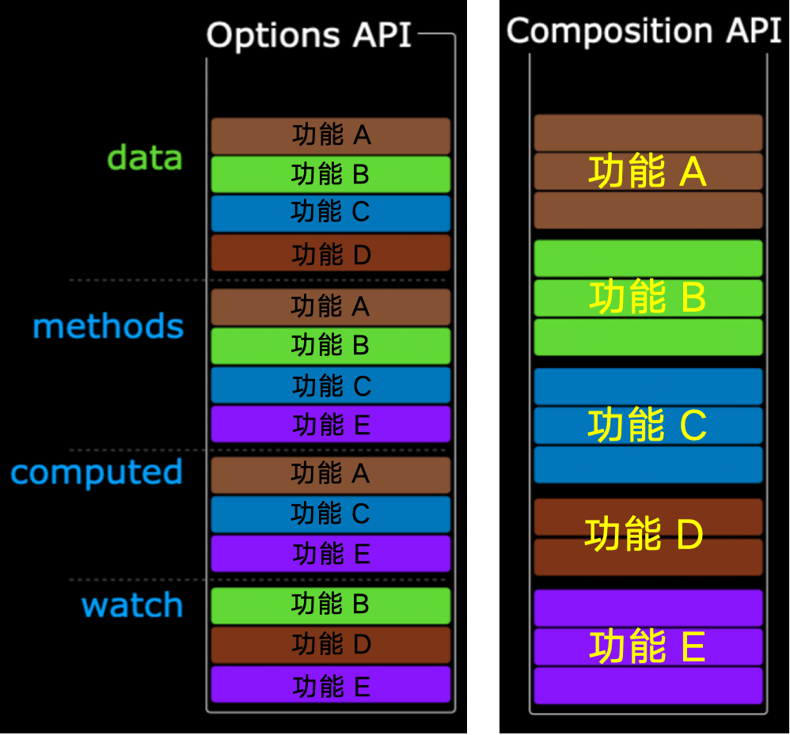

[Vue3 官方文档](https://cn.vuejs.org/guide/introduction)  
[Vue3 生态](https://vue3js.cn/)

## 1. Vue3 简介

Vue 是一款用于构建用户界面的 JavaScript 框架。

从 Vue2 到 Vue3，产品的边界发生变化：

- Vue2 专注给用户提供一个完整的 MVVM（模型 Model、视图 View、视图模型 View Model）框架，让数据和模型绑定；
- Vue3 是一个专注视图层（View）渲染的框架，服务范围在缩小。
  - Vue3 不再是一个 MVVM 框架，并不是说设计程序不再使用 MVVM 架构，而是说 Vue3 专注于渲染，服务范围在缩小，我们可以使用任何架构。

Vue3 是根据数据渲染视图的函数，加上一些副作用。

- 纯函数：计算数据返回 DOM；
- 副作用（effect）：网络请求、Cookie 操作、window 操作、绑定事件、浏览器历史、页面跳转等。

```
UI/view = f(data) with effect[]
```

### Vue3 的优点

- 更快（重新实现数据响应式、重写 diff 算法、模版编译优化、更高效的组件初始化、去掉 Time slice：https://github.com/vuejs/rfcs/issues/89）
- 更小（Tree-shaking）
- 更好用、更好维护
  - Composition API：拥抱函数式；简化 API，让 API 更简单（setup，箭头函数），减少学习成本（不再推荐使用指令）；更好的封装和最小的颗粒度复用（关注点分离原则）
  - 支持 Typescript：提供了更好的代码静态检查和开发体验

## 2. Composition API



### 2.1 Options API 与 Composition API

Vue2 采用的就是 `options API`

- 优点:易于学习和使用, 每个代码有着明确的位置 (例如: 数据放 data 中, 方法放 methods 中)
- 缺点: data、methods、computed 是分散的，不便于维护和复用；虽然可以通过 mixins 提取相同的逻辑，但是也并不是特别好维护

Vue3 新增了 `composition API`

- 可以用函数的方式，更加优雅的组织代码，让相关功能的代码更加有序的组织在一起，大大的提升了代码可读性和可维护性。



### 2.2 setup

setup 是 Vue3 中一个新的配置项，值为一个函数。

setup() 使用场景：需要在组件中使用 Composition API 时。

```vue
<template>
  <button @click="count++">{{ count }}</button>
</template>

<script>
import { ref } from "vue";

export default {
  setup() {
    const count = ref(0);

    // 返回值会暴露给模板和其他的选项式 API 钩子
    return {
      count,
    };
  },

  mounted() {
    console.log(this.count); // 0
  },
};
</script>
```

setup() 的参数：

- props：第一个参数是组件的 props，props 是响应式的，通过 props.xxx 的形式来使用其中的 props。
- context：第二个参数是一个上下文对象
  - context.attrs: 透传属性（非响应式的对象，等价于 this.$attrs）
  - context.slots: 插槽（非响应式的对象，等价于 $slots）
  - context.emit: 触发自定义事件的函数（函数，等价于 this.$emit）
  - context.expose：暴露公共属性（函数）

setup() 的返回值：

- 若返回一个对象，则对象中的属性和方法, 可以在模版 `<template>` 和组件实例 this 中使用。
- 若返回一个渲染函数：则可以自定义渲染内容（异步组件）。

```js
export default {
  setup(props, { attrs, slots, emit, expose }) {
    ...
  }
}
```

注意事项：

- 在 beforeCreate 之前执行一次，此时组件实例还没有创建，this 是 undefined，不能通过 this 来访问 data/computed/methods/props
- 尽量不要与 Options API 混用
  - 可以在 Options API 中访问 setup 提供的的属性和方法，但 setup 方法不能访问 data 和 methods
  - 如果有重名，setup 优先
- setup 不能是一个 async 函数，因为返回值不再是 return 的对象, 而是 promise, 模板看不到 return 对象中的属性。（其实也可以返回一个 Promise 实例，但需要 Suspense 和异步组件的配合）

#### 1) expose

expose 函数用于显式地限制该组件暴露出的属性，当父组件通过$ref 访问该组件的实例时，将仅能访问 expose 函数暴露出的内容。

```js
export default {
  setup(props, { expose }) {
    // 让组件实例处于 “关闭状态”
    // 即不向父组件暴露任何东西
    expose();

    const publicCount = ref(0);
    const privateCount = ref(0);
    // 有选择地暴露局部状态
    expose({ count: publicCount });
  },
};
```

#### 2) defineComponent()

在定义 Vue 组件时提供类型推导的辅助函数。可用于对 TypeScript 代码的类型推导，帮助开发者简化掉很多编码过程中的类型声明。

比如，原本需要这样才可以使用 setup 函数：

```js
import { Slots } from 'vue'

// 声明 `props` 和 `return` 的数据类型
interface Data {
  [key: string]: unknown
}

// 声明 `context` 的类型
interface SetupContext {
  attrs: Data
  slots: Slots
  emit: (event: string, ...args: unknown[]) => void
}

// 使用的时候入参要加上声明， `return` 也要加上声明
export default {
  setup(props: Data, context: SetupContext): Data {
    // ...

    return {
      // ...
    }
  },
}
```

每个组件都这样进行类型声明，会非常繁琐.如果使用了 defineComponent，只要是 Vue 本身的 API，defineComponent 都可以自动推导其类型。开发者只需要维护自己定义的数据类型就可以了，可专注于业务。

```js
import { defineComponent } from "vue";

// 使用 `defineComponent` 包裹组件的内部逻辑
export default defineComponent({
  setup(props, context) {
    // ...

    return {
      // ...
    };
  },
});
```

#### 3) `<script setup>`

[sfc-script-setup](https://cn.vuejs.org/api/sfc-script-setup.html#basic-syntax)

`<script setup>`是在单文件组件 (SFC) 中使用组合式 API 的编译时语法糖。相比于普通的 `<script>` 语法，它具有更多优势：

- 更少的样板内容，更简洁的代码。
- 能够使用纯 TypeScript 声明 props 和自定义事件。
- 更好的运行时性能 (其模板会被编译成同一作用域内的渲染函数，避免了渲染上下文代理对象)。
- 更好的 IDE 类型推导性能 (减少了语言服务器从代码中抽取类型的工作)。

```vue
<!-- 需要为组件命名时使用 -->
<script lang="ts">
export default {
  name: "Person",
};
</script>

<!-- 下面的写法是setup语法糖 -->
<script setup lang="ts">
// 任何在 <script setup> 声明的顶层的绑定 (包括变量，函数声明，以及 import 导入的内容) 都能在模板中直接使用

// 变量
const msg = "Hello!";

// 函数
function log() {
  console.log(msg);
}

const props = defineProps({
  foo: String,
});

const emit = defineEmits(["change", "delete"]);

// 使用 <script setup> 的组件是默认关闭的——即通过模板引用或者 $parent 链获取到的组件的公开实例，不会暴露任何在 <script setup> 中声明的绑定。
// 可以通过 defineExpose 编译器宏来显式指定在 <script setup> 组件中要暴露出去的属性：
const a = 1;
const b = ref(2);

defineExpose({
  a,
  b,
});
</script>

<template>
  <button @click="log">{{ msg }}</button>
</template>
```

### 2.3 ref 和 reactive

ref 定义一个响应式的数据。

- 语法：`let xxx = ref(初始值)`。
- ref 接收的数据可以是：基本类型、对象类型。若 ref 接收的是对象类型，内部其实也是调用了 reactive 函数。
- 返回值：一个 RefImpl 的实例对象，简称 ref 对象或 ref，ref 对象的 value 属性是响应式的。ref 创建的变量必须使用.value（可以使用 volar 插件自动添加.value）。

```js
function createRef<T>(val: T) {
  const obj = {
    get value() {
      return val;
    },
    set value(v: T) {
      val = v;
    },
  };
  return obj;
}
```

reactive 定义一个对象类型的响应式数据。

- 语法：`let 响应式对象 = reactive(源对象)`。
- 返回值：一个 Proxy 的实例对象，简称：响应式对象。
- reactive 定义的响应式数据是“深层次”的。

```js
function reactive<T extends object>(obj: T) {
    const proxy = new Proxy(obj, {
        get(target, key) {
            return Reflect.get(target, key);
        },
        set(target, key, value) {
            Reflect.set(target, key, value);
            return true;
        }
    });
    return proxy;
}
```

使用场景：

- 若需要一个基本类型的响应式数据，必须使用 ref。
- 若需要一个响应式对象，层级不深，ref、reactive 都可以。
- 若需要一个响应式对象，且层级较深，推荐使用 reactive。

响应式对象的更新方式：

- reactive 重新分配一个新对象，会失去响应式（可以使用 Object.assign 去整体替换）。

```js
let car = ref({ brand: "奔驰", price: 30 });
car.value = { brand: "奥迪", price: 50 }; // 页面更新

let car = reactive({ brand: "奔驰", price: 30 });
car.price = 50; // 页面更新
Object.assign(car, { brand: "奥迪", price: 50 }); // 页面更新
car = { brand: "奥迪", price: 50 }; // 页面不更新
car = reactive({ brand: "奥迪", price: 50 }); // 页面不更新
```

#### 1) shallowReactive 与 shallowRef

shallowReactive 和 shallowRef 允许我们创建一个浅层的响应式对象。

对于 shallowReactive，只有对象的第一层属性会变为响应式的，对象的更深层次的属性不会被转换。

```js
import { shallowReactive, shallowRef } from "vue";

const obj = shallowReactive({ a: { b: 1 } });
obj.a.b; // 这不是一个响应式的值

const num = shallowRef(1);
num.value; // 你需要使用 .value 才能访问到值
```

#### 2) readonly 与 shallowReadonly

readonly 和 shallowReadonly 允许我们创建一个只读的响应式对象。

- 对于 readonly，对象的所有属性（包括嵌套属性）都会变为只读。
- shallowReadonly 是 readonly 的浅层版本，只有对象的第一层属性会变为只读。

```js
import { readonly, shallowReadonly } from "vue";

const obj = readonly({ a: { b: 1 } });
obj.a = 2; // 这会抛出一个错误

const shallowObj = shallowReadonly({ a: { b: 1 } });
shallowObj.a.b = 2; // 这不会抛出错误
```

#### 3) toRaw 与 markRaw

toRaw 和 markRaw 允许我们逃避 Vue 的响应式系统。

- toRaw 可以返回一个对象的原始版本。
- markRaw 可以防止一个对象被转换为响应式的。

```js
import { reactive, toRaw, markRaw } from "vue";

const obj = reactive({ a: 1 });
const rawObj = toRaw(obj); // rawObj 是 obj 的原始版本

const nonReactiveObj = markRaw({ a: 1 }); // nonReactiveObj 不会被转换为响应式的
```

#### 4) customRef

customRef 允许我们创建一个自定义的 ref，我们可以控制它何时触发依赖追踪和更新。

```js
import { customRef } from "vue";

const myRef = customRef((track, trigger) => ({
  get() {
    track();
    return someValue;
  },
  set(newValue) {
    someValue = newValue;
    trigger();
  },
}));
```

### 2.4 watch 和 watchEffect

#### 1) watch

watch 监听, 接收三个参数：

- 参数 1: 监视的数据源
- 参数 2: 回调函数
- 参数 3: 额外的配置

watch 只能监听以下四种数据：

- 一个函数，返回一个值
- 一个 ref 数据
- 一个 reactive 对象
- ...或是由以上类型的值组成的数组

监听 ref 定义的基本类型数据。

```vue
<template>
  <div class="person">
    <h2>当前求和为：{{ sum }}</h2>
    <button @click="changeSum">点我sum+1</button>
  </div>
</template>

<script lang="ts" setup>
import { ref, watch } from "vue";

let sum = ref(0);

function changeSum() {
  sum.value += 1;
}

const stopWatch = watch(sum, (newValue, oldValue) => {
  console.log("sum变化了", newValue, oldValue);
  if (newValue >= 10) {
    // 停止监听
    stopWatch();
  }
});
</script>
```

监听 ref 定义的对象类型数据：直接写数据名，监视的是对象的【地址值】，若想监视对象内部的数据，要手动开启深度监视。

```vue
<template>
  <div class="person">
    <h2>姓名：{{ person.name }}</h2>
    <h2>年龄：{{ person.age }}</h2>
    <button @click="changeAge">修改年龄</button>
    <button @click="changePerson">修改整个人</button>
  </div>
</template>

<script lang="ts" setup>
import { ref, watch } from "vue";

let person = ref({
  name: "张三",
  age: 18,
});
function changeAge() {
  person.value.age += 1;
}
function changePerson() {
  person.value = { name: "李四", age: 90 };
}

watch(
  person,
  (newValue, oldValue) => {
    console.log("person变化了", newValue, oldValue);
  },
  { deep: true }
);
</script>
```

监视 reactive 定义的【对象类型】数据，且默认开启了深度监视。

```vue
<template>
  <h2>测试：{{ obj.a.b.c }}</h2>
  <button @click="test">修改obj.a.b.c</button>
</template>

<script lang="ts" setup name="Person">
import { reactive, watch } from "vue";

let obj = reactive({
  a: {
    b: {
      c: 666,
    },
  },
});
function test() {
  obj.a.b.c = 888;
}

watch(obj, (newValue, oldValue) => {
  console.log("obj变化了", newValue, oldValue);
});
</script>
```

监听响应式对象的某个属性：要写成函数式。仅监视函数返回值的变化，如果需要监听内部数据，需要开启深度监听。

```vue
<template>
  <div class="person">
    <h2>姓名：{{ person.name }}</h2>
    <h2>汽车：{{ person.car.c1 }}、{{ person.car.c2 }}</h2>
    <button @click="changeName">修改名字</button>
    <button @click="changeC1">修改第一台车</button>
    <button @click="changeCar">修改整个车</button>
  </div>
</template>

<script lang="ts" setup name="Person">
import { reactive, watch } from "vue";

// 数据
let person = reactive({
  name: "张三",
  car: {
    c1: "奔驰",
    c2: "宝马",
  },
});
// 方法
function changeName() {
  person.name += "~";
}
function changeC1() {
  person.car.c1 = "奥迪";
}
function changeCar() {
  person.car = { c1: "雅迪", c2: "爱玛" };
}

watch(
  () => person.name,
  (newValue, oldValue) => {
    console.log("person.name变化了", newValue, oldValue);
  }
);

watch(
  () => person.car,
  (newValue, oldValue) => {
    console.log("person.car变化了", newValue, oldValue);
  },
  { deep: true }
);
</script>
```

监听多个数据。

```js
watch([fooRef, barRef], ([foo, bar], [prevFoo, prevBar]) => {
  /* ... */
});

watch(
  [() => person.name, () => person.car],
  (newValue, oldValue) => {
    console.log("person.car变化了", newValue, oldValue);
  },
  { deep: true }
);
```

#### 2) watchEffect

立即运行一个函数，同时响应式地追踪其依赖，并在依赖更改时重新执行该函数。

```js
import { defineComponent, ref, watchEffect } from "vue";

export default defineComponent({
  setup() {
    const name = ref("Petter");
    const age = ref(18);

    const getUserInfo = () => {
      console.log({
        name: name.value,
        age: age.value,
      });
    };

    setTimeout(() => {
      name.value = "Tom";
    }, 2000);

    setTimeout(() => {
      age.value = 20;
    }, 4000);

    // 直接侦听调用函数，在每个数据产生变化的时候，它都会自动执行
    watchEffect(getUserInfo);
  },
});
```

watch 对比 watchEffect：

- 都能监听响应式数据的变化，不同的是监听数据变化的方式不同
- watch 要明确指出监视的数据，watchEffect 不用明确指出监视的数据（函数中用到哪些属性，那就监视哪些属性）；
- watch 可以访问侦听状态变化前后的值，而 watchEffect 没有；
- watch 是在属性改变的时候才执行，而 watchEffect 则默认会执行一次，然后在属性改变的时候也会执行。

### 2.5 生命周期

Vue 组件实例在创建时要经历一系列的初始化步骤，在此过程中 Vue 会在合适的时机，调用特定的函数，从而让开发者有机会在特定阶段运行自己的代码，这些特定的函数统称为：生命周期钩子。

|                    | 选项式 API    | Hook inside setup |
| ------------------ | ------------- | ----------------- |
| 创建阶段           | beforeCreate  | --                |
|                    | created       | --                |
| 挂载阶段           | beforeMount   | onBeforeMount     |
|                    | mounted       | onMounted         |
| 更新阶段           | beforeUpdate  | onBeforeUpdate    |
|                    | updated       | onUpdated         |
| 卸载阶段           | beforeUnmount | onBeforeUnmount   |
|                    | unmounted     | onUnmounted       |
| `<KeepAlive>` 组件 | activated     | onActivated       |
|                    | deactivated   | onDeactivated     |

### 2.6 自定义 hook 函数

[组合式函数](https://cn.vuejs.org/guide/reusability/composables#vs-react-hooks)

Vue2 中如果要进行组件逻辑的封装，大多使用的是 mixins 混入。然而 mixins 有三个主要的短板：

- 不清晰的数据来源：当使用了多个 mixin 时，实例上的数据属性来自哪个 mixin 变得不清晰，这使追溯实现和理解组件行为变得困难。
- 命名空间冲突：多个来自不同作者的 mixin 可能会注册相同的属性名，造成命名冲突。
- 隐式的跨 mixin 交流：多个 mixin 需要依赖共享的属性名来进行相互作用，这使得它们隐性地耦合在一起。

```js
export default {
  mixins: [a, b, c, d, e, f, g], // 混入了多个mixin
  mounted() {
    console.log(this.name); // 这个 this.name 来自于谁
  },
};
```

hook 本质是一个函数，把 setup 函数中使用的 Composition API（响应式、computed、watch、生命周期等）进行了封装，利于代码组织和复用。

- 函数名/文件名以 use 开头，形如: useXX；
- 引用时将响应式变量或者方法显式解构暴露出来。

```js
import { ref, onMounted } from "vue";

function useCounter() {
  const count = ref(0);

  const increment = () => {
    count.value++;
  };

  onMounted(() => {
    console.log("counter mounted");
  });

  return {
    count,
    increment,
  };
}

export default {
  setup() {
    const counter = useCounter();

    return {
      counter,
    };
  },
};
```

```js
const { myName, getAge } = useUser();

const { myName as firstName, get as firstGetAge } = useUser();
const { myName as secondName, get as secondGetAge } = useUser();
```

## 3. 新的内置组件

### 3.1 Fragment

```vue
<template>
  <div>Hello</div>
  <div>World</div>
</template>
```

### 3.2 Teleport

Teleport 组件允许你将子组件渲染到 DOM 的任何位置，而不仅仅是它的父组件中。

```vue
<teleport to="body">
  <div class="modal" v-show="isShow">
    <h2>我是一个弹窗</h2>
    <p>我是弹窗中的一些内容</p>
    <button @click="isShow = false">关闭弹窗</button>
  </div>
</teleport>
```

### 3.3 Suspense

Suspense 组件允许你等待一个或多个异步组件，然后显示一些备用内容，直到所有的异步组件都被解析。
使用步骤：

1. 异步引入组件
2. 使用 Suspense 包裹组件，并配置好 default 与 fallback

```vue
<template>
  <div class="app">
    <h3>我是App组件</h3>
    <Suspense>
      <template v-slot:default>
        <Child />
      </template>
      <template v-slot:fallback>
        <h3>加载中.......</h3>
      </template>
    </Suspense>
  </div>
</template>

<script>
import { defineAsyncComponent, Suspense } from "vue";
const Child = defineAsyncComponent(() => import("./Child.vue"));
</script>
```

异步组件和 v-if 的区别：

- 异步组件会单独打包成一个 js，在组件加载的时候才会去加载这个 js 文件，这个过程是异步的，等 js 加载完成才会去渲染这个组件。可以用于分包。
- v-if 是只是控制组件是否展示。
