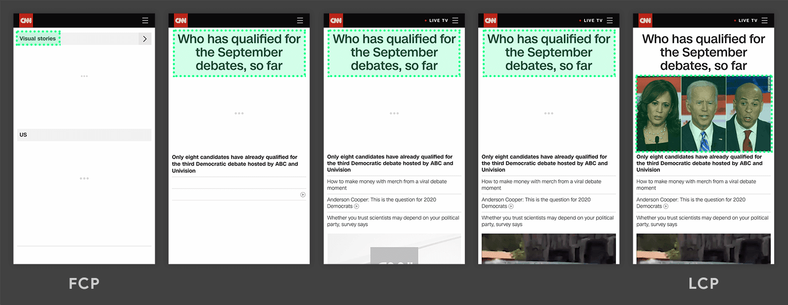
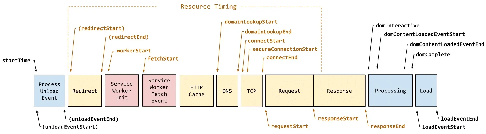

## 1. 性能优化介绍

### 1.1 什么是 Web 性能

MDN 定义：Web 性能是网站或应用程序的客观度量和可感知的用户体验。

简单来说就是网站够不够快，包括渲染（打开速度、动画效果、页面切换等）和交互（表单提交、列表滚动等）。

### 1.2 为什么要关注 Web 性能

- 用户的留存
- 网站的转化率
- 体验与传播
- 搜索排名
- 客户投诉
- 提升工作绩效

### 1.3 如何进行 Web 性能优化

1. 首先需要了解性能指标（多快才算快？）；
2. 使用专业的工具可量化地评估出网站或应用的性能表现；
3. 然后立足于网站页面响应的生命周期，分析出造成较差性能表现的原因；
4. 最后进行技术改造、可行性分析等具体的优化实施；
5. 迭代优化。

## 2. Web 性能指标

[web.dev](https://web.dev/articles/user-centric-performance-metrics?hl=zh-cn)

[Chrome Lighthouse](https://developer.chrome.com/docs/lighthouse/overview?hl=zh-cn)

| 颜色编码     | FCP 时间/s | LCP 时间/s | TBT/ms    |
| ------------ | ---------- | ---------- | --------- |
| 绿色（快速） | 0 - 1.8    | 0 - 2.5    | 0 - 200   |
| 橙色（中等） | 1.8 - 3    | 2.5 - 4    | 200 - 600 |
| 红色（慢）   | 超过 3     | 超过 4     | 超过 600  |

### 2.1 First Contentful Paint (FCP)

首次内容绘制 (FCP) 指从用户首次导航到网页，到网页内容的任何部分在屏幕上呈现的时间。

“内容”是指文本、图片（包括背景图片）、`<svg>` 元素或非白色 `<canvas>` 元素。如果有启动画面或加载中图标，会影响 FCP。

### 2.2 Largest Contentful Paint (LCP)

最大内容绘制 (LCP) 指视口中可见的最大图片、文本块或视频的呈现时间。粗略地估算出网页主要内容何时对用户可见。

LCP 会考虑以下因素：

- `` 元素
- `<svg>` 元素内的 `<image>` 元素
- `<video>` 元素（使用封面图加载时间或视频的第一帧呈现时间，以两者中较早达到者为准）
- 此元素包含使用 url() 函数加载的背景图片
- 包含文本节点或其它内嵌级文本元素子级的块级元素




### 2.3 First Meaningful Paint (FMP)

首次有效绘制 (FMP) 是指从用户启动网页加载到呈现**主要首屏内容**的网页之间间隔的时间。

### 2.4 Time to Interactive (TTI)

可交互时间 (TTI) 是指网页实现完全可交互所需的时间。完全可交互是指：

- 网页会显示有用内容，内容的衡量依据是 FCP，
- 大多数可见页面元素都会注册事件处理脚本，并且
- 网页会在 50 毫秒内响应用户互动。

### 2.5 Total Blocking Time (TBT)

总阻塞时间 (TBT) 是指网页被禁止响应用户输入（例如鼠标点击、屏幕点按或键盘按下操作）的总时长。

### 2.6 Cumulative Layout Shift (CLS)

累计布局偏移 (CLS) 是指在页面整个生命周期内发生的每次意外布局偏移的分数的总和。它是一种保证页面的视觉稳定性从而提升用户体验的指标方案。

### 2.7 Speed Index

速度指数用于衡量在网页加载期间内容直观地显示的速度。 Lighthouse 首先会在浏览器中拍摄一段网页加载视频，并计算帧之间的视觉进度。

## 3. Web 性能测试

### 3.1 window.performance

Performance 用于获取当前页面中与性能相关的信息。可以通过 `window.performance` 访问窗口中运行的代码的性能信息。

```javascript
performance = {
  // memory 是非标准属性，只在 Chrome 有
  memory: {
    // JS 对象（包括V8引擎内部对象）占用的内存，一定小于 totalJSHeapSize
    usedJSHeapSize: 16100000,

    // 可使用的内存
    totalJSHeapSize: 35100000,

    // 内存大小限制
    jsHeapSizeLimit: 793000000,
  },

  navigation: {
    // 如果有重定向的话，页面通过几次重定向跳转而来
    redirectCount: 0,

    // 0   即 TYPE_NAVIGATENEXT 正常进入的页面（非刷新、非重定向等）
    // 1   即 TYPE_RELOAD       通过 window.location.reload() 刷新的页面
    // 2   即 TYPE_BACK_FORWARD 通过浏览器的前进后退按钮进入的页面（历史记录）
    // 255 即 TYPE_UNDEFINED    非以上方式进入的页面
    type: 0,
  },

  timing: {
    // 在同一个浏览器上下文中，前一个网页（与当前页面不一定同域）unload 的时间戳，如果无前一个网页 unload ，则与 fetchStart 值相等
    navigationStart: 1441112691935,

    // 前一个网页（与当前页面同域）unload 的时间戳，如果无前一个网页 unload 或者前一个网页与当前页面不同域，则值为 0
    unloadEventStart: 0,

    // 和 unloadEventStart 相对应，返回前一个网页 unload 事件绑定的回调函数执行完毕的时间戳
    unloadEventEnd: 0,

    // 第一个 HTTP 重定向发生时的时间。有跳转且是同域名内的重定向才算，否则值为 0
    redirectStart: 0,

    // 最后一个 HTTP 重定向完成时的时间。有跳转且是同域名内部的重定向才算，否则值为 0
    redirectEnd: 0,

    // 浏览器准备好使用 HTTP 请求抓取文档的时间，这发生在检查本地缓存之前
    fetchStart: 1441112692155,

    // DNS 域名查询开始的时间，如果使用了本地缓存（即无 DNS 查询）或持久连接，则与 fetchStart 值相等
    domainLookupStart: 1441112692155,

    // DNS 域名查询完成的时间，如果使用了本地缓存（即无 DNS 查询）或持久连接，则与 fetchStart 值相等
    domainLookupEnd: 1441112692155,

    // HTTP（TCP） 开始建立连接的时间，如果是持久连接，则与 fetchStart 值相等
    // 注意如果在传输层发生了错误且重新建立连接，则这里显示的是新建立的连接开始的时间
    connectStart: 1441112692155,

    // HTTP（TCP） 完成建立连接的时间（完成握手），如果是持久连接，则与 fetchStart 值相等
    // 注意如果在传输层发生了错误且重新建立连接，则这里显示的是新建立的连接完成的时间
    // 注意这里握手结束，包括安全连接建立完成、SOCKS 授权通过
    connectEnd: 1441112692155,

    // HTTPS 连接开始的时间，如果不是安全连接，则值为 0
    secureConnectionStart: 0,

    // HTTP 请求读取真实文档开始的时间（完成建立连接），包括从本地读取缓存
    // 连接错误重连时，这里显示的也是新建立连接的时间
    requestStart: 1441112692158,

    // HTTP 开始接收响应的时间（获取到第一个字节），包括从本地读取缓存
    responseStart: 1441112692686,

    // HTTP 响应全部接收完成的时间（获取到最后一个字节），包括从本地读取缓存
    responseEnd: 1441112692687,

    // 开始解析渲染 DOM 树的时间，此时 Document.readyState 变为 loading，并将抛出 readystatechange 相关事件
    domLoading: 1441112692690,

    // 完成解析 DOM 树的时间，Document.readyState 变为 interactive，并将抛出 readystatechange 相关事件
    // 注意只是 DOM 树解析完成，这时候并没有开始加载网页内的资源
    domInteractive: 1441112693093,

    // DOM 解析完成后，网页内资源加载开始的时间
    // 在 DOMContentLoaded 事件抛出前发生
    domContentLoadedEventStart: 1441112693093,

    // DOM 解析完成后，网页内资源加载完成的时间（如 JS 脚本加载执行完毕）
    domContentLoadedEventEnd: 1441112693101,

    // DOM 树解析完成，且资源也准备就绪的时间，Document.readyState 变为 complete，并将抛出 readystatechange 相关事件
    domComplete: 1441112693214,

    // load 事件发送给文档，也即 load 回调函数开始执行的时间
    // 注意如果没有绑定 load 事件，值为 0
    loadEventStart: 1441112693214,

    // load 事件的回调函数执行完毕的时间
    loadEventEnd: 1441112693215,
  },
};
```

整个流程如下：

1. 上一个文档卸载
2. 重定向
3. 浏览器准备好使用 http 抓取文档
4. 检查本地缓存
5. 查询 DNS 域名
6. TCP 建立连接
7. HTTP 请求、响应
8. 渲染 DOM 树并解析
9. 网页开始加载资源
10. 准备就绪触发 load 事件执行回调函数



统计页面性能指标的方法：

```javascript
var performance = window.performance;

if (!performance) {
  // 当前浏览器不支持
  console.log("你的浏览器不支持 performance 接口");
  return;
}

var t = performance.timing;
var times = {};

// 页面从开始导航到加载完成所用的时间，代表了用户等待页面可用的时间
times.loadPage = t.loadEventEnd - t.navigationStart;

// 卸载页面的时间
times.unloadEvent = t.unloadEventEnd - t.unloadEventStart;

// 重定向耗时
times.redirect = t.redirectEnd - t.redirectStart;

// DNS 缓存时间
times.appcache = t.domainLookupStart - t.fetchStart;

// DNS 解析耗时
// DNS 预加载做了么？页面内是不是使用了太多不同的域名导致域名查询的时间太长？
// 可使用 HTML5 Prefetch 预查询 DNS ，[HTML5 prefetch](http://segmentfault.com/a/1190000000633364)
times.lookupDomain = t.domainLookupEnd - t.domainLookupStart;

// TCP 建立连接完成握手的时间
times.connect = t.connectEnd - t.connectStart;

// 读取页面第一个字节的时间 Time To First Byte (TTFB)
// 可以理解为用户拿到你的资源占用的时间，加异地机房了么，加CDN 处理了么？加带宽了么？加 CPU 运算速度了么？
times.ttfb = t.responseStart - t.navigationStart;

// 内容加载完成的时间
// 页面内容经过 gzip 压缩了么，静态资源 css/js 等压缩了么？
times.request = t.responseEnd - t.requestStart;

// 解析 DOM 树结构的时间，判断 DOM 树嵌套是不是太多了
times.domReady = t.domComplete - t.responseEnd;

// 执行 onload 回调函数的时间
// 是否太多不必要的操作都放到 onload 回调函数里执行了，考虑过延迟加载、按需加载的策略么？
times.loadEvent = t.loadEventEnd - t.loadEventStart;
```

### 3.2 LightHouse
