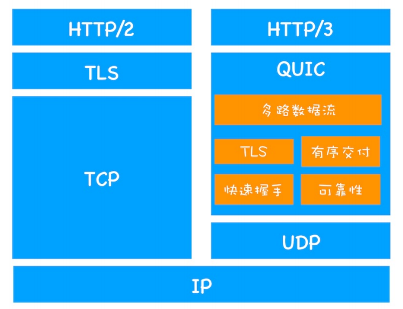

## 1. HTTP 协议

HTTP（hypertext transport protocol）协议，即超文本传输协议，是一种基于 TCP/IP 的应用层通信协议，规定了浏览器和服务器之间互相通信的规则。
协议中主要规定了两个方面的内容：

- 客户端向服务器发送数据，称为请求报文
- 服务端向客户端返回数据，称为响应报文

### 1.1 请求报文

- 请求行：请求方法、请求 URL、HTTP 协议版本号
- 请求头：包含浏览器信息和请求正文的有用信息，格式：【头名: 头值】
- 空行
- 请求体：可以是空、字符串、JSON 等，比如 POST 方法的参数信息等。

| 
请求头
 | 解释                                                        | 举例                                       |
| -------------------------------------- | ----------------------------------------------------------- | ------------------------------------------ |
| Host                                   | 主机名                                                      | www.baidu.com                              |
| Connection                             | 连接的设置；keep-alive 保持连接，close 关闭连接             | keep-alive                                 |
| Cache-Control                          | 缓存控制                                                    | max-age=0                                  |
| Upgrade-Insecure-Requests              | 将网页中的 http 请求转化为 https 请求（很少用，老网站升级） | 1                                          |
| User-Agent                             | 客户端字符串标识，比如可以区分 PC 端和手机端等              | Mozilla/5.0 (Macintosh; Intel Mac OS X ... |
| Accept                                 | 设置浏览器接收的数据类型                                    | text/html,application/xhtml+xml,...        |
| Accept-Encoding                        | 设置接收的压缩方式                                          | gzip, deflate, br, zstd                    |
| Accept-Language                        | 设置接收的语言，q 为喜好系数，满分为 1                      | zh-CN,zh;q=0.9                             |
| Cookie                                 | Cookie                                                      |                                            |

### 1.2 响应报文

- 响应行：HTTP 协议版本号、状态码、状态描述，例如 HTTP/1.1 200 OK
- 响应头
- 空行
- 响应体：响应体内容的类型是非常灵活的，常见的类型有 HTML、CSS、JS、图片、JSON

| 响应头           | 解释                                                                         | 举例                     |
| ---------------- | ---------------------------------------------------------------------------- | ------------------------ |
| Cache-Control    | 缓存控制                                                                     | max-age=0                |
| Connection       | 连接的设置；keep-alive 保持连接，close 关闭连接                              | keep-alive               |
| Content-Type     | 设置响应体的数据类型以及字符集，浏览器会根据该字段决定如何显示响应体的内容。 | text/html; charset=utf-8 |
| Content-Length   | 响应体的长度，单位为字节                                                     |                          |
| Content-Encoding | 设置响应体的压缩方式                                                         | deflate, gzip            |

### 1.3 HTTP 的特点

HTTP 优点：

- 简单：HTTP 基本的报文格式就是 header+body，头部信息也是 key-value 简单文本的形式；
- 灵活和易于扩展：
  - HTTP 协议里的各类请求方法、URI/URL、状态码、头字段等每个组成，都允许开发人员自定义和扩充；
  - HTTP 工作在应用层，它的下层可以随意变化，HTTPS 是在 HTTP 与 TCP 层之间增加了 SSL/TLS 安全传输层，HTTP/3 甚至把 TCP 层换成了基于 UDP 的 QUIC。
- 应用广泛和跨平台
  - 从台式机的浏览器到手机的各种 APP，从看新闻、刷贴吧到购物、理财、吃鸡，HTTP 的应用片地开花，同时天然具有跨平台的优越性。

HTTP 缺点：

- 无状态是双刃剑
  - 服务器不会去记忆 HTTP 的状态，减轻了服务器资源的消耗，能够把更多的 CPU 和内存用来对外提供服务。
  - 既然服务器没有记忆能力，它在完成有关联性的操作时会非常麻烦。可以通过 Cookie 等控制客户端状态。
- 明文传输是双刃剑
  - 明文传输，方便阅读和调试，但传输过程中容易被窃取。
  - 不安全：明文传输，内容可能会被窃听；不验证通信方的身份，因此有可能遭遇伪装；无法证明报文的完整性，内容可能被篡改。可以用 HTTPS 的方式解决。

## 2. HTTP 请求方法

- GET：从服务器获取资源
- POST：在服务器创建资源
- PUT：在服务器修改资源
- DELETE：在服务器删除资源
- OPTION：预检请求
- TRACE：用于显示调试信息
- CONNECT：代理相关

### 2.1 GET 和 POST 请求的区别

- 定义：
  - GET 方法的含义是请求从服务器获取资源，可以是静态的文本、页面、图片、视频等。
  - POST 方法的含义是向服务器提交数据。
- 参数：
  - GET 参数放在 URL 中，只能接收 ASCII 字符，有长度限制（浏览器对 URL 有长度限制），不安全（参数暴露且保存在历史操作中）；
  - POST 参数放在请求体中，支持多种数据类型，更适合传输敏感信息。
- 是否幂等：
  - GET 请求是一个幂等（执行多次操作结果都是相同的）的请求，一般不会修改服务器上的资源。
  - POST 请求不是一个幂等的请求，一般会修改服务器资源。
- 是否缓存：
  - 浏览器一般会对 GET 请求结果进行缓存，但很少对 POST 请求缓存。
- POST 可能会分成两个数据包
  - 从 TCP 的角度，GET 请求会把请求报文一次性发出去，而 POST 可能会分为两个 TCP 数据包，首先发 header 部分，如果服务器响应 100(continue)， 然后发 body 部分。

### 2.2 OPTIONS 预检请求

OPTIONS 请求是指，在复杂请求发送之前，先发送一次预检请求，根据请求结果来决定是否继续发送真实的请求到服务器。

预检请求头：

- Access-Control-Request-Method：告知服务器实际请求所使用的 HTTP 方法。
- Access-Control-Request-Headers：告知服务器实际请求所携带的自定义标头。
- Origin：浏览器会自行加上一个 Origin 请求地址。

预检响应头：

- Access-Control-Allow-Methods：服务器支持的 HTTP 请求方法
- Access-Control-Allow-Headers：服务器允许的请求头
- Access-Control-Allow-Origin：服务器允许跨域请求的域名，如果要允许所有域名则设置为 \*
- Access-Control-Max-Age：指定了预检请求的结果能够被缓存多久，在缓存有效期内，该资源的请求（URL 和 header 字段都相同的情况下）不会再触发预检。

**预检请求的触发条件：**

- 使用非简单请求方法：除了 GET、POST 和 HEAD 的请求。
- 使用自定义请求头：人为设置了以下集合之外的字段 Accept/Accept-Language/Content-Language/Content-Type/DPR/Downlink/Save-Data/Viewport-Width/Width
- 内容类型不为简单类型：当请求的 Content-Type 不是 text/plain、multipart/form-data、application/x-www-form-urlencoded 三种之一。
- 任何跨域请求

## 3. HTTP 状态码

1xx（信息型状态码）：

- 100 Continue：服务器已接收到请求的初始部分，客户端应该继续发送剩余部分。
- 101 Switching Protocols：服务器应客户端升级协议的请求（Upgrade 请求头）正在切换协议。

2xx（成功状态码）：

- 200 OK：请求已成功，服务器返回请求的内容。
- 201 Created：请求已成功，并在服务器上创建了新的资源。
- 204 No Content：服务器成功处理了请求，但没有返回任何内容。
- 206 Partial Content：请求已成功，返回的 body 数据只是资源的一部分。

3xx（重定向状态码）：

- 301 Moved Permanently：请求的资源已永久移动到新位置。
- 302 Found：请求的资源临时移动到新位置。浏览器会重定向到这个 URL。
  - 301 和 302 都是重定向，网络进程都会从响应头的 Location 字段读取重定向的地址，然后再发起新请求。
- 303 See Other：通常作为 PUT 或 POST 操作的返回结果，它表示重定向链接指向的不是新上传的资源，而是另外一个页面，比如消息确认页面或上传进度页面。
- 304 Not Modified：服务器内容没有更新，无需再次传输请求的内容，可以使用客户端缓存的内容。

4xx（客户端错误状态码）：

- 400 Bad Request：客户端请求参数错误，服务器无法理解客户端的请求。
- 401 Unauthorized：请求未经授权，请求需要用户身份认证。
- 403 Forbidden：指的是服务器端有能力处理该请求，但是拒绝授权访问。类似于 401，但进入 403 状态后即使重新验证也不会改变该状态。
- 404 Not Found：服务器无法找到所请求的资源。不清楚是否为永久或临时的丢失。
- 410 Gone：请求的目标资源在服务器上不存在了，并且是永久性的丢失。

5xx（服务器错误状态码）：

- 500 Internal Server Error：服务器错误。
- 501 Not Implemented：请求的方法不被服务器支持，因此无法被处理。
- 502 Bad Gateway：作为网关或代理服务器的服务器从上游服务器收到无效的响应。
- 503 Service Unavailable：服务器当前无法处理请求，可以一会再试。
- 504 Gateway Timeout：扮演网关或者代理的服务器无法在规定的时间内获得想要的响应。

## 4. HTTP 1/2/3 的区别

### 4.1 HTTP/1.1

- **增加长连接：** HTTP/1.1 默认使用长连接，Connection: keep-alive。长连接可减少 TCP 建立连接和断开连接造成的性能开销。
- **管线化技术：** 在同一个 TCP 连接里，客户端可以发起多个请求，第二个请求不必等第一个请求返回，减少了整体响应时间。
  - **队头阻塞：** 服务器是按照顺序响应请求，如果 TCP 通道中的某个请求没有及时返回，就会阻塞后面的所有请求。
- 支持请求资源的一部分：HTTP/1.1 则在请求头引入了 range 头域，它允许只请求资源的某个部分，即返回码是 206，便于充分利用带宽和连接，支持断点续传。
- 新增 host 字段，指定服务器的域名：指定 host 字段可以将请求发往到同一台服务器上的不同网站。
- 引入了更多缓存控制策略，例如 Etag、If-Unmodified-Since、If-Match、If-None-Match 等更多可供选择的缓存头来控制缓存策略。
- 客戶端 Cookie、安全机制

### 4.2 HTTP/2

主流浏览器 HTTP/2 的实现都是基于 SSL/TLS 的，也就是说使用 HTTP/2 的网站都是 HTTPS 协议的，基于 SSL/TLS 的 HTTP/2 连接建立过程和 HTTPS 类似。

- **二进制格式：** HTTP/2 则是一个二进制协议，而非 HTTP/1.x 中的纯文本，头信息和数据体都是二进制，是实现多路复用的基础。
- **多路复用：** HTTP/2 可以在一个连接中并发多个请求或回应，不用按照顺序一一发送。避免了队头阻塞问题，提高了连接利用率。
- **头部压缩：** 在客户端和服务器同时维护一张头信息表，生成一个索引号，以后就不发送同样字段了，只发送索引号，这样就提高速度了。
- **可以设置请求优先级：** HTTP/2 提供了请求优先级，可以在发送请求时，标上该请求的优先级，这样服务器接收到请求之后，会优先处理优先级高的请求。
- **服务器推送：** HTTP/2 支持服务器主动向客户端发送消息，指把客户端所需要的 css/js/img 资源伴随着 index.html 一起发送到客户端，省去了客户端重复请求的步骤。

### 4.3 HTTP/3

HTTP/1 和 HTTP/2 均是基于 TCP 的协议。TCP 的缺陷：

- TCP 的队头阻塞和丢包
  - HTTP/1.1 是在虚拟管道中传输数据包，有队头阻塞问题；
  - HTTP/2 中多个请求在一个 TCP 管道中，如果其中任意一路数据流中出现了丢包的情况，那么就会阻塞该 TCP 连接中的所有请求。
- TCP 三次握手建立连接的延时
- TCP 协议僵化
  - 网络中间设备使用了 TCP 特性，被设置后很少更新；
  - TCP 协议是通过操作系统内核来实现的，应用程序只能使用不能修改，想更新内核中的 TCP 协议也是非常困难的。

HTTP/3 选择了 UDP 协议，避免设备僵化的问题。基于 UDP 实现了类似于 TCP 的多路数据流、传输可靠性等功能，把这套功能称为 QUIC 协议。

</img>

- 实现了类似 TCP 的流量控制、传输可靠性的功能。
- 集成了 TLS 加密功能，减少了握手的网络延迟。
- 实现了 HTTP/2 中的多路复用功能。实现了数据流的单独传输，解决了 TCP 中队头阻塞的问题。
- 实现了快速握手功能。由于 QUIC 是基于 UDP 的，可以用最快的速度来发送和接收数据，大大提升首次打开⻚面的速度。

## 5. HTTPS

HTTPS 在 TCP 和 HTTP 网络层之间加入了 SSL/TLS 安全协议，使得报文能够加密传输。

### 5.1 HTTPS 建立连接的过程

HTTPS 在 TCP 连接建立后，还需要经历 SSL 协议握手，成功后才能发起请求。

SSL/TLS 协议基本流程：客户端向服务器索要并验证服务器的公钥；双方协商生产会话秘钥；双方采用会话秘钥进行加密通信。前两步也就是 SSL/TLS 的建立过程，也就是握手阶段。

SSL/TLS 的握手阶段涉及四次通信：

1. 客户端发起加密请求，发送以下信息：客户端支持的 SSL/TLS 协议版本、客户端生产的随机数、客户端支持的密码套件列表。

2. 服务器发出响应：确认 SSL/TLS 协议版本，如果浏览器不支持，则关闭加密通信；服务器生产的随机数；确认的密码套件列表；服务器的数字证书。

3. 客户端回应

   - 客户端确认数字证书的真实性；
   - 如果证书没有问题，客户端会从数字证书中取出服务器的公钥，使用它加密报文，向服务器发送如下信息:
     - 一个随机数；
     - 加密通信算法改变通知，表示随后的信息都将用「会话秘钥」加密通信；
     - 客户端握手结束通知，表示客户端的握手阶段已经结束；
     - 把之前所有内容的发生的数据做个摘要，验证加密通信是否可用，让服务端校验之前的握手信息是否有被篡改。
   - 客户端用这三个随机数，按双方协商的加密算法，生成本次通信的「会话秘钥」。

4. 服务器再次回应
   - 服务器用这三个随机数，按双方协商的加密算法，生成本次通信的「会话秘钥」。
   - 向客户端发生最后的信息：
     - 加密通信算法改变通知，表示随后的信息都将用会话秘钥，加密通信。
     - 服务器握手结束通知，表示服务器的握手阶段已经结束。
     - 把之前所有内容的发生的数据做个摘要，用来供客户端校验。

至此，整个 SSL/TLS 的握手阶段全部结束。接下来，客户端与服务器进入加密通信，完全是使用普通的 HTTP 协议，只不过用会话秘钥加密内容。

### 5.2 HTTPS 加密原理

- 会被窃听？**混合加密**：采用非对称加密传输对称加密的秘钥，数据传输阶段使用对称加密。
- 会被篡改？**摘要算法**：客户端通过摘要算法计算明文的指纹，把「指纹+明文」一同加密，发送给服务器；服务器解密后，用相同的摘要算法计算明文的指纹，与客户端携带的指纹做比较，若指纹相同，说明数据是完整的。
- 会被伪装？**数字证书**：借助第三方权威机构 CA（数字证书认证机构），将服务器公钥放在数字证书中，只要证书是可信的，公钥就是可信的。

</img>

## 6. HTTP 缓存

### 6.1 强缓存和协商缓存

HTTP 缓存分为强缓存和协商缓存。

- 强缓存：不会向服务器发送请求，直接从缓存中读取资源。
  - 在 chrome 控制台的 network 选项中可以看到该请求返回 200 的状态码，并且 size 显示 from disk cache 或 from memory cache。
- 协商缓存：向服务器发送请求，服务器根据请求头字段来判断是否命中协商缓存，如果命中，则返回 304 状态码并带上新的响应头，通知浏览器从缓存中读取资源。

两者都是从客户端缓存中读取资源；区别是强缓存不会发请求，协商缓存会发请求。

### 6.2 缓存相关字段

- `Expires`：在 HTTP/1.0 中，代表该资源的缓存过期时间，即再次发起该请求时，如果客户端的时间小于 Expires 的值，直接使用缓存结果。
  - Expires 返回的是服务端时间，与客户端时间相比，可能会出现时间不一致
- `Cache-Control`：在 HTTP/1.1 中，用于控制网页缓存，主要取值为：
  - public：所有内容都将被缓存（客户端和代理服务器都可缓存）
  - private：所有内容只有客户端可以缓存，Cache-Control 的默认值
  - no-cache：客户端缓存内容，但是是否使用缓存则需要经过协商缓存来验证决定
  - no-store：所有内容都不会被缓存，既不使用强制缓存，也不使用协商缓存
  - max-age=xx：强缓存，缓存内容将在 xx 秒后失效
  - s-maxage：资源在代理服务器可以缓存的时长

Cache-Control 优先级高于 Expires；在某些不支持 HTTP1.1 的环境下，Expires 就会发挥用处。

- `ETag`：上一次加载资源时，服务器返回的响应头，是对该资源的唯一标识，只要资源内容有变化，ETag 就会重新生成。
- `If-None-Match`：客户端再次发起该请求时，携带上次请求返回的唯一标识 Etag 值。

服务器将 If-None-Match 的值和该资源文件的 Etag 值做比较，如果相同，则返回 304，表示资源文件没有发生改变，命中协商缓存；不一致则重新返回资源文件，状态码为 200。

- `Last-Modified`：服务器响应请求时，返回该资源文件在服务器最后被修改的时间。
- `If-Modified-Since`：客户端再次发起该请求时，携带上次请求返回的 Last-Modified 值。

服务器收到该请求，根据 If-Modified-Since 的值与该资源在服务器的最后被修改时间做对比，若服务器的资源最后被修改时间大于 If-Modified-Since 的字段值，则重新返回资源，状态码为 200；否则则返回 304，代表资源无更新，可继续使用缓存文件。

Etag 优先级高于 Last-Modified。

- Last-Modified 的时间单位是秒，如果某个文件在 1 秒内改变了多次，那么他们的 Last-Modified 其实并没有体现出来修改，但是 Etag 每次都会改变确保了精度；如果是负载均衡的服务器，各个服务器生成的 Last-Modified 也有可能不一致。
- Etag 比 Last-Modified 性能差，因为 Last-Modified 只需要记录时间，而 Etag 需要服务器通过算法来计算出一个 hash 值。

</img>

缓存策略：

- 对于频繁变动的资源，使用 no-cache，使浏览器每次都请求服务器验证资源是否有效。这样的做法虽然不能节省请求数量，但是能显著减少响应数据大小。
- 对于不常变化的资源，配置一个很大的 max-age=31536000 (一年)，浏览器之后请求相同的 URL 会命中强缓存。为了解决更新的问题，需要在文件名(或者路径)中添加 hash。

用户行为与缓存：

- 地址栏访问，链接跳转是正常用户行为，将会触发浏览器缓存机制；
- F5 刷新，浏览器会设置 max-age=0，跳过强缓存判断，会进行协商缓存判断；
- ctrl+F5 刷新，跳过强缓存和协商缓存，直接从服务器拉取资源。

### 6.3 内存缓存与硬盘缓存

HTTP 缓存的位置分为内存缓存（memory cache） 和硬盘缓存（disk cache）。

- 内存缓存：保存在浏览器当前进程内存中的缓存，主要包含当前中页面中已经抓取到的资源，例如页面上已经下载的样式、脚本、图片等。
  - 快速读取：读取内存中的数据比磁盘块。
  - 时效性：一旦该进程（Tab 页面）关闭，则该进程的内存则会清空。
- 硬盘缓存：直接将缓存写入硬盘文件中，读取缓存需要对硬盘文件进行 I/O 操作，重新解析该缓存内容，读取复杂，速度比内存缓存慢。

浏览器会把哪些文件丢进内存中？哪些丢进硬盘中？

- 对于大文件来说，大概率是不存储在内存中的，反之优先
- 当前系统内存使用率高的话，文件优先存储进硬盘
