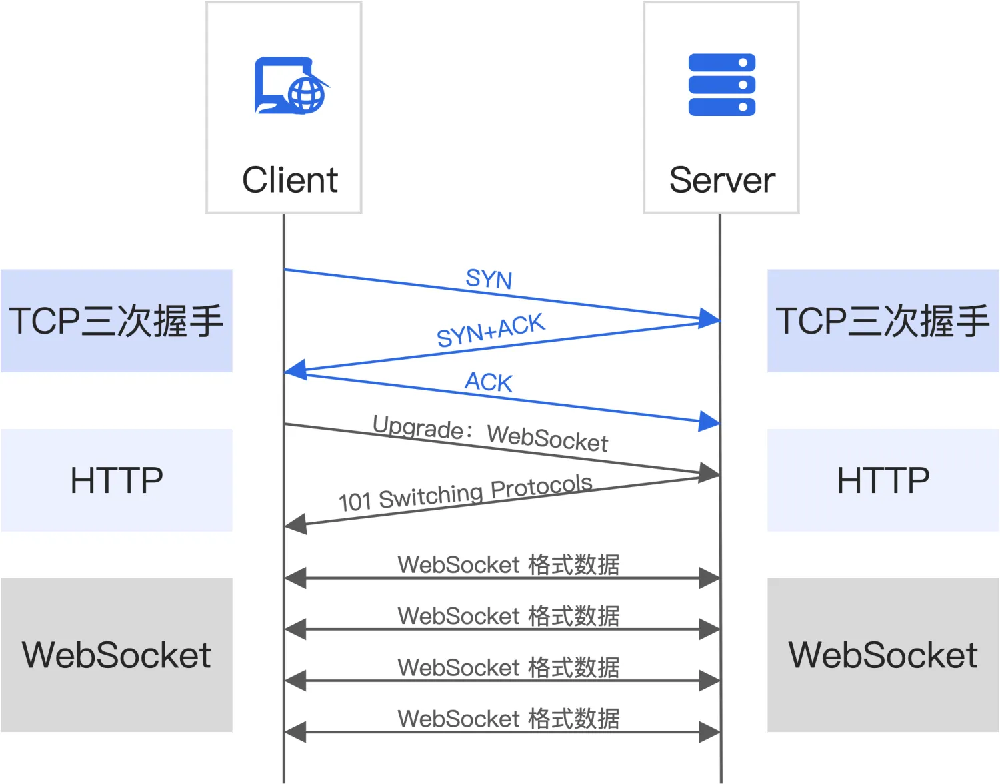

## 1. WebSocket 介绍

WebSocket 是应用层的网络通信协议。特点如下：

- 支持**客户端与服务器的全双工通信**，服务器可以主动向客户端推送信息，客户端也可以主动向服务器发送信息，能更好地节省服务器资源和带宽并达到实时通讯的目的；
- 是一种**持久连接**；
- 允许**跨域通信**；
- 建立在 TCP 协议之上；
- 与 HTTP 协议有着良好的兼容性：默认端口也是 80 和 443，并且握手阶段采用 HTTP 协议，因此握手时不容易屏蔽，能通过各种 HTTP 代理服务器；
- 数据格式比较轻量，性能开销小，通信高效；通过第一个请求建立了 TCP 连接之后，之后交换的数据都不需要发送请求头；
- 可以发送文本，也可以发送二进制数据；
- 协议标识符是 ws（如果加密，则为 wss），服务器网址就是 URL `ws://example.com:80/some/path`。

## 2. WebSocket 建立连接

</img>

1. 客户端发起 http 请求，经过 3 次握手，与服务器建立 TCP 连接（HTTP 版本必须是 1.1 以上）；
2. 发送一个 GET 请求进行协议升级，http 请求头存放 WebSocket 相关信息；
3. 服务器收到客户端的握手请求后，同样采用 http 协议作出响应；
4. 在协议升级后，客户端和服务器之间的通信将使用 WebSocket 协议进行而不再是 HTTP，可以在同一个 WebSocket 连接上进行双向通信。

请求头：

- `Connection: Upgrade`：表示要升级协议
- `Upgrade: websocket`：表示要升级到 Websocket 协议
- `Sec-WebSocket-Version: 13`：表示 Websocket 的版本。如果服务端不支持该版本，需要返回一个 `Sec-WebSocket-Versionheader`，包含服务端支持的版本号。
- `Sec-WebSocket-Key: klqqcs6ouTl4HdLM5v7bgw==`：与后面服务端响应首部的 `Sec-WebSocket-Accept` 是配套的，提供基本的防护，比如恶意的连接，或者无意的连接。

响应头：

- `Connection: Upgrade`：表示要升级协议
- `Upgrade: websocket`：表示要升级到 Websocket 协议
- `Sec-WebSocket-Accept: kR1cCC0ilB7m2S4czPawig/H4Ek=`：根据客户端请求首部的 Sec-WebSocket-Key 计算出来。

状态代码 101 表示协议切换。到此完成协议升级，后续的数据交互都按照新的协议来。

## 3. WebSocket 心跳

https://www.ruanyifeng.com/blog/2017/05/websocket.html
