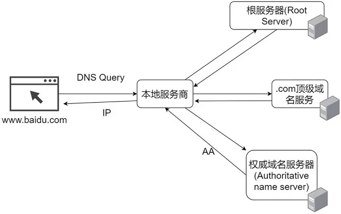

## 1. 从输入 URL 到页面加载发生了什么？

1. 用户在地址栏输入 URL 并按下回车；
2. 浏览器查找当前 URL 是否存在缓存，并比较缓存是否过期；
3. DNS 将域名解析为对应的 IP 地址；
4. 根据 IP 地址，通过三次握手建立 TCP 连接；
5. 发送 HTTP 请求；
6. 服务器处理请求，浏览器接收 HTTP 响应；
7. 浏览器解析并渲染页面；
8. 通过四次挥手关闭 TCP 连接。

## 2. DNS 域名解析的过程

1. 优先在`浏览器 DNS 缓存`中查找，如果有缓存，则直接响应用户的请求
2. 如果没有要访问的域名，就继续在`操作系统的 DNS 缓存`中查找，如果也没有，最后通过本地的 DNS 服务器查到对应的 IP 地址
3. `DNS 服务器`查询过程：
   - 如果没有找到对应的 IP 地址，浏览器会发出一个 DNS 请求到`本地 DNS 服务器`，本地 DNS 服务器会首先查询它的缓存记录，如果缓存中有此条记录，直接返回结果；
   - 如果没有找到对应的 IP 地址，
     1. 本地 DNS 服务器向`根域名服务器`发送请求，根域名服务器会返回一个所查询域的顶级域名服务器地址；
     2. 本地 DNS 服务器向`顶级域名服务器`（负责 com, org, net, edu 等顶级域名和 cn, uk, fr 等国家顶级域名）发送请求，顶级域名服务器返回一个所查询域的权威域名服务器；
     3. 本地 DNS 服务器向`权威域名服务器`（例 163.com 域名服务器）发出请求，收到一个域名和 IP 地址对应关系；
     4. 本地 DNS 服务器把 IP 地址返回浏览器，把对应关系保存在缓存中，以备下次查询时直接返回结果。

</img>

## 3. TCP 的三次握手和四次挥手

### 3.1 三次握手

浏览器拿到域名对应的 IP 地址后，会以一个随机端口（1024~65535）向 Web 服务器（httpd、nginx 等）发起 TCP 的连接请求，通过三次握手建立 TCP 连接。

1. 第一次握手：客户端发送 SYN 数据包到服务器（SYN=1 表示要建立连接，seq=x 随机产生的初始序列号），客户端进入 SYN_SENT 状态，等待服务端确认；
2. 第二次握手：服务端收到数据包后，由标志位 SYN=1 知道客户端请求建立连接，服务端确认用户的 SYN 包（ACK=1，ack=x+1），服务端也发送一个 SYN 包（SYN=1，seq=y），服务端进入 SYN_RCVD 状态；
3. 第三次握手：客户端收到确认后，检查 ACK 是否为 1，ack 是否为 x+1，如果正确则将标志位 ACK 置为 1，ack=y+1，并将该数据包发送给服务端，服务端检查 ACK 是否为 1，ack 是否为 y+1，如果正确则连接建立成功，客户端和服务端进入 ESTABLISHED 状态，完成三次握手，随后客户端与服务端之间可以开始传输数据了。

</img>

**握手为什么需要三次？**

- 第二次是客户端确认服务器端收到连接请求且可以连接。
- 第三次是服务器端确认客户端可以建立连接，防止客户端已经不需要连接，而服务器端一直等待。
- 假设客户端发出了第一个连接请求，因为网络阻塞隔了一段时间才到达服务器，此时客户端已经不需要连接了。如果握手只有两次，服务端将一直等待，会浪费资源。

### 3.2 四次挥手

客户端或服务器均可主动发起挥手动作，假如是客户端先发起关闭请求。

1. 第一次挥手：客户端请求断开连接（FIN=1，序号 seq=u），进入 FIN_WAIT1 状态。
2. 第二次挥手：服务端收到断开连接请求后，发出确认报文段（ACK=1，确认号 ack=u+1，序号 seq=v），服务端进入 CLOSE_WAIT 状态，客户端收到服务端的确认后，进入 FIN_WAIT2 状态。

   - 此时的 TCP 处于半关闭状态，客户端到服务端的连接释放。

3. 第三次挥手：如果服务端也想断开连接了，服务端请求断开连接（FIN=1，ACK=1，序号 seq=w，确认号 ack=u+1），服务端进入 LAST_ACK 状态。
4. 第四次挥手：客户端收到断开连接请求后，发出确认报文段（ACK=1，seq=u+1，ack=w+1），客户端进入 TIME_WAIT 状态。此时 TCP 未释放掉，需要经过时间等待计时器设置的时间 2MSL 后，客户端才进入 CLOSED 状态。

</img>

**挥手为什么需要四次？**

- 三次握手是因为服务端收到建立连接请求的 SYN 报文后，把 ACK 和 SYN 放在一个报文里发送给客户端。
- 四次挥手是 TCP 的连接是全双工的，需要双方分别释放连接。比如客户端到服务器的连接释放了，表示客户端不再发送数据了，但是还可以接收数据。

**四次挥手后，为什么客户端最后还要等待 2MSL？**

MSL 是 Maximum Segment Lifetime 英文的缩写，表示报文最大生存时间。

- 保证客户端发送的最后一个 ACK 报文能够到达服务器，因为这个 ACK 报文可能丢失，如果服务端没有收到，服务端会重发一次，而客户端就能在这个 2MSL 时间段内收到这个重传的报文，接着给出回应报文，并且会重启 2MSL 计时器。
- 防止“已经失效的连接请求报文段”出现在本连接中。客户端发送完最后一个确认报文后，在这个 2MSL 时间中，就可以使本连接持续的所产生的所有报文都从网络中消失，这样新的连接中不会出现旧连接的请求报文。
